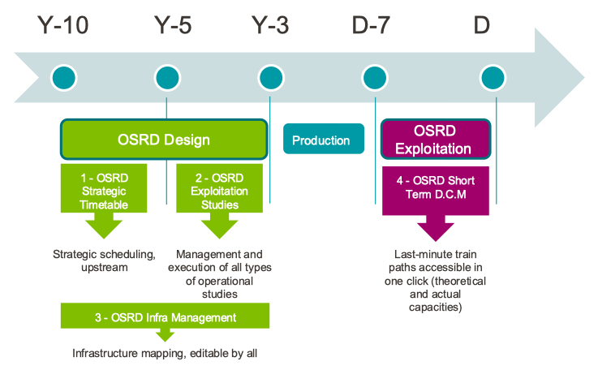

OSRD is meant to fulfill a range of use-cases related to railway planning:
 - [timetabling](#timetabling)
 - [operation studies](#%C3%A9tudes-dexploitation)
 - [infrastructure management](#infrastructure-management)
 - [short term capacity management](#short-term-capacity-management)

## Timetabling

Timetabling is about designing a transport service in order
to meet the transit needs.

OSRD addresses this by providing:
 - a track level railway infrastructure database
 - a rolling stock database
 - an infrastructure edition tool
 - a timetabling tool
 - train path allowances, including an allowance distribution which minimizes energy use

Planned features include:
 - automated conflict detection[^conflict]
 - line level infrastructure synthesis from track level infrastructure
 - interactive timetable diagrams
 - a throughput and rolling stock turnover optimizer

[^conflict]: A conflicts occurs when the movement of a train interferes with another

## Operation studies

Operation studies assess the ability of infrastructures to meet demand,
and balance infrastructure capacity with transportation needs.
They enable informed public infrastructure investment decisions.

OSRD addresses this need by providing:
 - a track level railway infrastructure database
 - a rolling stock database
 - an infrastructure edition tool
 - a timetabling tool
 - train path allowances, including an allowance distribution which minimizes energy use
 - a signaling simulator

Planned features include:
 - automated conflict detection[^conflict]
 - automated timetable robustness assessment using stochastic simulation
 - automated throughput analyzer

## Infrastructure management

Processing railway infrastructure data is a requirement shared by all of OSRD's features.
Therefore, a dedicated module provides:
 - a customizable infrastructure map
 - an infrastructure editor
 - a search feature
 - an import tool[^railjson]

[^railjson]: OSRD uses the RailJSON rail infrastructure file format.
             It is a free and documented format, designed to be
	     infrastructure manager-agnostic, easy to generate and use.

## Short term capacity management

Even though most train paths[^train-path] are allocated years before operations,
a growing part is allocated shortly before the planned departure time. This change
is largely due to growing demand for rail freight.

There is therefore a need for timely (less than 3 minutes) and correct answers,
which cannot be achieved without automation.

A correct train path must, among other things:
 - take planned infrastructure work into account
 - avoid generating conflicts[^conflict] with planned trains,
   including inside stations
 - realistically estimate train behavior, and thus when the train reaches
   or leaves critical locations

Even though some tools can currently provide answers, none currently takes all
of the above into account, especially station conflicts.

This tool is undergoing active development, and should be available within
the coming years.

[^train-path]: A train paths is a right of way on the rail network,
           bounded in time and space. Train paths are sold by infrastructure
           managers to railway companies.
