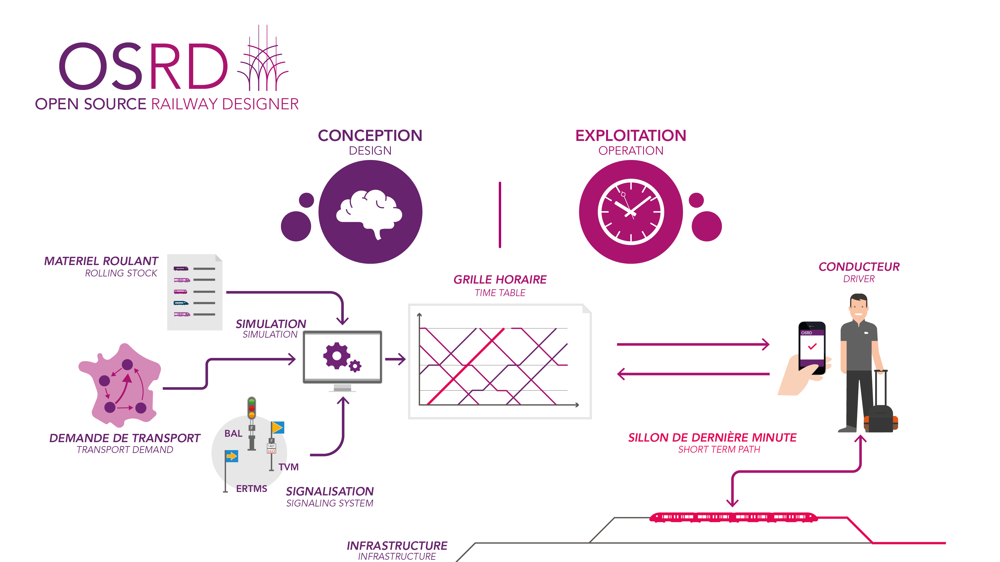

Le projet a pour ambition de répondre à une large gamme de besoins autour de la plannification ferroviaire :
 - [conception des plans de transport](#conception-des-plans-de-transport)
 - [études d'exploitation](#%C3%A9tudes-dexploitation)
 - [gestion d'infrastructure](#gestion-dinfrastructure)
 - [production de sillons de dernière minute](#sillons-de-derni%C3%A8re-minute)

## Conception des plans de transport

La conception de plans de transport consiste à formuler une réponse[^plan-exploitation] aux
schémas de dessertes[^schema-desserte]. OSRD fournit déjà un certain nombre de fonctionnés utiles à cette fin :
 - base d'infrastructure ferroviaires à la voie
 - base de donnée de matériel roulant
 - possibilité de modifier l'infrastructure
 - visualisation de grilles horaires
 - application de différents types de marges sur les sillons, y compris une
   marge économique, qui minimise l'énergie consommée

Les perspectives futures comprennent notament :
 - la détection automatique de conflits[^conflit]
 - synthèse d'infrastructure à la ligne à partir d'infrastructure à la voie
 - visualisation schématique du plan de transport
 - module d'optimisation de la capacité en ligne, d'occupation de la voie en gare et de roulement matériel

[^plan-exploitation]: Sous forme de plan d'exploitation
[^schema-desserte]: Un schéma de desserte est une demande d'offre de transport, qui comprend:
    - la représentation des trains demandés
    - leur itinéraire
    - les arrêts à desservir

[^conflit]: Un conflit se produit lorsque la circulation d'un train en gêne un autre

## Études d'exploitation

Les études d'exploitation permettent d'évaluer la capacité de l'infrastructure à
répondre à la demande et de la mettre en cohérence avec les besoins de transport.
Elles permettent de prendre des décisions d'investissements d'infrastructure publique éclairées.

OSRD permet de répondre à ce besoin en :
 - fournissant une base d'infrastructure ferroviaires à la voie
 - fournissant une base de donnée de matériel roulant
 - donnant la possibilité de modifier l'infrastructure existante et ajouter des installations
 - permettant de visualiser les grilles horaires
 - permettant d'appliquer différents types de marges sur les sillons, dont une
   répartition économique, qui minimise l'énergie consommée.
 - fournissant un simulateur de signalisation

Les pespectives futures comprennent notament :
 - détection de conflits[^conflit]
 - évaluation de la robustesse d'une grille horaire via un module de simulation stochastique.
 - calcul automatique de débit et capacité

## Gestion d'infrastructure

Le traitement d'informations liées à l'infrastructure ferroviaire étant un besoin
commun à toutes les fonctionnalités d'OSRD, un module dédié permet de:
 - visualiser sur une carte les différents types d'objets utilisables dans l'application
 - éditer l'infrastructure ferroviaire
 - rechercher des objets
 - importer de nouvelles infrastructures[^railjson]

[^railjson]: RailJSON est le format de fichier d'infrastructure utilisé par OSRD.
             Il est libre, documenté, conçu pour être agnostique au gestionnaire
	     d'infrastructure, facile à générer et manipuler.

## Sillons de dernière minute

Si une grande partie des sillons[^sillon] sont établis longtemps à
l'avance, une proportion grandissante ne sont commandés que très peu
de temps avant le départ souhaité du train, notament avec le développement
du fret.

Il faut par conséquent être capable de répondre non seulement rapidement
(moins de 3 minutes) à ces demandes, mais aussi correctement, ce qui n'est pas
possible sans automatisation.

Une offre de sillon correcte doit répondre à de nombreux critères, notament :
 - prendre en compte les travaux sur l'infrastructure
 - ne pas générer de conflits[^conflit] avec des sillons déjà établis, y compris en gare
 - estimer de manière réaliste le comportement du train, et donc le moment auquel
   le train atteint ou quitte des endroits critiques

Si certains outils automatisés sont capables de fournir des réponses aux
demandes de sillons de dernière minute, aucun ne prend encore en compte
tous ces critères, en particulier la gestion des conflits[^conflit] en gare.

Cet outil est en cours de développement, et devrait être disponible dans
les années à venir.

[^sillon]: Un sillon est un droit de passage sur le réseau ferroviaire,
           inscrit dans l'espace et dans le temps. Il est vendu par un
           gestionnaire d'infrastructure (GI) à une entreprise ferroviaire (EF).
