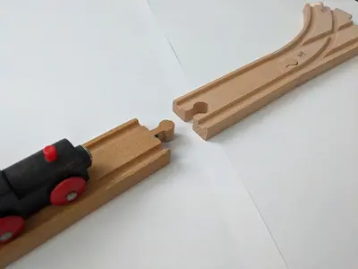
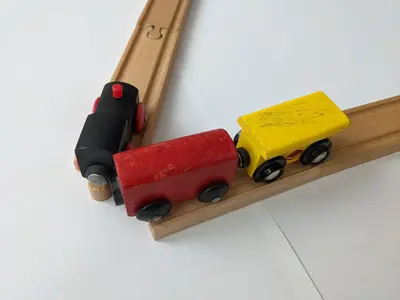

## Dreiländer hack, the annual meeting of German-speaking railway companies... but not only!

On 29 and 30 June, the ["Dreiländer hack"](https://bcc.oebb.at/de/das-leisten-wir/innovationen/dreilaenderhack) (the hackathon of the three countries) was held in Wien (Austria). Organised by DB (Germany), ÖBB (Austria) and SBB (Switzerland), this is an annual event dedicated to collaboration on shared railway-related challenges.

We were delighted to be invited to take part thanks to the [OpenRail Foundation](https://openrailfoundation.org/), and this year's theme being "Open Railways", it would have been hard to refuse!

## 24 hours to work together on a topic of common interest

The 150 participants were divided into 16 working groups on a wide variety of topics such as:

* Imagining a simple interface for ordering train paths (an important subject for the future of OSRD);
* Offering passenger information adapted to different disabilities;
* Optimizing the prioritisation of trains at junctions according to the number of passengers on board and on the platform (Motis project);
* Automatically identifying energy-consuming trains in storage;
* Calculating forecast maintenance dates from a historical database for each train component;
* Detecting speed measurement and GPS positioning errors on track inspection trains;
* Optimizing maintenance work to limit lost capacity;
* Facilitating passenger information with a GPT chatbot;
* Designing an easy-to-use display and ticketing interface for night trains across Europe.

## Challenge proposal by OSRD

The challenge proposed by OSRD was to consolidate the railway data in OpenStreetMap, an open & collaborative database that we use as a source for railway infrastructure in Europe.

The objective was to develop an algorithm to identify 5 types of probable errors in the data:

### Disconnected tracks

### Suspicious switches

### Stations apart from tracks

### Weird angles

### Missing gauge info

The subject was of interest and we formed a team of 10 people divided between the four participating companies. After a presentation of the challenge and of the OpenStreetMap data model, we looked for existing tools and chose to use [Osmose](https://osmose.openstreetmap.fr/), an open source application for detecting and displaying potential errors in OSM. We then split up to work on the 5 types of errors.

*From left to right: Christoph (DB), Klara (ÖBB), Frederik (SBB), Carl (SBB), Julius (DB), Jennifer (DB), Daniel (ÖBB), Céline (SNCF), Max (DB), Tristram (SNCF).*

## Results

After 24 hours of work, the result is an [interactive map showing the various errors](https://openrailfoundation.github.io/FixOurRail-weird-angles/) (click on the pictograms to show error details). You can find all the code that was produced on the [Open Rail Foundation's GitHub](https://github.com/OpenRailFoundation/FixOurRail-simple-solutions).

We did not manage to integrate our analysers into Osmose within the allotted time, but that remains the target on which we're going to continue working, so that all OpenStreetMap contributors can easily correct errors in railway data!
