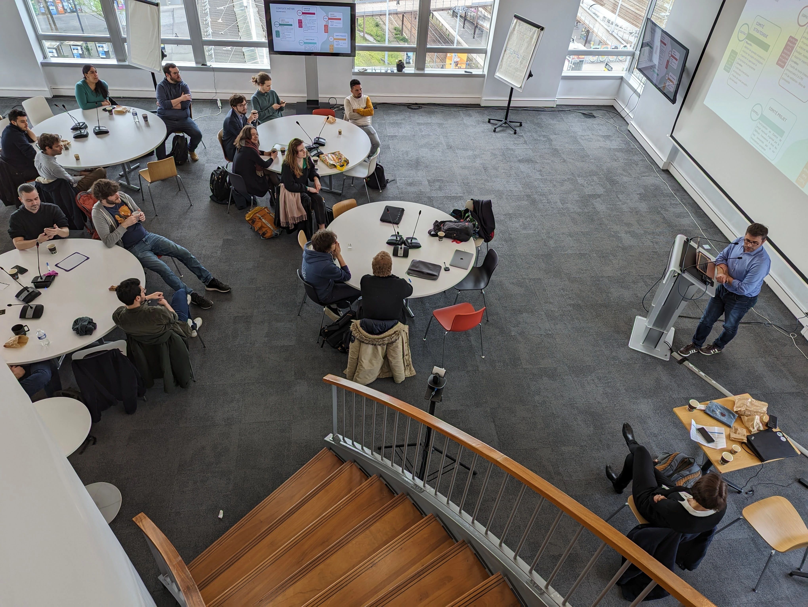
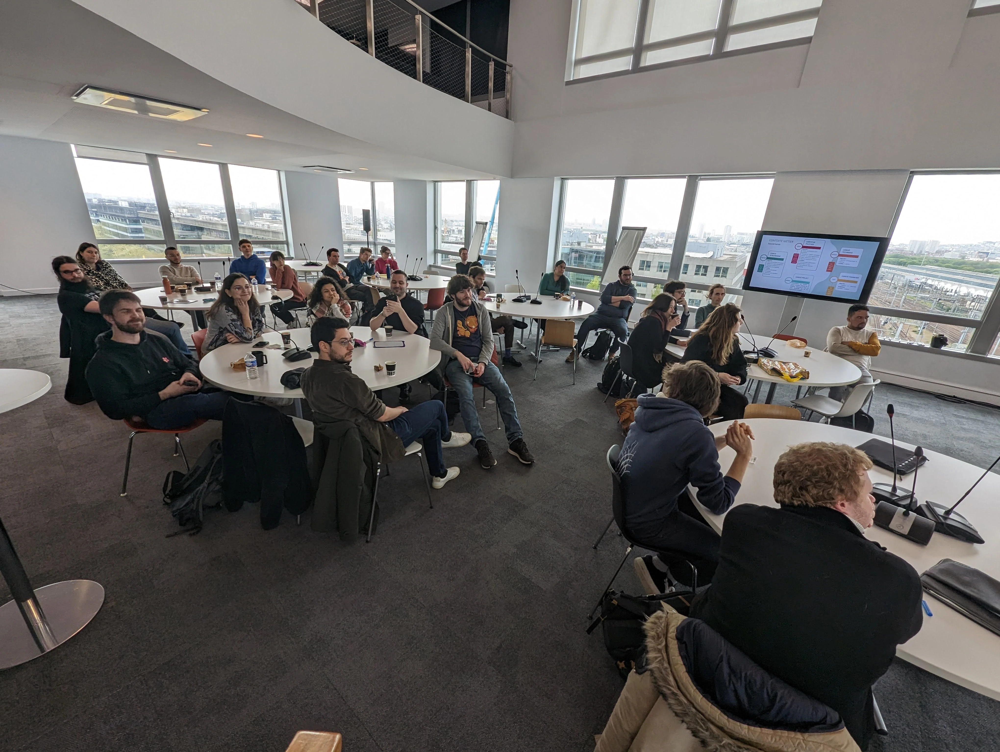

## Un I&A prometteur

Notre 5ème Inspect & Adapt a commencé avec la présentation de notre PI System demo de l'application OSRD, démontrant l’ensemble des travaux réalisés au cours de ce PI5 par nos équipes. À la suite de cette demo, l’atteinte de nos objectifs (engagés et non engagés) a été évaluée par nos partie-prenantes. Verdict : 113 % de réussite...  Si, si, c’est possible 😉 !

## Planification de notre 6ème  Product Increment (PIP6) !
Après les traditionnelles séquences portant sur l’évolution de notre contexte de métier et technique, nous avons assisté à l’intervention de François Marchal, Responsable domaine numérique exploitation à la Digit, portant sur les enjeux du numérique au sein de SNCF Réseau et le rôle d’OSRD au sein de l’organisation.

Le lendemain, Nathanaël Dias, Chargé d’étude exploitation ferroviaire, nous a présenté son métier, et le processus d’élaboration d’une étude exploitation. Il a insisté sur l’importance de partager les résultats et les travaux.

Au cours du PIP, de nouvelles fonctionnalités ont été embarquées par les équipes, et transformées en objectifs à atteindre. Le travail a été planifié pour les 11 semaines à venir et les risques ont été évalués pour être minimisés.

Rendez-vous mi-juillet pour le 7ème PIP !

