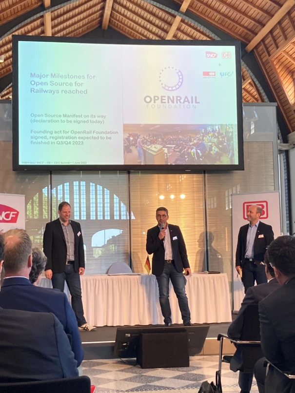

Le 1er juin 2023 se tenait à Potsdam, près de Berlin, le CEO Summit du Memorandum of Understanding (MoU) entre SNCF et Deutsche Bahn.

L'open source est l'un des huit sujets identifiés du MoU. Loïc Hamelin, Directeur du Programme, était invité à présenter OSRD devant JP Farandou et R Lutz, PDG des groupes SNCF et DB.

Il a insisté sur l’opportunité apportée par l’open source pour l'avenir du secteur ferroviaire européen.

