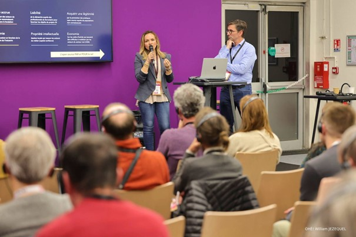

L'édition 2024 d'**Open Source Experience** (OSXP) s'est déroulée les **4 et 5 décembre au Palais des Congrès de Paris**. 

Cet événement a rassemblé plus de 6 000 professionnels du numérique, développeur.euse.s, décideur.ice.s IT et acteur.rice.s de l'écosystème open source.

Open Source Experience 2024 a confirmé son rôle de **plateforme incontournable** pour la diffusion des technologies open source. L'événement a permis de renforcer les collaborations entre les acteur.rice.s du secteur et de favoriser l'émergence de nouvelles solutions innovantes.

Cette édition a brillamment mis en avant la vitalité et le dynamisme de l'écosystème open source, prouvant une fois de plus l'importance du libre dans la transformation numérique.

## Les Thématiques Clés

L'édition 2024 a mis en lumière plusieurs thématiques technologiques majeures :
- **Intelligence Artificielle (IA) :** Focus sur les solutions open source intégrant l'IA dans les processus industriels et sociétaux.
- **Gestion des Données :** Présentation des outils de gestion et d'exploitation des données massives.
- **Internet des Objets (IoT) :** Innovations open source appliquées aux objets connectés.
- **Cloud Computing :** Évolutions des infrastructures cloud open source.
- **Blockchain :** Applications de la blockchain dans les secteurs publics et privés.

## Openrail & Open Source

C’est le 04 décembre que, **Loïc Hamelin**, *Directeur du Programme OSRD* et **Amel Charleux**, *Maître de Conférence à l’Université de Montpellier*, ont pu présenter en salle Allison Randal leur retour d’expérience lors de la conférence : 

**Les fondations “métier” pour l'open source : quelles spécificités et quels défis ?**

> Amel Charleux (à gauche) et Loïc Hamelin (à droite)

Un partage autour de l’histoire de la création de l’Association OpenRail, née pour répondre aux besoins d’optimisation, de transparence et de standardisation, grâce à l’open source ferroviaire.

Aujourd’hui, OpenRail Association, c’est :
- **7 pays membres :** Groupe SNCF (France), Deutsche Bahn (Allemagne), SBB CFF FFS (Suisse), Entur (Norvège), Infrabel (Belgique), l'ONCF (Maroc) et l’UIC - International union of railways
- **5 projets hébergés** : [OSRD](https://osrd.fr), [RCM OSS](https://github.com/OpenRailAssociation/rcm-dx), DAC Migration DSS, [Netzgrafik-Editor](https://github.com/SchweizerischeBundesbahnen/netzgrafik-editor-frontend), et [libLRS](https://github.com/osrd-project/liblrs/)

L’open source est créateur de valeur, et nous espérons voir toujours plus de membres et de projets rejoindre cette aventure.

**Prochaine étape :** animer la communauté pour faire vivre cette fondation et amplifier son impact ! 

Merci à tous.tes celleux qui y contribuent déjà !
