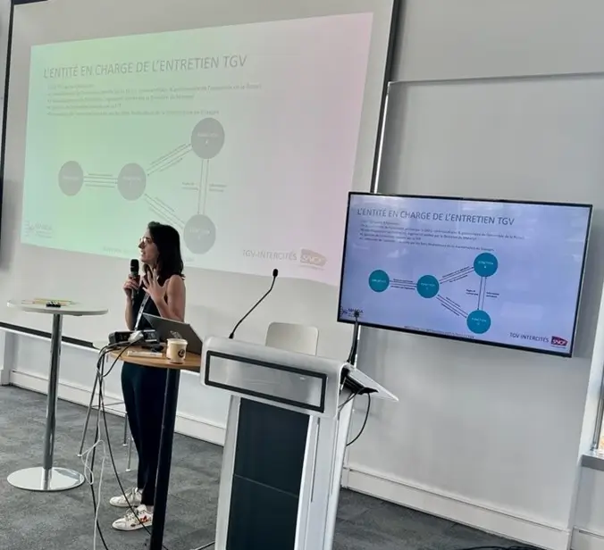

# Un PIP 7 estival

En juillet, notre 7ème PIP s’est déroulé sous le signe de l’été.

Merci à Eric Volay, Responsable du Département Coordination des Trafics à la DIGIT, pour son intervention. Grâce à lui, nous naviguons désormais avec plus de facilité dans l’écosystème des projets portés par la Direction de la digitalisation des métiers de l’exploitation.

Merci également à Chloé Dauxois, Design Authority du projet Mandalore à la DOI Maintenance de SNCF Voyageurs. Grâce à Chloé, nous avons découvert les enjeux de la maintenance des TGV… et nous avons compris à quel point le “m” du TGVm est synonyme de meilleur ! 
 
Rendez-vous fin septembre, après la trêve estivale, pour notre PI Planning numéro 8 !  

