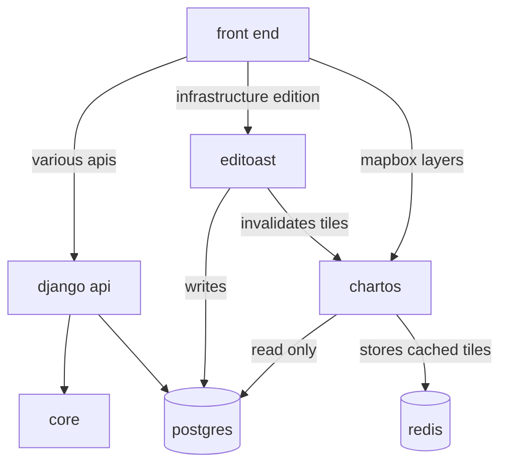

# Le front-end (`front`) {#front}

TODO

# Le service d'API django (`api`) {#api}

TODO

# Le service d'édition (`editoast`) {#editoast}

TODO

# Le service de cartographie (`chartos`) {#chartos}

TODO

# Le service de simulation et de pathfinding (`core`) {#core}

TODO