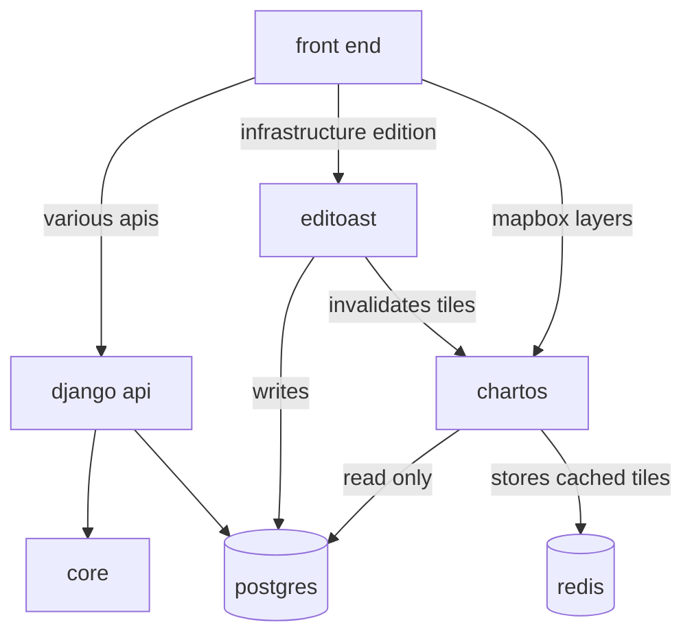

```mermaid
flowchart TD
    front[front end]

    django-api[django api]
    editoast[editoast]
    chartos[chartos]

    core[core]

    pg[(postgres)]
    redis[(redis)]

    front -- various apis--> django-api
    front -- infrastructure edition --> editoast
    front -- mapbox layers --> chartos

    django-api --> core

    django-api --> pg
    chartos -- read only --> pg
    chartos -- stores cached tiles --> redis
    editoast -- writes --> pg
    editoast -- invalidates tiles --> chartos

    click front href "./#front" _self
    click django-api href "./#django-api" _self
    click editoast href "./#editoast" _self
    click chartos href "./#chartos" _self
    click core href "./#core" _self
```
