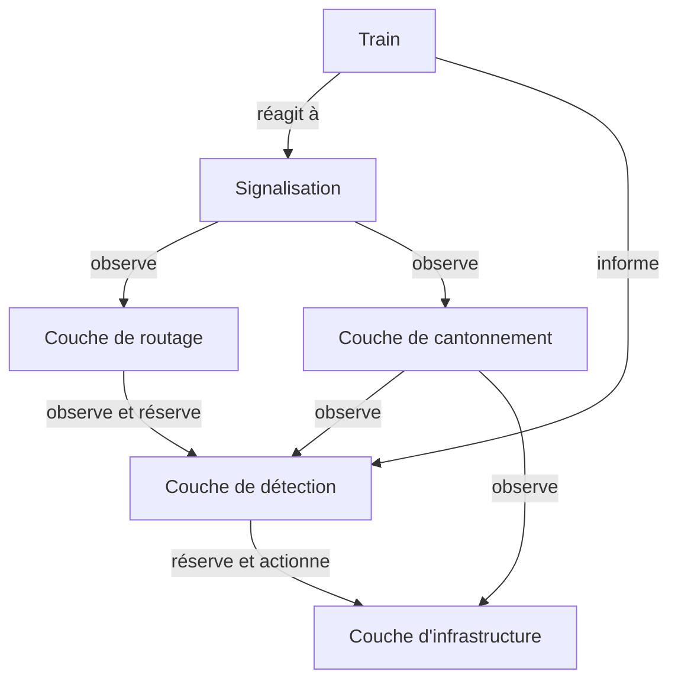
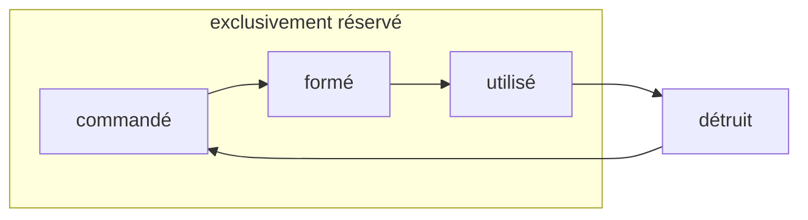

{}
Cette partie est en cours d'implémentation. Le code existant n'a pas encore cette structure.
{}

# Architecture



# Couche d'infrastructure {#infra}

Gère l'état des organes de commande (des aiguilles) et leur réservation

## État

Chaque organe de commande a une liste d'états possibles et mutuellement exclusifs

## Opérations possibles

 - lock / unlock une aiguille
 - bouger une anguille

# Couche de détection (TVDSections) {#detection}

Gère la localisation des trains sur les voies, et la réservation de zones

## État

```rust
struct ZoneState {
  reservation: ZoneReservationState,
  occupation: usize,
}

enum ZoneReservationState {
  Free,
  Reserved(config: ZoneConfig, count: usize),
}
```

## Opérations

 - Observer les changements d'état d'une zone
 - Réserver une configuration de zone
 - Relacher une réservation de zone
 - Occuper la zone
 - Libérer la zone

## Définition

Les zones (ou TVDSection / DetectionSection) sont des partitions physiques des voies:

 - capables de détecter la présence d'un train
 - qui fournissent un service de réservation à l'usage des routes

Chaque zone a un certain nombre de configurations différentes.
Par exemple, une zone sans aiguille aura deux configurations:

 - sens pair
 - sens impair

Une zone avec une aiguille aura 4 configurations:

 - sens pair voie principale
 - sens impair voie principale
 - sens pair voie déviation
 - sens impair voie déviation

**Chaque zone ne peut être réservée que pour une configuration donnée à la fois, mais peut être réservée simultanément par plusieurs routes**.
Une zone ne peut changer de configuration que lorsqu'elle n'est pas réservée.

L'enclanchement de transit est un enclanchement qui vise à empêcher le mouvement d'un appareil de voie lorsqu'un train est en approche.
Il concerne les organes de commandes des aiguilles.
un enclanchement est un système qui permet d'imposer des ordres de manoeuvre sur un système, soit imposer des interdictions

# Couche de routage (routes) {#routing}

Gère le cycle de vie des routes, qui réservent des zones lors de leur activation.

## État



 - **commandée**: dès que la route est en attente de formation
 - **formé**: quand le transit est lancé au travers de chacune des zones, et les appareils de voie sont dans la position attendue
 - **en cours d'utilisation**: dès que la tête du train rentre dans la première zone
 - **détruit**, l'état par défaut: dès que la queue du train a libéré la première zone.
   c'est important pour qu'on puisse re-réserver l'itinéraire sans attendre qu'ils soit entièrement parcouru par un premier train

## Opérations

 - **activer une route**: démarre un processus asynchrone qui ne se terminera que lorsque la route aura été réservée, puis qu'un train l'aura parcourue

## Comportement

 - Chaque route ne peut être en cours de formation qu'une seule fois

```python
async def activate(self):
    async with self.lock:
        self.switch_state(REQUESTED)
        # zone_sequence is a list of the zones of the route,
        # sorted by any absolute order to avoid deadlocks
        for zone, config in self.zone_sequence:
            await zone.reserve(config)
        self.switch_state(READY)
        first_zone = self.zones[0]
        await first_zone.wait_occupation_state(OCCUPIED)
        self.switch_state(USED)
        await first_zone.wait_occupation_state(FREE)
        self.switch_state(DESTROYED)
```

{}
certains postes d'aiguillages ont un enclanchement entre itinéraires de sens contraire (affrontement) qui empêche l'activation d'une route en menant à une zone avec un transit en sens contraire.
{}

# Couche de cantonnement {#spacing}

La couche de cantonnement gère des routes de signal à signal.
Elle permet à la signalisation d'observer l'état d'un groupe
de zones protégées par chaque signal, et de trouver le signal
suivant dans la chaîne.

Requirements:
 - chaque signal doit connaître le prochain signal compatible
 - chaque signal doit connaître les zones qu'il protège
 - compatibilité modules signalisation:
 pour chaque signal dans railjson, un choisit quel module doit l'importer
 une fois que tous les signaux sont importés, les modules doivent créer des routes de cantonnement entre signaux. Chaque route de cantonnement est associée à un système de signalisation
 - compatibilité pathfinding: Le pathfinding se fait dans le graphe des routes de mouvement, mais les déplacements sont contraints aux chemins qui sont permis par la couche de cantonnement

# Couche de signalisation {#signaling}

Réagit aux changements d'état de la signalisation

La couche de signalisation peut observer les changements d'état des routes et réagir en fonction.

# Questions en suspens

 - overlap
 - flank protection
 - opposing movement protection
