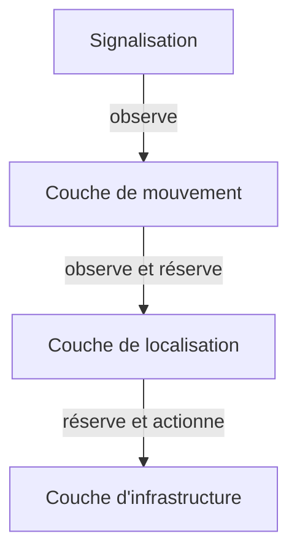

{}
Cette partie est en cours d'implémentation. Le code existant n'a pas encore cette structure.
{}

# Architecture

# Détails

## Couche d'infrastructure

Contient les organes de commandes des aiguilles, et s'occupe de gérer leur état.

## Couche de localisation (TVDSections)

Les zones (ou TVDSection / DetectionSection) sont des partitions physiques des voies:

 - capables de détecter la présence d'un train
 - qui fournissent un service de réservation à l'usage des routes

Chaque zone a un certain nombre de configurations différentes.
Par exemple, une zone sans aiguille aura deux configurations:

 - sens pair
 - sens impair

Une zone avec une aiguille aura 4 configurations:

 - sens pair voie principale
 - sens impair voie principale
 - sens pair voie déviation
 - sens impair voie déviation

Chaque zone ne peut être réservée que pour une configuration donnée à la fois, mais
peut être réservée simultanément par plusieurs routes. Une zone ne peut changer de
configuration que lorsqu'elle n'est pas réservée.

L'enclanchement de transit est un enclanchement qui vise à empêcher le mouvement d'un appareil de voie lorsqu'un train est en approche.
Il concerne les organes de commandes des aiguilles.
un enclanchement est un système qui permet d'imposer des ordres de manoeuvre sur un système, soit imposer des interdictions

## Couche de mouvement (routes)

 - commandée: dès que la route est en attente de formation
 - formé: quand le transit est lancé au travers de chacune des zones, et les appareils de voie sont dans la position attendue
 - en cours d'utilisation: dès que tête du train rentre dans la première zone
 - détruit, l'état par défaut: dès que la queue du train a libéré la première zone.
   c'est important pour qu'on puisse re-réserver l'itinéraire sans attendre qu'ils soit entièrement parcouru par un premier train

NOTE: certains postes d'aiguillages ont un enclanchement entre itinéraires de sens contraire (affrontement)
      qui empêche l'activation d'une route en menant à une zone avec un transit en sens contraire.

## Couche de signalisation

La couche de signalisation peut observer les changements d'état des routes et réagir en fonction.

# Questions en suspens

 - overlap
 - flank protection
 - opposing movement protection
 - routes composites
