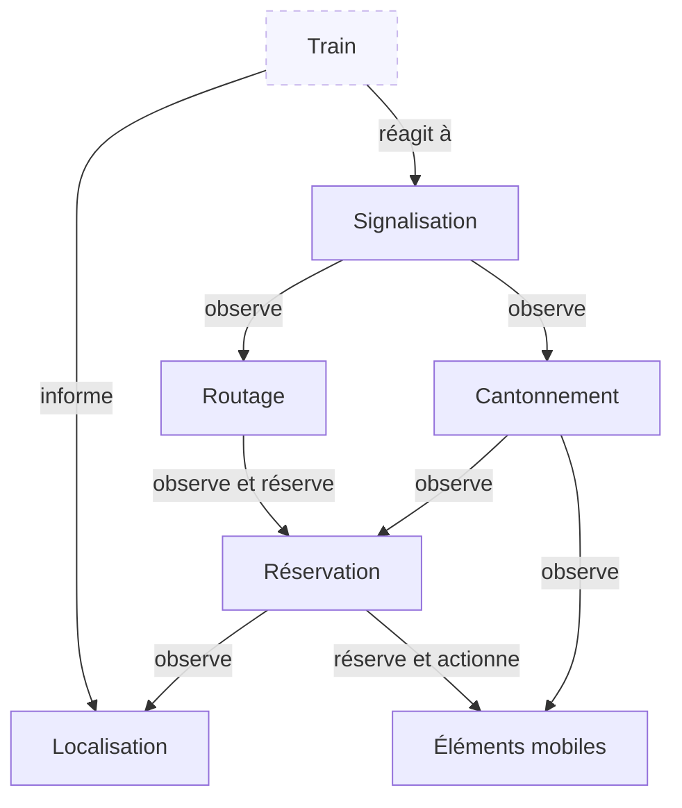

{}
Ce modèle n'est pas finalisé, et en attente d'implémentation
{}

## Architecture

```mermaid
flowchart TD
    %%%% NODES

    train[Train]
    style train opacity:50%,stroke-dasharray: 5 5
    %% ↓
    signaling[Signalisation]
    %% ↓
    routing[Routage]
    spacing["Cantonnement"]
    %% ↓
    reservation[Réservation]
    %% ↓
    location[Localisation]
    movable-elements["Éléments mobiles"]

    %%%% EDGES

    train -- réagit à --> signaling
    signaling -- observe --> routing
    signaling -- observe --> spacing
    spacing -- observe --> reservation
    spacing -- observe --> movable-elements
    routing -- observe et réserve --> reservation
    reservation -- observe --> location
    reservation -- réserve et actionne --> movable-elements
    train -- informe --> location

    %%%% CLICKABLE LINKS

    click signaling href "./signaling/" _self
    click routing href "./routing/" _self
    click spacing href "./spacing/" _self
    click reservation href "./reservation/" _self
    click location href "./location/" _self
    click movable-elements href "./movable-elements/" _self
```

## TODO

- overlaps
- opposing movement protection
