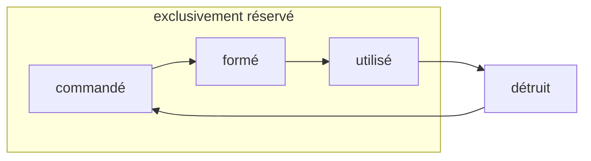

## Description

- les routes sont formées à la demande
- une route peut être re-formée alors qu'un train est déjà en train de la parcourir
- chaque route ne peut être en cours de formation qu'une seule fois, les autres processus de formation attendent

```python
async def activate(self):
    async with self.lock:
        self.switch_state(REQUESTED)
        # zone_sequence is a list of the zones of the route,
        # sorted by any absolute order to avoid deadlocks
        for zone, config in self.zone_sequence:
            await zone.reserve(config)
        self.switch_state(READY)
        first_zone = self.zones[0]
        await first_zone.wait_occupation_state(OCCUPIED)
        self.switch_state(USED)
        await first_zone.wait_occupation_state(FREE)
        self.switch_state(DESTROYED)
```

{}
certains postes d'aiguillages ont un enclanchement entre itinéraires de sens contraire (affrontement) qui empêche l'activation d'une route en menant à une zone avec un transit en sens contraire.
{}

## État



- **commandée**: dès que la route est en attente de formation
- **formé**: quand le transit est lancé au travers de chacune des zones, et les appareils de voie sont dans la position attendue
- **en cours d'utilisation**: dès que la tête du train rentre dans la première zone
- **détruit**, l'état par défaut: dès que la queue du train a libéré la première zone.
   c'est important pour qu'on puisse re-réserver l'itinéraire sans attendre qu'ils soit entièrement parcouru par un premier train

## Dépendances

- une liste d'élements mobiles
- liste des états possibles de chaque élément mobile

## Opérations

- **activer une route**: démarre un processus asynchrone qui ne se terminera que lorsque la route aura été réservée, puis qu'un train l'aura parcourue
