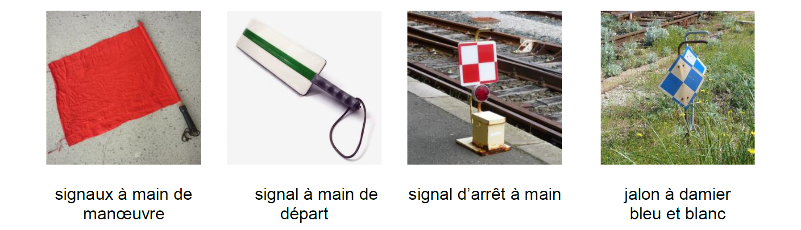
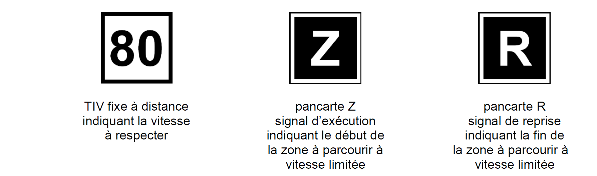
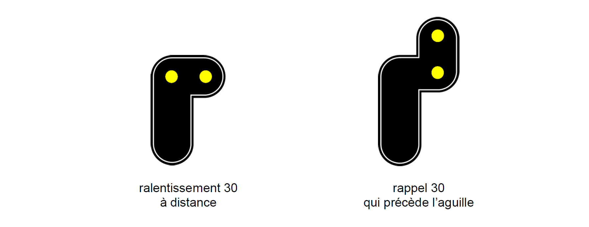
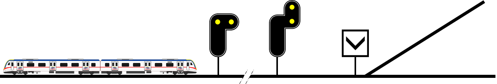

### Principe

Pour transmettre au conducteur des ordres et informations liées à la sécurité des circulations, il est fait usage de
signaux. Ces signaux peuvent indiquer des informations relatives aux limites de vitesse, peuvent servir à garantir
l'espacement des trains ou donner des indications diverses telles que l'accès à des voies de service, des ouvrages
d'art à gabarits réduit, etc.

### La signalisation à main

### La signalisation au sol

La signalisation au sol est normalement implantée à gauche ou au-dessus de la voie concernée.

#### Signaux de protection

Les signaux de protection sont destinés à interdire l’accès à un itinéraire, à une aiguille, à un PN, etc. Ils sont
généralement manœuvrés depuis des postes par des agents de SNCF Réseau.

#### Signaux de cantonnement

Les signaux de cantonnement sont destinés à assurer l’espacement des circulations de même sens.

Sur les sections de lignes équipées en [block automatique (BA)](../spacing/automatic_block_systems/), les signaux de
cantonnement **se ferment automatiquement** dès l’occupation du canton et restent fermés jusqu’à sa complète libération.

Sur les sections de lignes équipées en block manuel (BM), les signaux de cantonnement sont **manœuvrés depuis des postes
par des agents du service du GI chargé de la gestion des circulations**.

#### Signaux d’annonce d’arrêt

Le carré, le sémaphore et le feu rouge clignotant sont normalement **annoncés à distance** par un **avertissement** qui
peut lui-même être précédé, en signalisation lumineuse, par un feu jaune clignotant.

Toutefois, les signaux qui ne peuvent être abordés qu’en marche à vue ou en marche en manœuvre ne sont normalement pas
annoncés (par exemple, le guidon d’arrêt). Il en est de même des signaux situés sur voie principale à la sortie des
gares en impasse.

#### Signaux d’indication de marche

Le feu vert indique au conducteur que la circulation en marche normale est autorisée, s’y rien ne s’y oppose.

Sur les sections de ligne où la vitesse des trains est supérieure à 160 km/h, un **feu vert clignotant** précède
généralement l’avertissement ou le feu jaune clignotant.

#### Signaux de limitation de vitesse

Ils limitent à un taux déterminé la vitesse des trains sur une partie de voie ou au franchissement de certains points
particuliers (aiguille, traversée de gare, etc.).

##### Les limitations permanentes de vitesse (en complément de celles pouvant figurer dans les RT)

- Sur des parties de voie par tableau indicateur de vitesse (TIV) ordinaire
  

- Au franchissement de certains points particuliers (exemple des aiguilles)

  - Ralentissement à 30 km/h en signalisation lumineuse
  
  

  

  - Ralentissement à 60 km/h en signalisation lumineuse
  
  

  - TIV mobiles
  
  
  Ces tableaux peuvent être lumineux ou mécaniques ; lorsqu’ils sont ouverts ils présentent une bande verticale blanche continue.

  Si cela est nécessaire, l’emplacement de l’aiguille (ou de la première aiguille dans le cas d’aiguilles successives) est repéré par un chevron pointe en bas.
  
  

  

##### Les limitations temporaires de vitesse

