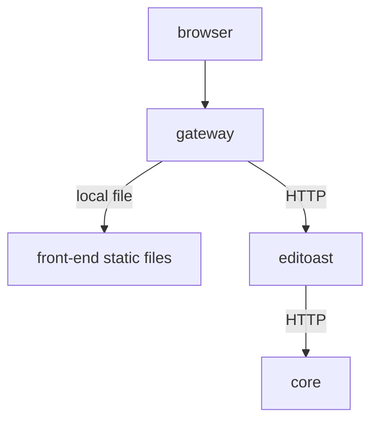

There are 3 main containers deployed in a standard OSRD setup:
 - **Gateway** _(includes the frontend)_: Serves the front end, handles authentication and proxies requests to the backend.
 - **Editoast**: Acts as the backend that interacts with the front end.
 - **Core**: Handles computation and business logic, called by Editoast.

## Standard deployment

The standard deployment can be represented with the following diagram.

External requests are received by the gateway. If the path asked starts with `/api` it will be forwarded using HTTP to editoast, otherwise it will serve a file with the asked path. Editoast reach the core using HTTP if required.

The gateway is not only a reverse proxy with the front-end bundle included, it also provides all the authentication mechanisms: using OIDC or tokens.