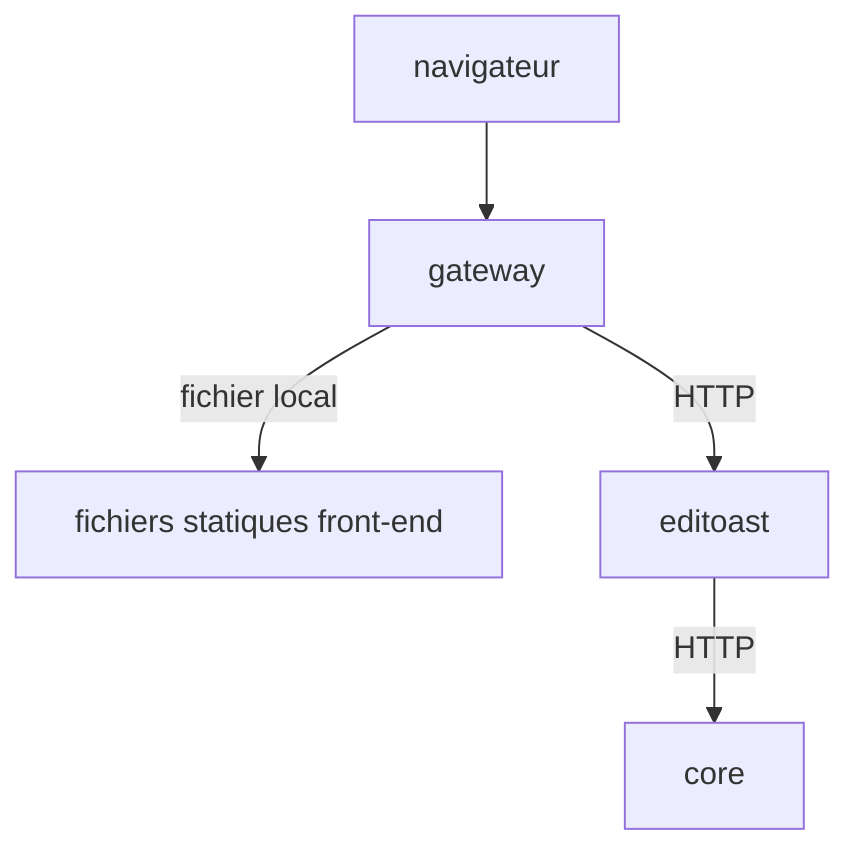

Il y a 3 principaux conteneurs déployés dans une configuration OSRD standard :
 - **Gateway** _(inclut le frontend)_ : Sert le front-end, gère l'authentification et proxy les requêtes vers le backend.
 - **Editoast** : Agit comme le backend qui interagit avec le front-end.
 - **Core** : Gère les calculs et la logique métier, appelé par Editoast.

## Déploiement standard

Le déploiement standard peut être représenté par le diagramme suivant.

Les requêtes externes sont reçues par le gateway. Si le chemin demandé commence par `/api`, il sera transféré en utilisant HTTP vers editoast, sinon il servira un fichier avec le chemin demandé. Editoast atteint le core en utilisant HTTP si nécessaire.

Le gateway n'est pas seulement un proxy inverse avec le bundle front-end inclus, il fournit également tous les mécanismes d'authentification : utilisant OIDC ou des tokens.
