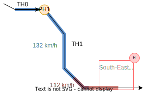

### Introduction

This page gives an example of how the data formats are used to describe an infrastructure in **OSRD**.

For this purpose, let's take as an example the following toy infrastructure:

{}
To zoom in on diagrams, click on the edit button that appears when hovering over it.
{}

This diagram is an overview of the infrastructure with lines and stations only.

This infrastructure is not meant to be realistic, but rather meant to help illustrate OSRD's data model.
This example will be created step by step and explained along the way.

#### The infrastructure generator

In the [*OSRD* repository](https://github.com/osrd-project/osrd) is a [python library](https://github.com/osrd-project/osrd/tree/dev/python/railjson_generator) designed to help generate infrastructures in a format understood by *OSRD*.

The infrastructure discussed in this section can be generated thanks to [small_infra.py](https://github.com/osrd-project/osrd/blob/dev/python/railjson_generator/railjson_generator/scripts/examples/small_infra.py) file. To learn more about the generation scripts, you can check out the related [README](https://github.com/osrd-project/osrd/blob/dev/python/railjson_generator/README.md).

### Tracks

#### Track sections

The first objects we need to define are `TrackSections`. Most other objects are positioned relative to track sections.

A track section is a section of rail (switches not included). One can chose to divide the tracks of their infrastructure in as many track sections as they like. Here we chose to use the longest track sections possible, which means that between two switches there is always a single track section.

Track sections is what simulated trains roll onto. They are the abstract equivalent to physical rail sections. Track sections are bidirectional.

In this example, we define two tracks for the line between the West and North-East stations. We also have overpassing tracks at the North and Mid-West stations for added realism. Finally, we have three separate tracks in the West station, since it's a major hub in our imaginary infrastructure.

{}
`TrackSections` are represented as arrows in this diagram to stress the fact that they have a **start** and an **end**. It matters as objects positioned on track sections are located using their distance from the **start** of their track section.

Therefore, to locate an object at the beginning of its track section, set its offset to 0. To move it to the end of its track section, set its offset to the `length` of the track section.
{}

These attributes are required for the track section to be complete:

* `length`: the length of the track section in meters.
* `geo`: the coordinates in real life (geo is for geographic), in the [GeoJSON](https://en.wikipedia.org/wiki/GeoJSON) format.
* `sch`: the coordinates in the schematic view (sch for schematic), also in [GeoJSON](https://en.wikipedia.org/wiki/GeoJSON) format.
* cosmetic attributes: `line_name`, `track_name`, `track_number` which are used to indicate the name and labels that were given to the tracks / lines in real life.

For all track sections in our infrastructure, the `geo` and `sch` attributes are identical, and very much resemble the given diagram.

For most track sections, their `length` is proportional to what can be seen in the diagram. To preserve readability, exceptions were made for *TA6*, *TA7*, *TD0* and *TD1* (which are 10km and 25km).

#### Track Section Links

At the moment we only created track sections, which are not connected to each other (geospacial data is not used to deduce which tracks connect).

`TrackSectionLinks` are used to connect two track sections together, just like a weld joint would in real life. In an OSRD simulation, a train can go from one track section to another only if they are connected by a `TrackSectionLink` (or by a `Switch`).

To connect more than two `TrackSections` together, use the [`Switches`](#switches).

In our infrastructure, since we chose to have our track sections as long as possible, we do not actually need to use `TrackSectionLinks`.
`TrackSectionLinks` are always optional: two track sections connected by a link behave just like a single track section.

#### Switches

A `Switch` represents just what you would expect: railway switches.

Switches can be thought of as a collections of track section links, partitioned into groups. Each group represents for a switch state. Switching group can take time, and at most one link can be ready to use at a time.

In the real world, switches are not unique, but rather instances of existing models.
Thus, links and groups are not part of the switch itself, but in a `SwitchType` object, which is shared by switches of the same model.

##### Switch Types

`SwitchTypes` have two mandatory attributes:

* `ports`: A list of port names. A port is an endpoint which can be connected to a track section.
* `groups`: A mapping from group names to lists of links between two ports.

At any time, all switches have an active group, and may have an active link, which always belongs to the active group. If there is an active link, it is active in a given direction. During a simulation, changing active link inside a group is instantaneous, but changing active link across groups takes configurable time.
This is because a switch is a physical object, and changing active link can involve moving parts of it. `Groups` are designed to represent the different positions that a switch can have. Each `group` contains the links that can be used in the associated switch position.

The duration needed to change group is stored inside the `Switch`, since it can vary depending on the physical implementation of the switch.

Our examples currently use three switch types. Switch types are just like other objects, and can easily be added as needed.

**1) The Point Switch**

The ubiquitous Y switch, which can be thought of as either two tracks merging, or one track splitting.

This switch type has three ports: *base*, *left* and *right*.

There are two groups, each with one connection in their list: `LEFT`, which connects *base* to *left*, and `RIGHT` which connects *base* to *right*.

Thus, at any given moment, a train can go from *base* to *left* or from *base* to *right* but never to both at the same time. A train cannot go from *left* to *right*.

A Point Switch only has two positions:

**2) The Cross Switch**

This is simply two tracks crossing each other.

This type has four ports: *north*, *south*, *east* and *west*.

It has only one group containing two connections: *north* to *south* and *west* to *east*. Indeed this kind of switch is *passive*: it has no moving parts. Despite having a single group, it is still used by the simulation to enforce route reservations.

Here are the two different connections that this switch type has:

**3) The Double cross switch**

This one is more like two point switches back to back. It has four ports: *south1*, *south2*, *north1* and *north2*.

However, it has four groups, each with one connection. The four groups are represented in the following diagram:

##### Back to switches

A `Switch` has three attributes:

* `switch_type`: the [`SwitchType`](#switch-types) identifier for this switch.
* `ports`: a mapping from port names to track sections extremities.
* `group_change_delay`: the time it takes to change which group of the switch is activated.

The port names must match the ports of the switch type chosen. The track section endpoints can be start or end, be careful to chose the appropriate ones.

Most of our example's switches are regular point switches. The path from North station to South station has two cross switches, and there is a double cross switch right before the main line splits into the North-East and South-East lines.

#### Curves and slopes

`Curves` and `Slopes` are instrumental to realistic simulations. These objects are defined as a range between a `begin` and `end` offsets of one track section. If a curve / slope spans more than one track section, it has to be added to all of them.

The slope / curve values are constant on their entire range. For varying curves / slopes, one needs to create several objects.

Slope values are measured in *meters per kilometers*, and the curve values are measured in *meters* (the radius of the curve).

{}
Mind that the `begin` value should always be smaller than the `end` value. That is why the curve / slope values can be negative: an uphill slope of 1 going from offset 10 to 0 is the same as a downhill slope of -1 going from offsets 0 to 10.
{}

In the [small_infra.py](https://github.com/osrd-project/osrd/blob/dev/core/examples/generated/scripts/small_infra.py) file, we have slopes on the track sections *TA6*, *TA7*, *TD0* and *TD1*.

There are curves as well, on the track sections *TE0*, *TE1*, *TE3* and *TF1*.

### Interlocking

All objects so far contributed to track topology (shape). Topology would be enough for trains to navigate the network, but not enough to do so safely. to ensure safety, two systems collaborate:

* Interlocking ensures trains are allowed to move forward
* Signaling is the mean by which interlocking communicates with the train

#### Detectors

These objects are used to create [TVD](https://ressources.data.sncf.com/explore/dataset/lexique-des-acronymes-sncf/table/?sort=abreviation&q=TVD) sections (Track Vacancy Detection section): the track area in between detectors is a TVD section. When a train runs into a detector, the section it is entering becomes occupied. The only function of TVD sections is to locate trains.

In real life, detectors can be [axle counters](https://en.wikipedia.org/wiki/Axle_counter) or [track circuits](https://en.wikipedia.org/wiki/Track_circuit) for example.

For this mean of location to be efficient, detectors need to be placed regularly along your tracks, not too many because of cost, but not too few, because then TVD sections would be very large and trains would need to be very far apart to be told apart, which reduces capacity.

There often are detectors close to all sides of switches. This way, interlocking is made aware pretty much immediately when a switch is cleared, which is then free to be used again.

{}
Let's take a cross switch as an example: if train A is crossing it *north* to *south* and train B is coming to cross *west* to *east*, then as soon as train A's last car has passed the crossing, B should be able to go, since A is now on a completely unrelated track section.
{}

In *OSRD*, detectors are point objects, so all the attributes it needs are its `id`, and track location (`track` and `offset`).

{}
The clumped up squares represent many detectors at once. Indeed, because some track sections are not represented with their full length, we could not represent all the detectors on the corresponding track section.
{}

Some notes:

* Between some points, we added only one detector (and not two), because they were really close together, and it would have made no sense to create a tiny TVDS between the two. This situation happened on track sections (*TA3*, *TA4*, *TA5*, *TF0* and *TG3*).
* In our infrastructure, there is relatively few track sections which are long enough to require more detectors than just those related to switches. Namely, *TA6*, *TA7*, *TDO*, *TD1*, *TF1*, *TG1* and *TH1*. For example  *TD0*, which measures 25km, has in fact 17 detectors in total.

#### Buffer stops

`BufferStops` are obstacles designed to prevent trains from sliding off dead ends.

In our infrastructure, there is a buffer stop on each track section which has a loose end. There are therefore 8 buffer stops in total.

Together with detectors, they set the boundaries of TVD sections (see [Detectors](#detectors))

#### Routes

A `Route` is an itinerary in the infrastructure. A train path is a sequence of routes. Routes are used to reserve section of path with the interlocking. See the [dedicated documentation](/fr/developers/internals/simulation-model/).

It is represented with the following attributes:

* `entry_point` and `exit_point`: references detectors or buffer stops which mark the beginning and the end of the Route.
* `entry_point_direction` : Direction on a track section to start the route from the `entry_point`.
* `switches_direction` : A set of directions to follow when we encounter a switch on our Route, to build this Route from `entry_point` to `exit_point`.
* `release_detectors`: When a train clears a release detector, resources reserved from the beginning of the route until this detector are released.

### Signaling

Thanks to interlocking, trains are located and allowed to move. It's a good start, but meaningless until trains are made aware of it. This is where `Signal`s come into play: signals react to interlocking, and can be seen by trains.

How trains react to signals depends on the aspect, kind of signal, and signaling system.

Here are the most important attributes for signals:

* `linked_detector`: The linked [detector](#detectors).
* `type_code`: The type of signal.
* `direction`: The direction it protects, which can simply be interpreted as the way in which it can be seen by an incoming train (since there are lights only on one side...). Direction is relative to track section orientation.
* Cosmetic attributes like `angle_geo` or `side` which control the way in which the signals are displayed in the front-end.

Here is a visualization of how one can represent a signal, and which direction it protects.

 

The way the signals are arranged is highly dependent on both signaling system and infrastructure manager.

Here are the basic rules used for this example infrastructure:

* We add two spacing signals (one per direction) for each detector that is cutting a long TVD section into smaller ones.
* Switch entries where a train might have to stop are protected by a signal (which is located outside of the switch TVD section). It must be visible from the direction used to approach the switch. When there are multiple switches in a row, only the first one usually needs protection, as interlocking is usually designed as not to encourage trains stopping in the middle of intersections.

Note that detectors linked to at least one signal are not represented, as there are not signals without associated detectors in this example.
To get the `id` of a detector linked to a signal, take the signal's `id` and replace *S* by *D* (e.g. SA0 -> DA0).

{}
On *TA6*, *TA7*, *TD0* and *TD1* we could not represent all signals because these track sections are very long and have many detectors, hence many signals.
{}

### Electrification

To allow electric trains to run on our infrastructure, we need to specify which parts of the infrastructure is electrified.

#### Catenaries

`Catenaries` are objects that represent the overhead wires that power electric trains. They are represented with the following attributes: 
* `voltage`: A string representing the type of power supply used for electrification
* `track_ranges`: A list of range of track sections (`TrackRanges`) covered by this catenary. A `TrackRange` is composed of a track section id, a `begin` offset and an `end` offset.

In our example infrastructure, we have two `Catenaries`:
* One with `voltage` set to `"1500"`, which covers only *TA0*.
* One with `voltage` set to `"25000"`, which covers all others except *TD1*.

This means that only thermal trains can cross the *TD1* track section.

Our example also outlines that, unlike its real life counterpart, a single `Catenary` may cover the whole infrastructure.

#### Neutral Sections

In some parts of an infrastructure, the train drivers may be instructed - mainly for safety reasons - to cut the power supply to the train. 

To represent such parts, we use `NeutralSections`. They are represented mainly with the following attributes:

* `track_ranges`: A list of `DirectedTrackRanges` (track ranges associated to a direction) which are covered by this neutral section.
* `lower_pantograph`: A boolean indicating whether the train's pantograph should be lowered while in this section.

In our example infrastructure, we have three `NeutralSections`: one at the junction of the `"1500"` and `"25000"` catenaries, one on *TA6* and one on *TG1* and *TG4*.

For more details about the model see the [dedicated page](../neutral_sections).

### Miscellaneous

#### Operational points

`OperationalPoints` are collections of points (`OperationalPointParts`) of interest.

For example, it may be convenient to store the location of platforms as parts and group them by station in operational points.

In the example infrastructure, we only used operational points to represent stations. Operational point parts are displayed as purple diamonds. Keep in mind a single operational point may contain multiple parts.

#### Loading Gauge Limits

These objects are akin to `Slopes` and `Curves`: it covers a range of track section, with a `begin` and an `end` offset. It represents a restriction on the trains that can travel on the given range, by weight or by train type (freight or passenger).

We did not put any in our examples.

#### Speed Sections

The `SpeedSections` represent speed limits (in meters per second) that are applied on some parts of the tracks. One `SpeedSection` can span on several track sections, and do not necessarily cover the whole track sections. Speed sections can overlap.

In our example infrastructure, we have a speed section covering the whole infrastructure, limiting the speed to 300 km/h. On a smaller part of the infrastructure, we applied more restrictive speed sections.

