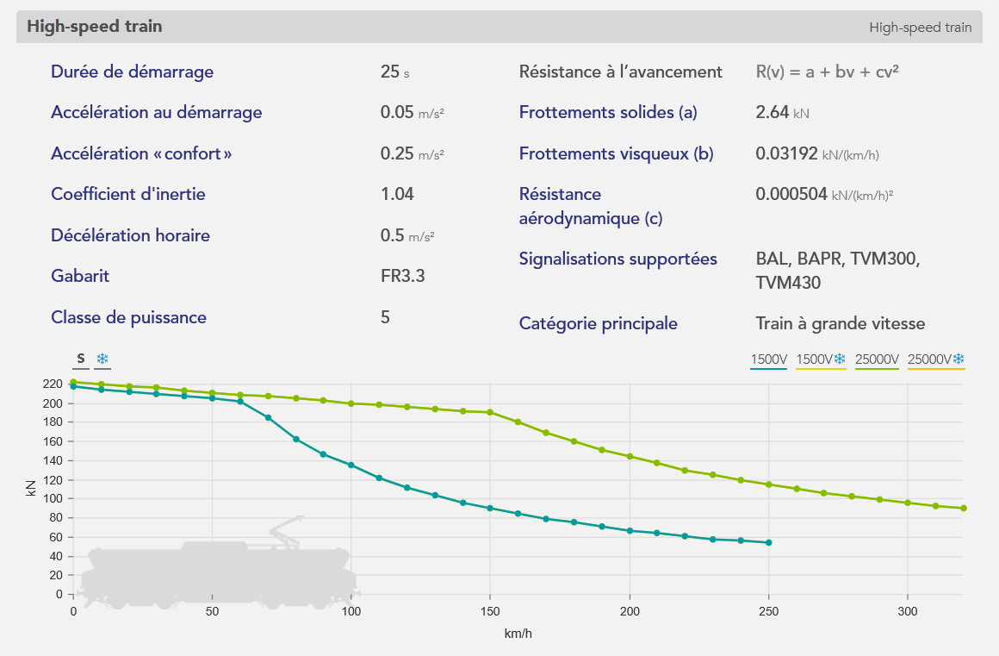

Les catégories sont des regroupements de matériel roulant, soit par leurs caractéristiques, leurs performances ou par la nature des dessertes pour lesquelles ils ont été conçus ou sont utilisés.

Un même matériel roulant peut être utilisé pour différents types de circulation, et de desserte. Ce caractère versatile est contenu dans les attributs :
- `primary_category` (requis) indique l'utilisation principale d'un matériel roulant
- `other_categories` (optionnel) indique les autres utilisations d'un matériel roulant

La catégorie principale d'un matériel roulant permet plusieurs fonctionnalités, comme le filtrage, un affichage différencié sur les graphiques ou réticulaire, et plus globalement, d'agréger des matériels roulants. 

#### Catégories de matériels roulants

Les différentes catégories de matériel roulant disponibles par défaut sont les suivantes :

- `Train à grande vitesse` (voir [High-speed train](https://fr.wikipedia.org/wiki/Train_%C3%A0_grande_vitesse))
- `Train interurbain` (voir [Intercity train](https://fr.wikipedia.org/wiki/InterCity))
- `Train régional` (voir [Regional train](https://en.wikipedia.org/wiki/Regional_rail))
- `Train suburbain` (voir [Commuter train](https://fr.wikipedia.org/wiki/Train_de_banlieue))
- `Train de fret` (voir [Freight train](https://fr.wikipedia.org/wiki/Train_de_fret))
- `Train de fret rapide` (pareil que Train de fret, mais avec un code de composition différent, `ME140` au lieu de `MA100` par exemple)
- `Train de nuit` (voir [Night train](https://fr.wikipedia.org/wiki/Train_de_nuit))
- `Tram-train` (voir [Tram-train](https://fr.wikipedia.org/wiki/Tram-train))
- `Train touristique` (voir [Touristic train](https://fr.wikipedia.org/wiki/Chemin_de_fer_touristique))
- `Train de travaux` (voir [Work train](https://fr.wikipedia.org/wiki/Train_de_travaux))

Il est aussi prévu que, plus tard, un utilisateur puisse créer directement de nouvelles catégories de matériel roulant.

### Matériels roulants réalistes open data

Afin de rendre l’application plus accessible aux utilisateurs en dehors de l’industrie ferroviaire, tels que des contributeurs externes et des laboratoires de recherche, et de préparer la sortie de la version publique "bac à sable" d'OSRD, plusieurs matériels roulants créés avec des données fictives sont disponibles pour tous les utilisateurs.

Ces matériels roulants ont été conçus pour couvrir la majorité des scénarios de simulation que les utilisateurs pourraient rencontrer.

Ces matériels roulants ne sont pas des matériels roulants existant réellement en raison de la confidentialité des données, mais ils s’en inspirent pour garantir le réalisme des simulations.

Ces matériels roulants sont fournis sous forme de [fichiers JSON](https://github.com/OpenRailAssociation/osrd/tree/dev/tests/data/rolling_stocks). Nous avons créé un matériel roulant représentatif de chaque catégorie présentée ci-dessus.

Les caractéristiques de ces matériels roulants ont été calculées à partir des valeurs moyennes des matériels roulants réels de chaque catégorie. De plus, la plupart de ces modèles ont été conçus pour être compatibles avec divers réseaux : ils sont principalement bi-modes (supportant plusieurs tensions et courants d'alimentation), ce qui n’est pas toujours le cas des matériels roulants réels.

Un exemple de matériel roulant, un **train à grande vitesse**, est représenté ci-dessous, depuis l'éditeur de matériel roulant de l'application :



#### Open data

Puisque ces matériels roulants sont fictifs (mais réalistes), ils peuvent être librement utilisés dans des projets en dehors d’OSRD.

Pour y avoir accès et les utiliser dans l'application :

- **Depuis l'application open-source "bac à sable" :** Les matériels roulants sont disponibles par défaut.

- **Depuis une application lancée localement :** Utilisez la commande associée dans le [README](https://github.com/OpenRailAssociation/osrd/blob/dev/README.md) pour importer les matériels roulants de test dans votre base de données.

```sh
./scripts/load-railjson-rolling-stock.sh tests/data/rolling_stocks/realistic/*.json
```

