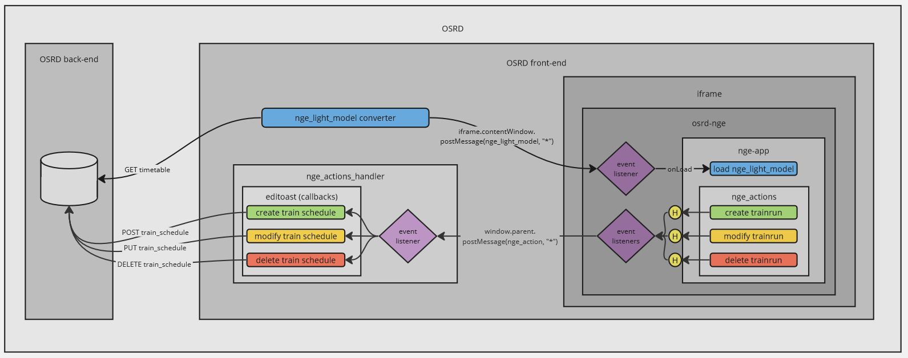
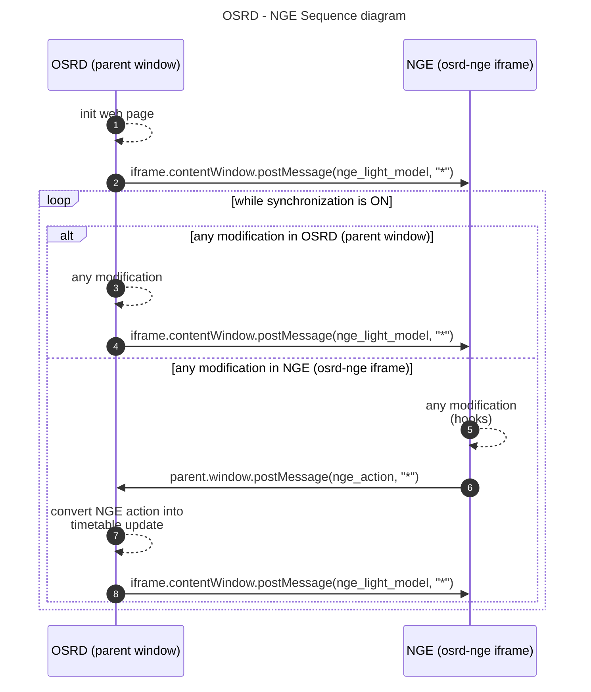
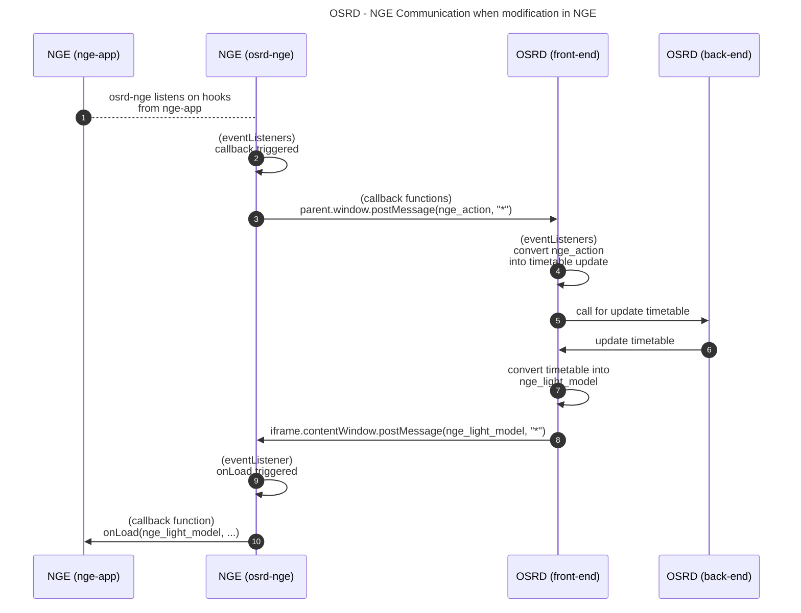

Netzgrafik-Editor (NGE) is an open-source software that enables the creation, modification, and analysis of regular-interval timetable, at a macroscopic level of details, developped by [Swiss Federal Railways (SBB CFF FFS)](https://www.sbb.ch/). See [front-end](https://github.com/SchweizerischeBundesbahnen/netzgrafik-editor-frontend) and [back-end](https://github.com/SchweizerischeBundesbahnen/netzgrafik-editor-backend) repositories.

OSRD (microscopic level of detail, trains scheduled once, based on a defined infrastructure, depicts a timetable) and NGE (macroscopic level of detail, regular-interval based train runs, no infrastructure, depicts a transportation plan) are semantically different, but close enough to make it work together.
The compatibility between NGE and OSRD has been tested through by a proof of concept, by running both pieces of software as separate services and without automated synchronization.

The idea is to give to OSRD a graphical tool to edit (create, update and delete train schedules from) a timetable from a operational study scenario, and get some insights on analytics at the same time. The second benefit of using both microscopic and macroscopic level of detail is that OSRD microscopic calculations can be propagated in NGE to enhance the level of detail of it.

The transversal objective of this feature is to make 2 open-source projects from 2 big infrastructure managers work along and cooperate with one another with the same goals.

#### 1 - Integration in OSRD

Therefore, NGE is integrated in the operational studies section of OSRD, in an [`iframe`](https://developer.mozilla.org/fr/docs/Web/HTML/Element/iframe). An alternative way to deal with the integration would have been to refactor NGE as [`web-components`](https://developer.mozilla.org/fr/docs/Web/API/Web_components), thus easy to import in OSRD, but this solution has been abandonned, because of the quantity of refactor that would have been needed. This `iframe` points to `osrd-nge`, a minimalist Angular app that embed the actual NGE app. It can also be seen as a wrapper of the actual NGE app. `osrd-nge` then customizes the actual NGE app with specific parameters and functionnalities:
- a `standalone` flag:
  - to tell NGE to disable all back-end interactions (no database on NGE side)
  - to tell NGE to disable some UI components (authentication, project managment, versionning system view, etc...)
- implementation of a communication interface between OSRD and NGE ([`message_event`](https://developer.mozilla.org/fr/docs/Web/API/Window/message_event), [`eventListener`](https://developer.mozilla.org/fr/docs/Web/API/EventTarget/addEventListener) and [`postMessage`](https://developer.mozilla.org/fr/docs/Web/API/Window/postMessage)).

NGE is then able to get the OSRD timetable as soon as a change is made on OSRD side, and OSRD is able to get the changes made on NGE side.

The following diagrams shows the workflow between the components.

Since OSRD is the only source of truth (= data source), NGE has to be updated as very last action, to be aligned with the timetable current state, and to get the updated microscopic calculations from OSRD.

More precisely, when a change is made in NGE:

#### 2 - Converters

To overpass the semantic differences and make the data models fit, 2 converters have to be implemented:
- **[OSRD -> NGE]** a converter that tranforms an OSRD timetable into an NGE model
- **[OSRD <- NGE]** an event handler, that transforms NGE action into OSRD database update on timetable

#### 3 - Open-source (cooperation / contribution)

To make NGE compatible with OSRD, some changes have been requested (disable back-end, create hooks on events) and directly implemented in the [official repository of NGE](https://github.com/SchweizerischeBundesbahnen/netzgrafik-editor-frontend), with the agreement and help of NGE team.

Contributions for one project to another, from both sides, are valuable and will be entertained in the future.

This feature also shows that open-source cooperation is powerful and a huge gain of time in software development.