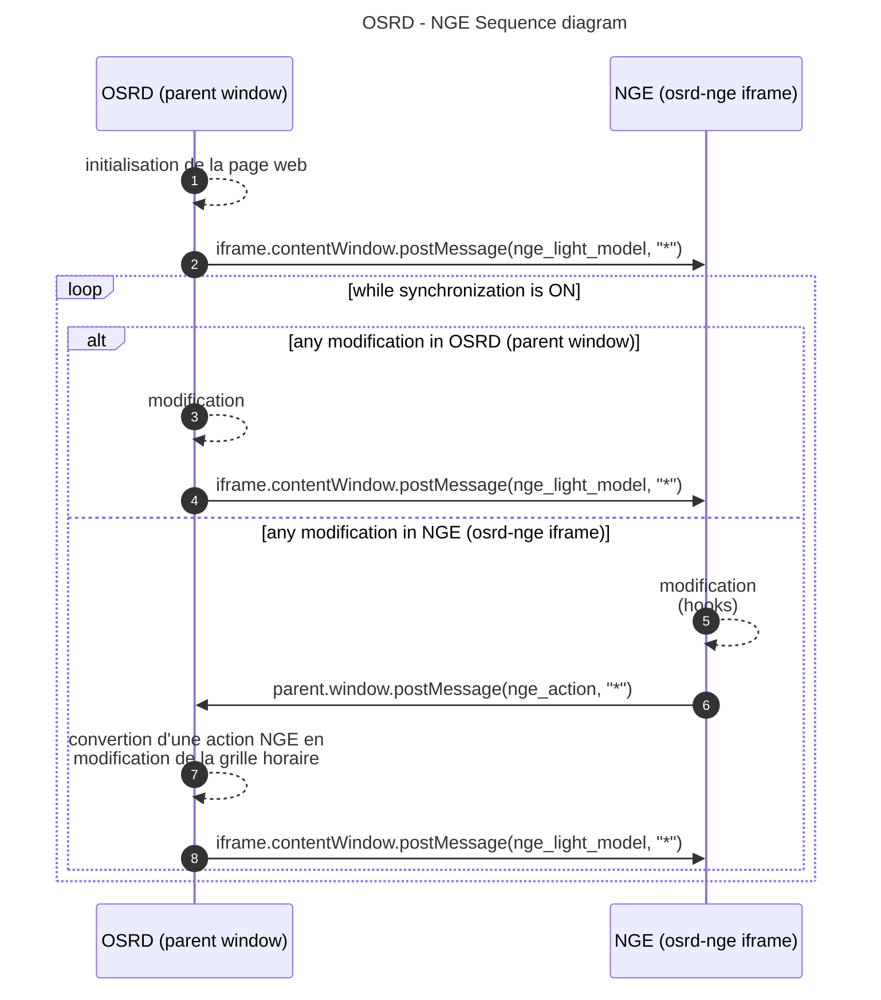
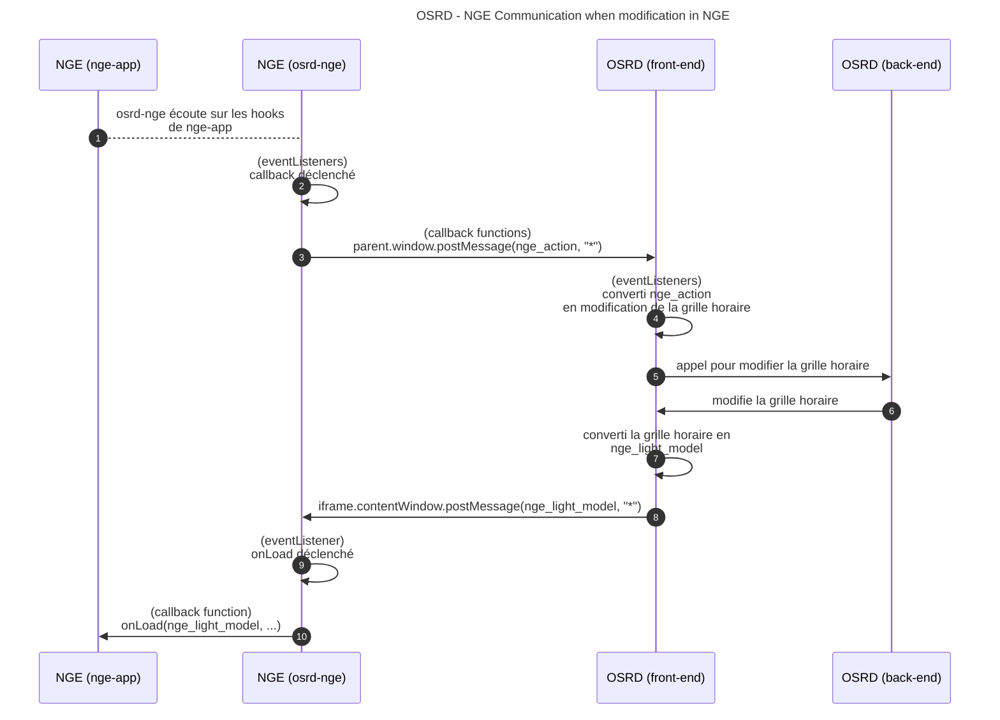

Netzgrafik-Editor (NGE) est un logiciel open-source qui permet la création, la modification et l'analyse d'horaires à intervalles réguliers, à un niveau de détail macroscopique, développé par les Chemins de Fer Fédéraux suisses (SBB CFF FFS). Voir les dépôts [front-end](https://github.com/SchweizerischeBundesbahnen/netzgrafik-editor-frontend) et [back-end](https://github.com/SchweizerischeBundesbahnen/netzgrafik-editor-backend)

OSRD (niveau de détail microscopique, trains à occurence unique, basé sur une infrastructure définie, représente une grille horaire) et NGE (niveau de détail macroscopique, courses de trains à intervalles réguliers, sans infrastructure, représente un plan de transport) sont sémantiquement différents, mais suffisamment proches pour fonctionner ensemble.
La compatibilité entre NGE et OSRD a été testée à travers une preuve de concept, en exécutant les deux logiciels comme services distincts sans synchronisation automatisée.

L'idée est de fournir à OSRD un outil graphique pour éditer (créer, mettre à jour et supprimer les horaires des trains) un horaire à partir d'un scénario d'étude opérationnelle, et obtenir en même temps des informations analytiques. Le deuxième avantage de l'utilisation des niveaux de détail microscopique et macroscopique est que les calculs microscopiques d'OSRD peuvent être propagés dans NGE pour améliorer son niveau de détail.

L'objectif transversal de cette fonctionnalité est de faire collaborer deux projets open-source de deux grands gestionnaires d'infrastructure pour atteindre des objectifs communs.

#### 1 - Intégration dans OSRD

Ainsi, NGE est intégré dans la section des études opérationnelles d'OSRD, dans un [`iframe`](https://developer.mozilla.org/fr/docs/Web/HTML/Element/iframe). Cet `iframe` pointe vers `osrd-nge`, une application Angular minimaliste qui intègre l'application NGE réelle. Il peut également être vu comme un conteneur de l'application NGE réelle. `osrd-nge` personnalise ensuite l'application NGE réelle avec des paramètres et des fonctionnalités spécifiques :

- un drapeau `standalone` :
  - pour indiquer à NGE de désactiver toutes les interactions back-end (pas de base de données côté NGE)
  - pour indiquer à NGE de désactiver certains composants de l'interface utilisateur (authentification, gestion de projet, vue du système de versionnage, etc...)
- implémentation d'une interface de communication entre OSRD et NGE ([`eventListener`](https://developer.mozilla.org/fr/docs/Web/API/EventTarget/addEventListener) and [`postMessage`](https://developer.mozilla.org/fr/docs/Web/API/Window/postMessage)).

NGE est alors capable d'obtenir la grille horaire OSRD dès qu'un changement est effectué du côté d'OSRD, et OSRD est capable d'obtenir les modifications effectuées du côté de NGE.

Les diagrammes suivants montrent workflow entre les composants.

Étant donné qu'OSRD est la seule source de vérité (= source de données), NGE doit être mis à jour en dernière action, pour être aligné avec l'état actuel de la grille horaire et obtenir les calculs microscopiques mis à jour d'OSRD.

Plus précisément, lorsqu'un changement est effectué dans NGE :

#### 2 - Convertisseurs

Pour surpasser les différences sémantiques et adapter les modèles de données, deux convertisseurs doivent être implémentés :
- **[OSRD -> NGE]** un convertisseur qui transforme une grille horaire OSRD en un modèle NGE
- **[OSRD <- NGE]** un gestionnaire d'événements, qui transforme une action NGE en mise à jour de la base de données OSRD sur la grille horaire

#### 3 - Open-source (coopération / contribution)

Pour rendre NGE compatible avec OSRD, certaines modifications ont été demandées (désactivation du back-end, création de hooks sur les événements) et directement implémentées dans le [répertoire officiel de NGE](https://github.com/SchweizerischeBundesbahnen/netzgrafik-editor-frontend), avec l'accord et l'aide de l'équipe NGE.

Les contributions d'un projet à l'autre, de part et d'autre, sont précieuses et seront encouragées à l'avenir.

Cette fonctionnalité montre également que la coopération open-source est puissante et constitue un gain de temps considérable dans le développement de logiciels.