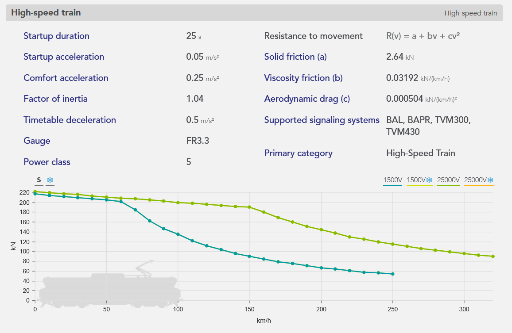

OSRD can be used to perform two types of calculations:

- **Standalone train simulation:** calculation of the travel time of a train on a given route without interaction between the train and the signalling system.
- **Simulation:** "dynamic" calculation of several trains interacting with each other via the signalling system.

#### 1 - The input data

A running time calculation is based on 5 inputs:

- **Infrastructure:** Line and track topology, position of stations and passenger buildings, position and type of points, signals, maximum line speeds, corrected line profile (gradients, ramps and curves).

> The blue histogram is a representation of the gradients in [‰] per position in [m]. The gradients are positive for ramps and negative for slopes.
>
> The orange line represents the cumulative profile, i.e. the relative altitude to the starting point.
>
> The blue line is a representation of turns in terms of radii of curves in [m].

- **The rolling stock:** The characteristics of which needed to perform the simulation are shown below.

> The orange curve, called the effort-speed curve, represents the maximum motor effort as a function of the speed of travel.
>
> The length, mass, and maximum speed of the train are shown at the bottom of the box.

- **The departure time** is then used to calculate the times of passage at the various points of interest (including stations).

- **Allowances:** Time added to the train's journey to relax its running (see [page on allowances](./allowances)).

- **The time step** for the calculation of [numerical integration](./numerical_integration).

#### 2 - The results

The results of a running time calculation can be represented in different forms:

- **The space/time graph (GET):** represents the path of trains in space and time, in the form of generally diagonal lines whose slope is the speed. Stops are shown as horizontal plates.

> Example of a GET with several trains spaced about 30 minutes apart.
>
> The **x** axis is the time of the train, the **y** axis is the position of the train in [m].
>
> The blue line represents the most tense running calculation for the train, the green line represents a relaxed, so-called "economic" running calculation.
>
> The solid rectangles surrounding the paths represent the portions of the track successively reserved for the train to pass (called blocks).

- **The space/speed graph (SSG):** represents the journey of a single train, this time in terms of speed. Stops are therefore shown as a drop in the curve to zero, followed by a re-acceleration.

> The **x** axis is the train position in [m], the **y** axis is the train speed in [km/h].
>
> The purple line represents the maximum permitted speed.
>
> The blue line represents the speed in the case of the most stretched running calculation.
>
> The green line represents the speed in the case of the "economic" travel calculation.

- **The timetable for the passage of the train at the various points of interest**.

