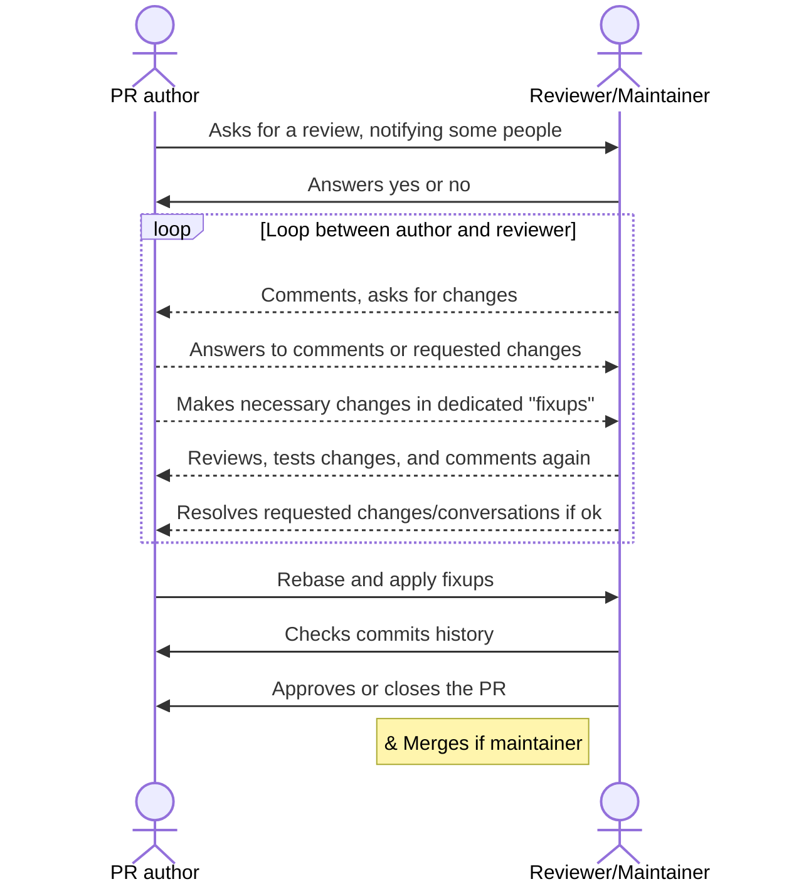

Here's a suggested workflow.

**It can be useful to communicate via instant messaging (Matrix, Slack, etc.) in order to guarantee the smooth flow of PR validation.**

```mermaid
sequenceDiagram
  actor A as PR author
  actor R as Reviewer/Maintainer
  
  A->>R: Asks for a review, notifying some people
  R->>A: Answers yes or no
  
  loop Loop between author and reviewer
    R-->>A: Comments, asks for changes
    A-->>R: Answers to comments or requested changes
    A-->>R: Makes necessary changes in dedicated "fixups"
    R-->>A: Reviews, tests changes, and comments again
    R-->>A: Resolves requested changes/conversations if ok
  end
 
  A->>R: Rebase and apply fixups
  R->>A: Checks commits history
  R->>A: Approves or closes the PR
  Note left of R: & Merges if maintainer
```
