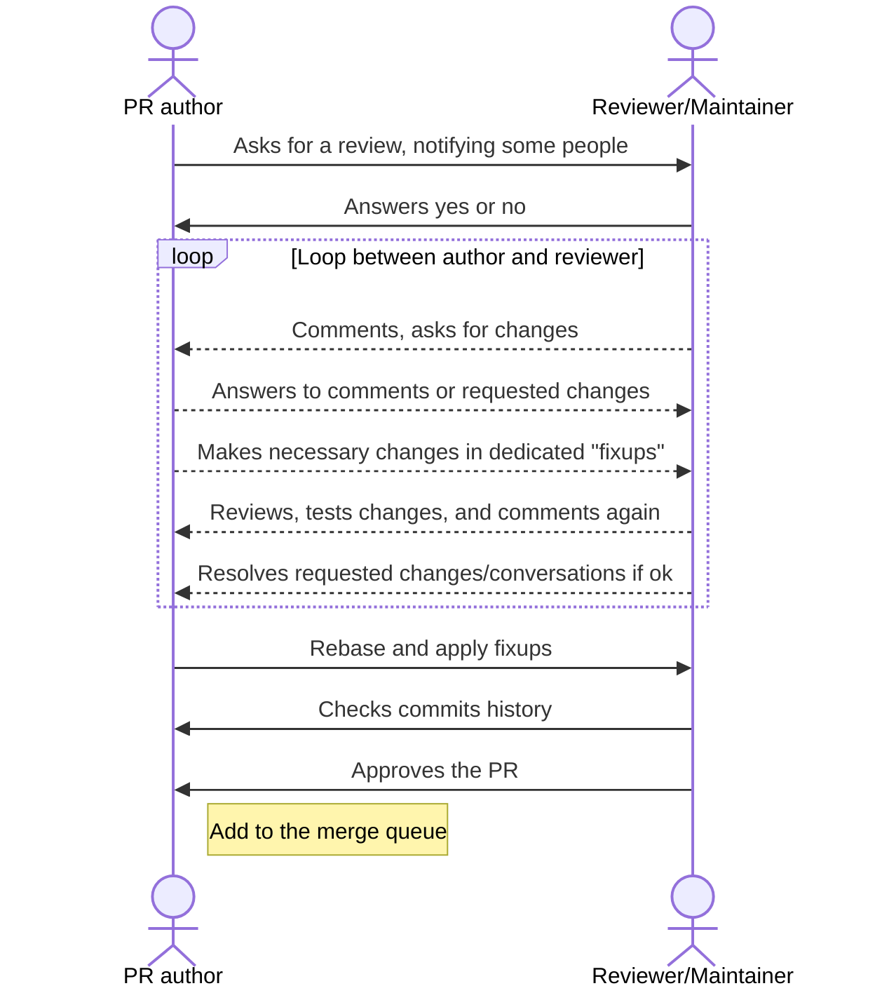

## Review cycle

A code review is an iterative process.
For a smooth review, it is imperative to [correctly configure your github notifications](https://docs.github.com/en/account-and-profile/managing-subscriptions-and-notifications-on-github/setting-up-notifications/configuring-notifications).

It is advisable to configure OSRD repositories as *"Participating and @mentions"*. This allows you to be notified of activities only on issues and PRs in which you participate.

> Maintainers are automatically notified by the `CODEOWNERS` system. The author of a PR is responsible for advancing their PR through the review process and manually requesting maintainer feedback if necessary.

