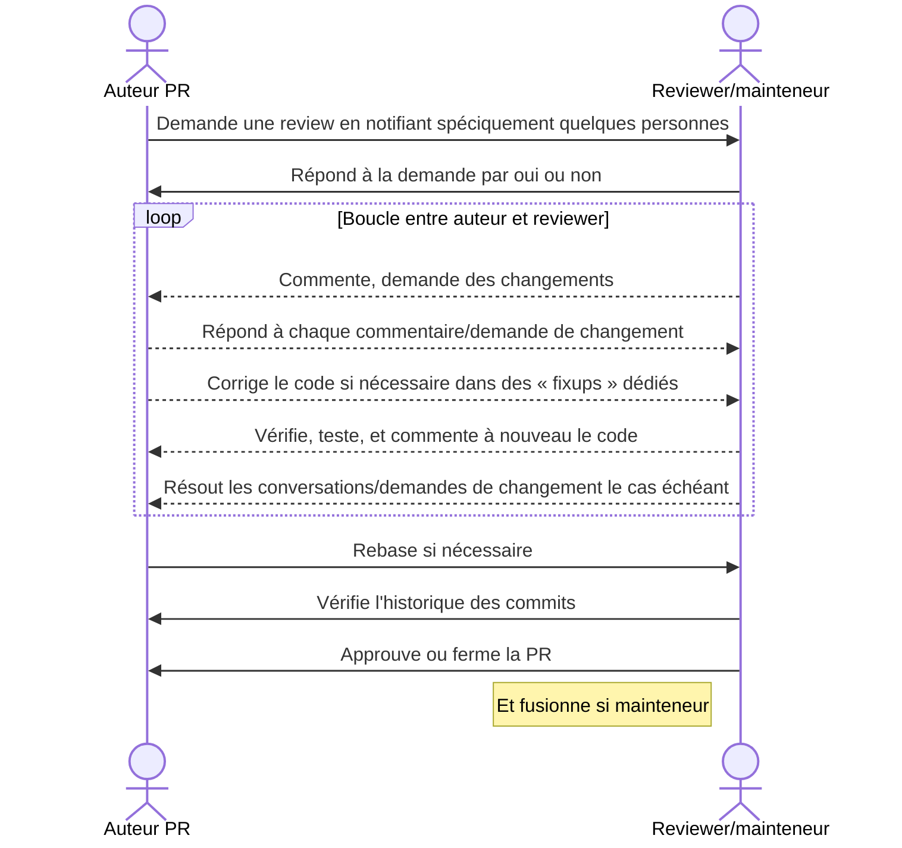

## Cycle de review

Une revue de code est un processus itératif.
Pour la fluidité d'une review, il est impératif de [configurer correctement ses notifications github](https://docs.github.com/en/account-and-profile/managing-subscriptions-and-notifications-on-github/setting-up-notifications/configuring-notifications).

Il est conseillé de configurer les dépôts OSRD en *"Participating and @mentions"*. Cela permet d'être notifié d'activités uniquement sur les issues et PR auxquelles vous participez.

> Les mainteneurs sont automatiquement notifiés par le système de `CODEOWNERS`. L'auteur d'une PR est responsable de faire avancer sa PR dans le processus de review (quitte à notifier manuellement un mainteneur).
