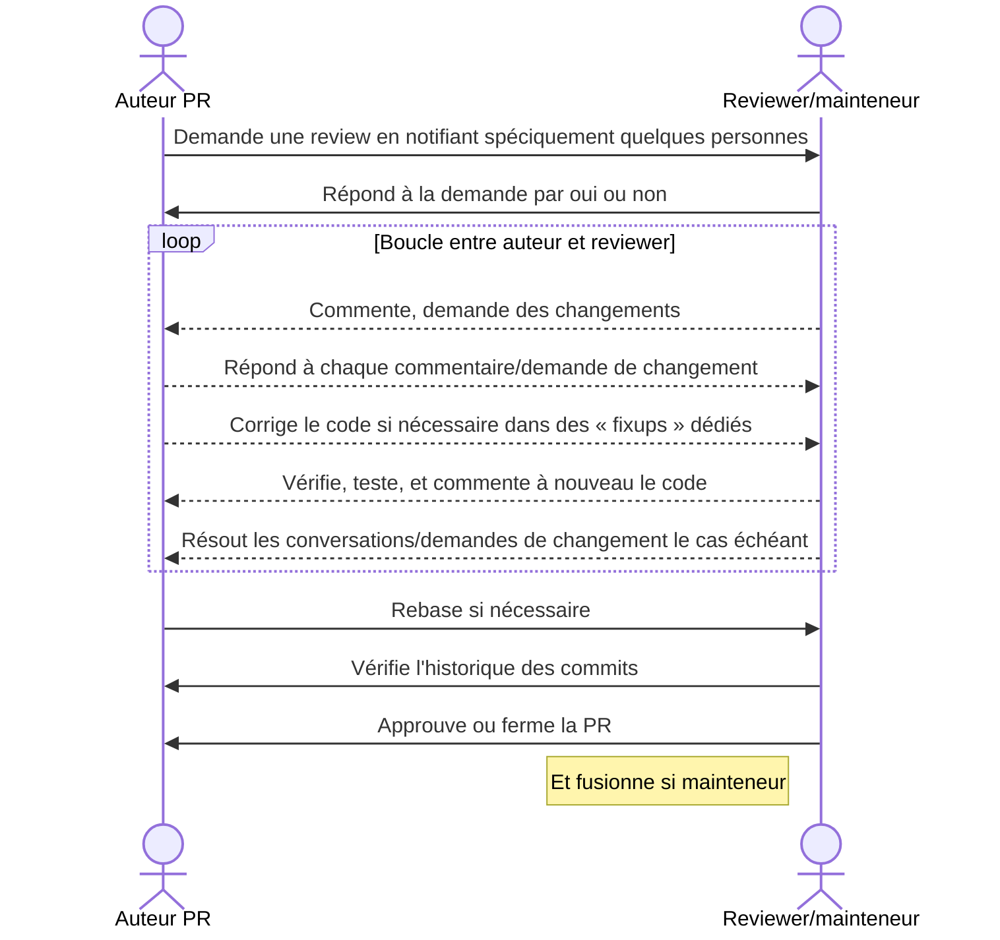

Voici une proposition de flux de travail.

**Il peut être utile de communiquer par messagerie instantanée (Matrix, Slack, etc.) afin de garantir le fonctionnement du flux de la validation d'une PR.**

