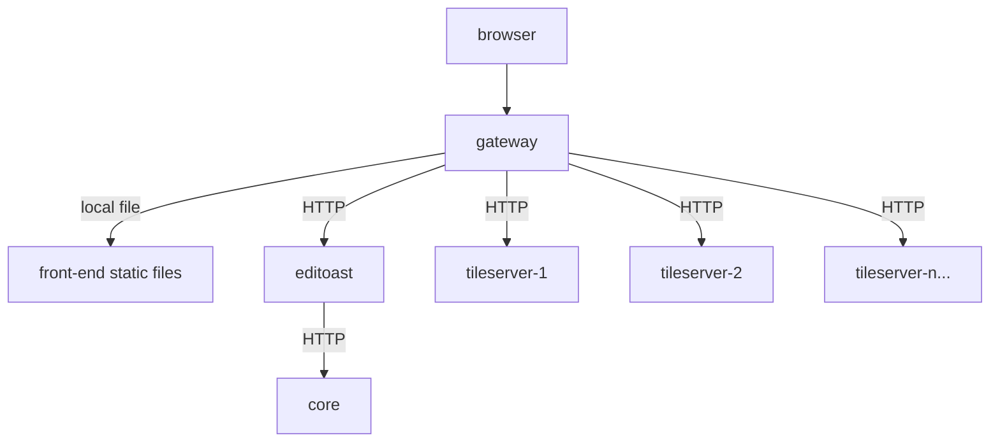

The OSRD project's Helm Chart provides a flexible and efficient way to deploy OSRD services in a Kubernetes environment. This document outlines the configuration options available in the Helm Chart, focusing on each service component.

## Prerequisites

Before proceeding with the deployment, ensure that you have the following installed:
- A Kubernetes cluster up and running
- A PostgreSQL database with PostGIS
- A Redis server (used for caching)

## The tileserver

Tileserver is the component responsible for generating vector map tiles. It is recommended to separate it from standard Editoast while running a production setup since Editoast cannot be scaled horizontally (it is stateful).

You can visualize the recommended deployment here:



The Helm chart leverages Kubernete's [HorizontalPodAutoscaler](https://kubernetes.io/docs/tasks/run-application/horizontal-pod-autoscale/) in order to spawn as much tileserver as required for the current workload.

## Chart Values Overview

The Helm Chart is configurable through the following values:

### Core Service

- `core`: Configuration for the core OSRD service.
  - `internalUrl`: Internal URL for service communication.
  - `image`: Docker image to use.
  - `pullPolicy`: Image pull policy.
  - `replicaCount`: Number of replicas.
  - `service`: Service type and port configuration.
  - `resources`, `env`, `annotations`, `labels`, `nodeSelector`, `tolerations`, `affinity`: Various Kubernetes deployment options.

### Editoast Service

- `editoast`: Configuration for the Editoast service.
  - Includes similar options as `core` for Kubernetes deployment.
  - `init`: Initialization configuration.

### Tile Server

- `tileServer`: Specialized Editoast service that serves only vector map tiles.
  - `enabled`: Set to `true` to enable tile server functionality.
  - `image`: Docker image to use (typically the same as Editoast).
  - `replicaCount`: Number of replicas, allowing for horizontal scaling.
  - `hpa`: Horizontal Pod Autoscaler configuration.
  - Other standard Kubernetes deployment options.

### Gateway

- `gateway`: Configuration for the OSRD gateway.
  - Includes service, ingress, and other Kubernetes deployment options.
  - `config`: Specific configurations for authentication and trusted proxies.

## Deployment

The chart is available at ghcr OCI repository. You can find 2 Helm charts: 
 - [Stable charts](https://github.com/osrd-project/osrd-chart/pkgs/container/charts%2Fosrd): `oci://ghcr.io/osrd-project/charts/osrd`
 - [Dev charts](https://github.com/osrd-project/osrd-chart/pkgs/container/charts%2Fosrd-dev): `oci://ghcr.io/osrd-project/charts/osrd-dev`

To deploy the OSRD services using this Helm Chart:

1. **Configure Values**: Adjust the values in the Helm Chart to suit your deployment needs.
2. **Install Chart**: Use Helm to install the chart into your Kubernetes cluster.

   ```bash
   helm install osrd oci://ghcr.io/osrd-project/charts/osrd -f values.yml
   ```

