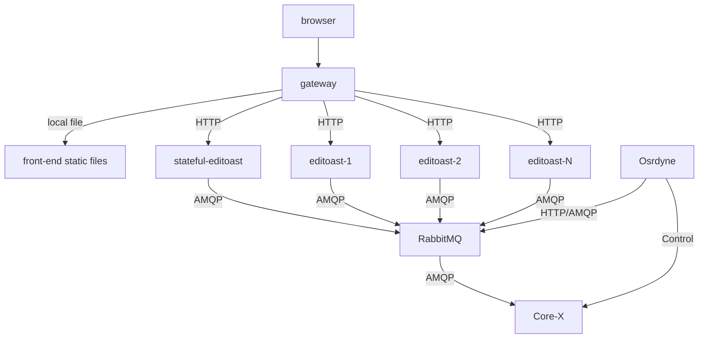

The OSRD project's Helm Chart provides a flexible and efficient way to deploy OSRD services in a Kubernetes environment. This document outlines the configuration options available in the Helm Chart, focusing on each service component.

## Prerequisites

Before proceeding with the deployment, ensure that you have the following installed:
- A Kubernetes cluster up and running
- A PostgreSQL database with PostGIS, unaccent, and pg_trgm extensions installed
- A Valkey server (used for caching)
- A Rabbitmq server (used for message exchange)

## Stateful editoast

Editoast is a service that is **almost** capable of horizontal scaling (stateless). However, part of the application requires consistent RAM storage and therefore doesn't support scaling. This small part is called **stateful editoast**.

The Helm Chart deploys two OSRD services:

- The first one `editoast` (stateless) which uses a [Horizontal Pod Autoscaler (hpa)](https://kubernetes.io/docs/tasks/run-application/horizontal-pod-autoscale/).
- The second one `stateful-editoast` which has a single replica to ensure data consistency in RAM.

You can view the recommended deployment here:



## Chart Values Overview

The Helm Chart is configurable through the following values:

### Editoast

  - `editoast`: Configuration for the Editoast service.
    - `init`: Initialization configuration.
    - `replicaCount`: Number of replicas, enabling horizontal scaling.
    - `hpa`: Horizontal Pod Autoscaler configuration.
    - Other standard Kubernetes deployment options.

### Stateful Editoast

  - `stateful-editoast`: Specialized Editoast service for `/infra/{infra_id}` requests
    - `image`: Docker image to use (usually the same as Editoast).
    - Other standard Kubernetes deployment options.

### Osrdyne

- `osrdyne`: Osrdyne service that controls the cores.
  - `image`: Docker image to use.
  - `amqp`: RabbitMQ connection
  - Other standard Kubernetes deployment options.

### Gateway

- `gateway`: Configuration for the OSRD gateway.
  - Includes service, ingress, and other Kubernetes deployment options.
  - `config`: Specific configurations for authentication and trusted proxies.

## Deployment

The chart is available at ghcr OCI repository. You can find 2 Helm charts:
 - [Stable charts](https://github.com/openrailassociation/osrd-chart/pkgs/container/charts%2Fosrd): `oci://ghcr.io/openrailassociation/charts/osrd`
 - [Dev charts](https://github.com/OpenRailAssociation/osrd-chart/pkgs/container/charts%2Fosrd-dev): `oci://ghcr.io/openrailassociation/charts/osrd-dev`

To deploy the OSRD services using this Helm Chart:

1. **Configure Values**: Adjust the values in the Helm Chart to suit your deployment needs.
2. **Install Chart**: Use Helm to install the chart into your Kubernetes cluster.

   ```bash
   helm install osrd oci://ghcr.io/openrailassociation/charts/osrd -f values.yml
   ```
