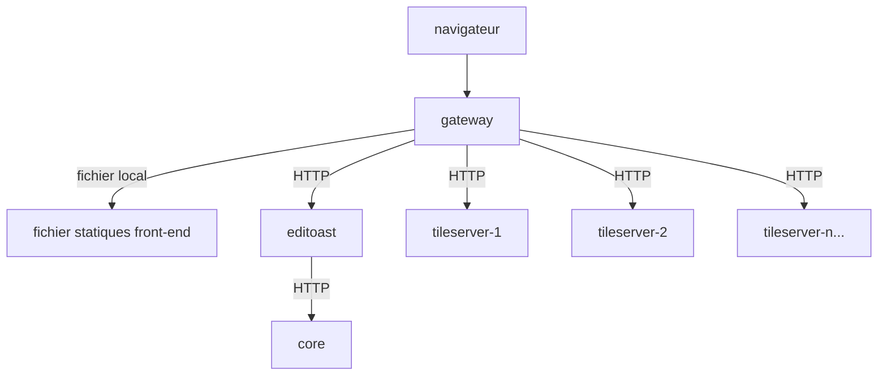

La Helm Chart du projet OSRD fournit une solution pour déployer les services OSRD dans un environnement Kubernetes de manière standardisée. Ce document décrit les options de configuration disponibles dans le Helm Chart.

## Prérequis

Avant de procéder au déploiement, assurez-vous que vous avez installé :

- Un cluster Kubernetes opérationnel
- Une base de données PostgreSQL avec PostGIS
- Un serveur Redis (utilisé pour le cache)

## Le serveur de tuiles

Le serveur de tuiles est le composant responsable de la génération des tuiles cartographiques vectorielles. Il est recommandé de le séparer du Editoast standard lors de l'exécution d'une configuration de production, car Editoast ne peut pas être mis à l'échelle horizontalement (il est stateful).

Vous pouvez visualiser le déploiement recommandé ici :



Le Helm Chart utilise le[HorizontalPodAutoscaler](https://kubernetes.io/docs/tasks/run-application/horizontal-pod-autoscale/) de Kubernetes pour lancer autant de serveurs de tuiles que nécessaire en fonction de la charge de travail.

## Configuration de la Helm Chart (values)

Le Helm Chart est configurable à travers les valeurs suivantes :

### Service Core

- `core` : Configuration pour le service central OSRD.
  - `internalUrl` : URL interne pour la communication entre services.
  - `image` : Image Docker à utiliser.
  - `pullPolicy` : Politique de récupération de l'image.
  - `replicaCount` : Nombre de réplicas.
  - `service` : Type de service et configuration des ports.
  - `resources`, `env`, `annotations`, `labels`, `nodeSelector`, `tolerations`, `affinity` : Diverses options de déploiement Kubernetes.

### Service Editoast

- `editoast` : Configuration pour le service Editoast.
  - Comprend des options similaires à `core` pour le déploiement Kubernetes.
  - `init` : Configuration d'initialisation.

### Serveur de tuiles

- `tileServer` : Service Editoast spécialisé qui sert uniquement des tuiles cartographiques vectorielles.
  - `enabled` : Définir sur `true` pour activer la fonctionnalité de serveur de tuiles.
  - `image` : Image Docker à utiliser (généralement la même que Editoast).
  - `replicaCount` : Nombre de réplicas, permettant la mise à l'échelle horizontale.
  - `hpa` : Configuration de l'Horizontal Pod Autoscaler.
  - Autres options standard de déploiement Kubernetes.

### Gateway

- `gateway` : Configuration pour le gateway OSRD.
  - Comprend des options de service, d'ingress et d'autres options de déploiement Kubernetes.
  - `config` : Configurations spécifiques pour l'authentification et les proxys de confiance.

## Déploiement

Le chart est disponible dans le dépôt OCI ghcr. Vous pouvez trouver 2 versions de la chart :
 - [Charts stables](https://github.com/osrd-project/osrd-chart/pkgs/container/charts%2Fosrd) : `oci://ghcr.io/osrd-project/charts/osrd`
 - [Charts de développement](https://github.com/osrd-project/osrd-chart/pkgs/container/charts%2Fosrd-dev) : `oci://ghcr.io/osrd-project/charts/osrd-dev`

Pour déployer les services OSRD en utilisant Helm :

1. **Configurer les valeurs** : Ajustez les valeurs selon vos besoins de déploiement.
2. **Installer le Chart** : Utilisez la commande `helm install` pour installer la chart dans votre cluster Kubernetes.

   ```bash
   helm install osrd oci://ghcr.io/osrd-project/charts/osrd -f values.yml
   ```
