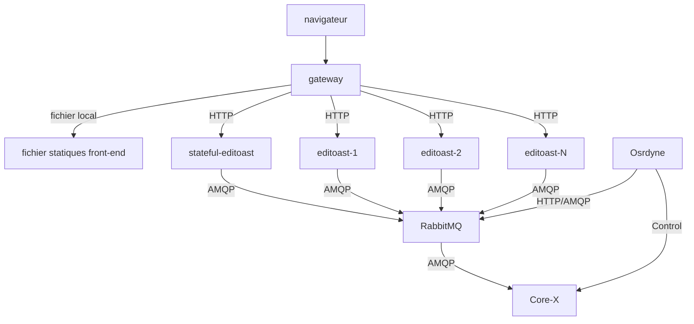

La Helm Chart du projet OSRD fournit une solution pour déployer les services OSRD dans un environnement Kubernetes de manière standardisée. Ce document décrit les options de configuration disponibles dans le Helm Chart.

## Prérequis

Avant de procéder au déploiement, assurez-vous que vous avez installé :

- Un cluster Kubernetes opérationnel
- Une base de données PostgreSQL avec PostGIS
- Un serveur Valkey (utilisé pour le cache)

## Stateful editoast

Editoast est un service **quasiment** capable d'être mis à l'échelle horizontalement (stateless). Cependant, une partie de l'application nécessite un stockage en RAM cohérent et donc ne supporte pas la mise à l'échelle. Cette petite partie est appelée **editoast stateful**.

Le Helm Chart déploie deux service OSRD:

- Le premier `editoast` (stateless) qui utilise un [Horizontal Pod Autoscaler (hpa)](https://kubernetes.io/docs/tasks/run-application/horizontal-pod-autoscale/).
- Le deuxième `stateful-editoast` qui n'à qu'une seule réplique pour assurer la cohérence des données en RAM.

Vous pouvez visualiser le déploiement recommandé ici :



## Configuration de la Helm Chart (values)

Le Helm Chart est configurable à travers les valeurs suivantes :


### Editoast

- `editoast` : Configuration pour le service Editoast.
  - `init` : Configuration d'initialisation.
  - `replicaCount` : Nombre de réplicas, permettant la mise à l'échelle horizontale.
  - `hpa` : Configuration de l'Horizontal Pod Autoscaler.
  - Autres options standard de déploiement Kubernetes.

### Stateful Editoast

- `stateful-editoast` : Service Editoast spécialisé dans les requêtes `/infra/{infra_id}`
  - `image` : Image Docker à utiliser (généralement la même que Editoast).
  - Autres options standard de déploiement Kubernetes.


### Osrdyne

- `osrdyne` : Service osrdyne qui permet de contrôler les cores.
  - `image` : Image Docker à utiliser.
  - `amqp` : Connection au rabbitMQ
  - Autres options standard de déploiement Kubernetes.

### Gateway

- `gateway` : Configuration pour le gateway OSRD.
  - Comprend des options de service, d'ingress et d'autres options de déploiement Kubernetes.
  - `config` : Configurations spécifiques pour l'authentification et les proxys de confiance.

## Déploiement

Le chart est disponible dans le dépôt OCI ghcr. Vous pouvez trouver 2 versions de la chart :
 - [Charts stables](https://github.com/OpenRailAssociation/osrd-chart/pkgs/container/charts%2Fosrd) : `oci://ghcr.io/OpenRailAssociation/charts/osrd`
 - [Charts de développement](https://github.com/OpenRailAssociation/osrd-chart/pkgs/container/charts%2Fosrd-dev) : `oci://ghcr.io/OpenRailAssociation/charts/osrd-dev`

Pour déployer les services OSRD en utilisant Helm :

1. **Configurer les valeurs** : Ajustez les valeurs selon vos besoins de déploiement.
2. **Installer le Chart** : Utilisez la commande `helm install` pour installer la chart dans votre cluster Kubernetes.

   ```bash
   helm install osrd oci://ghcr.io/OpenRailAssociation/charts/osrd -f values.yml
   ```
