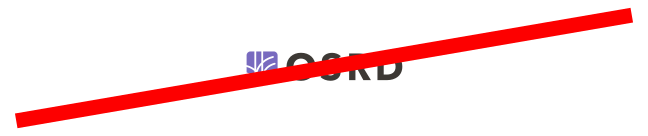

You can download each logo independently by clicking directly on it, or <a href="pictures/logo-osrd.zip">all the logos compressed into a zip file</a>.

It is advisable to carefully choose the logo you want to use, depending on the background on which you want to display it.

Modification, addition or deletion of the **shading** other than as presented in the logos **are not authorised** (this applies more generally throughout the design, the choice to use _drop shadows_ is part of the design considerations, it is not a variable element).

### Official

  

### Official for dark backgrounds

  

### White

  

### Black

  

### Favicons, logo without text

  

  

  

## 🚫 What you can't do

#### Too small (< 16px height)

#### Disproportion

#### Change the text colour or drop shadow

#### Changing direction

#### Deformation

## ✅ What you can do

#### Changing the internal colour for a specific event

  
  
  

  
  
  

#### Use of logo only (without text)

  

## Colors

> These colours are **those of the logo** and should not be confused with those of the overall design of the OSRD interface.

#786ABF
#C7B2DE
