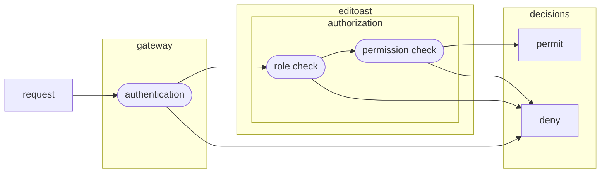
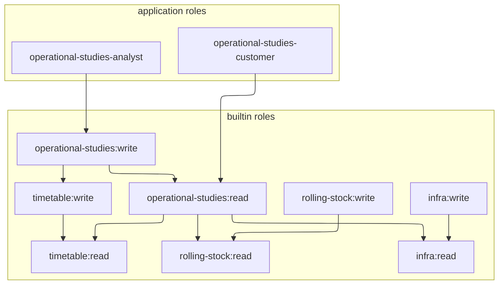

## Context and requirements

- authentication (`authn`) is the process of figuring out a user's identity.
- authorization (`authz`) is the process of figuring out whether a user can do something.

This design project started as a result of a feature request coming from SNCF users
and stakeholders. After some interviews, we believe the overall needs to be as follows:

- controlling access to features
  - some users are supposed to only view results of operational studies
  - some users only get access to part of the app
  - not everyone can have access to the admin panel
  - it could be nice to be able to roll experimental features out incrementally
- controlling access to data
  - some infrastructures shall only be changed by automated import jobs
  - users might want to control who can mess with what they're currently working on
  - rolling stock, infrastructure and timetable data may be confidential

## Overall architecture



## Authentication

The app's backend is not responsible for authenticating the user: it gets all required information
from `gateway`, the authenticating reverse proxy which stands between it and the front-end.

- at application start-up, the front-end redirects to the login page if the user is not logged in
- if the user is already authenticated, the gateway returns user metadata
- otherwise, the gateway initiates the authentication process, usually with OIDC.
  The implementation was designed to allow new backends to be added easily.
- once the user is authenticated, all requests to the backend can expect the following headers to be set:
  - `x-remote-user-identity` contain a unique identifier for this identity. It can be thought of as an opaque `provider_id/user_id` tuple.
  - `x-remote-user-name` contain a username

When editoast receives a request, it has to match the remote user ID with a
database user, creating it as needed.

```sql
create table authn_subject(
  id  bigserial generated always as identity primary key,
);

create table authn_user(
  id  bigint primary key references auth_subject on delete cascade,
  identity_id  text not null,
  name  text,
);

create table authn_group(
  id bigint primary key references auth_subject on delete cascade,
  name text not null,
);

-- add a trigger so that when a group is deleted, the associated authn_subject is deleted too
-- add a trigger so that when a user is deleted, the associated authn_subject is deleted too

create table authn_group_membership(
  user   bigint references auth_user  on delete cascade not null,
  group  bigint references auth_group on delete cascade not null,
  unique (user, group),
);
```

### Group and role management API

{}
Users cannot be directly created. The authenticating reverse proxy is in charge of user management.
{}

- role management is protected by the `role:admin` role.
- groups management is subject to permissions.

#### Get information about a user

```
GET /authn/me
GET /authn/user/{user_id}
```

```json
{
  "id": 42,
  "name": "Foo Bar",
  "groups": [
    {"id": 1, "name": "A"},
    {"id": 2, "name": "B"}
  ],
  "app_roles": ["ops"],
  "builtin_roles": ["infra:read"]
}
```

[Builtin roles](#builtin-roles) are deduced from app roles, and thus cannot be directly edited.

#### Add roles to a user or group

This endpoint can only be called if the user has the `role:admin` builtin role.

```
POST /authn/user/{user_id}/roles/add
POST /authn/group/{group_id}/roles/add
```

Takes a list of app roles:

```json
["ops", "stdcm"]
```

#### Remove roles from a user or group

This endpoint can only be called if the user has the `role:admin` builtin role.

```
POST /authn/user/{user_id}/roles/remove
```

Takes a list of app roles to remove:

```json
["ops"]
```

#### Create a group

This endpoint can only be called if the user has the `group:create` builtin role.
When a user creates a group, it becomes its owner.

```
POST /authn/group
```

```json
{
  "name": "Foo"
  "app_roles": ["ops"],
}
```

Returns the group ID.

#### Add users to a group

Can only be called if the user has `Writer` access to the group.

```
POST /authn/group/{group_id}/add
```

Takes a list of user IDs

```json
[1, 2, 3]
```

#### Remove users from a group

Can only be called if the user has `Writer` access to the group.

```
POST /authn/group/{group_id}/remove
```

Takes a list of user IDs

```json
[1, 2, 3]
```

#### Delete a group

Can only be called if the user has `Owner` access to the group.

```
DELETE /authn/group/{group_id}
```

## Authorization

As shown in the overall architecture section, to determine if a subject is
allowed to conduct an action on a resource, two checks are performed:

1. We check that the **roles** of the subject allows the action.
2. We check that the subject has the **minimum privileges** on the resource(s) that are required to perform the action.

### Roles

Subject can have any number of roles. Roles allow access to features. Roles do not give rights on specific objects.

Both the frontend and backend require some roles to be set to allow access to parts of the app.
In the frontend, roles guard features, in the backend, roles guard endpoints or group of endpoints.

There are two types of roles:

- **Builtin roles** are bundled with OSRD. Only builtin roles can be required by endpoints. These roles **cannot** directly be assigned to users.
- **Application roles** can be assigned to users. These roles are defined in a configuration file that editoast reads at startup.

Here is an example of what builtin roles might look like:

- `role:admin` allows assigning roles to users and groups
- `group:create` allows creating user groups
- `infra:read` allows access to the map viewer module
- `infra:write` implies `infra:read`. it allows access to the infrastructure editor.
- `rolling-stock:read`
- `rolling-stock:write` implies `rolling-stock:read`. Allows access to the rolling stock editor.
- `timetable:read`
- `timetable:write` implies `timetable:read`
- `operational-studies:read` allows read only access to operational studies. it implies `infra:read`, `timetable:read` and `rolling-stock:read`
- `operational-studies:write` allows write access to operational studies. it implies `operational-studies:read` and `timetable:write`
- `stdcm` implies `infra:read`, `timetable:read` and `rolling-stock:read`. it allows access to the short term path request module.
- `admin` gives access to the admin panel, and implies all other roles

Given these builtin roles, application roles may look like:

- `operational-studies-customer` implies `operational-studies:read`
- `operational-studies-analyst` implies `operational-studies:write`
- `stdcm-customer` implies `stdcm`
- `ops` implies `admin`

Roles are _hierarchical_. This is a necessity to ensure that, for example, if we are to introduce a new action related to scenarios, each subject with the role "exploitation studies" gets that new role automatically.
We'd otherwise need to edit the appropriate existing roles.

Their hierarchy could resemble:



### Permissions

Permission checks are done by the backend, even though the frontend may use the effective privilege level
of a user to decide whether to allow modifying / changing permissions for a given object.

Permissions are checked per resource, after checking roles.
A single request may involve multiple resources, and as such involve multiple permission checks.

Permission checks are performed as follows:

- for each request, before any resource is accessed, compute which resources need access and required privilege levels
- figure out, for the request's user, its effective privilege level for every involved resource
- if the user's privilege level does not meet expectations, raise an error **before any change is made**

```rust
enum EffectivePrivLvl {
    Owner,    // all operations allowed, including granting access and deleting the resource
    Writer,   // can change the resource
    Creator,  // can create new sub resources
    Reader,   // can read the resource
    MinimalMetadata, // is indirectly aware that the resource exists
}

trait Resource {
    #[must_use]
    fn get_privlvl(resource_pk: u64, user: &UserIdentity) -> EffectivePrivLvl;
}
```

The backend may therefore perform one or more privilege check per request:

- pathfinding:
  - `Reader` on the infrastructure
- displaying a timetable:
  - `Reader` on each rolling stock
- batch train creation:
  - `Creator` on the timetable
- conflict detection:
  - `Reader` on the infrastructure
  - `Reader` on the timetable
  - `Reader` on every involved rolling stock
- simulation results:
  - `Reader` on the infrastructure
  - `Reader` on the rolling stock

A grant is a right, given to a user or group on a specific resource.
Users get privileges through grants. There are two types of grants:

- explicit grants are explicitly attached to resources
- implicit grants automatically propagate explicit grants for objects which belong to a hierarchy:
  - if a subject owns a project, it also owns all studies and scenarios
  - if a subject can read a scenario, it knows the parent study and project exist

#### Explicit grants

- can be edited from the frontend
- any user holding grants over a resource can add new ones
- when a resource is created, `Owner` is granted to the current user
- not all objects type can have explicit grants: train schedule inherit their timetable's grants

```sql
-- this type is the same as EffectivePrivLvl, except that MinimalMetadata is absent,
-- as it cannot be granted directly. mere knowledge that an object exist can only be
-- granted using implicit grants.
create type grant_privlvl as enum ('Owner', 'Writer', 'Creator', 'Reader');

-- this table is a template, which other grant tables are
-- designed to be created from. it must be kept empty.
create table authz_template_grant(
  -- if subject is null, this grant applies to any subject
  subject     bigint references authn_subject on delete cascade,
  grant       grant_privlvl not null,
  granted_by  bigint references authn_user on delete set null,
  granted_at  timestamp not null default CURRENT_TIMESTAMP,
);
-- these indices speed up cascade deletes
create index on authz_template_grant(subject);
create index on authz_template_grant(granted_by);

-- create a new grant table for infrastructures
create table authz_grant_EXAMPLE (
  like authz_template_grant including all,
  resource bigint references EXAMPLE on delete cascade not null,
  unique nulls not distinct (resource, subject),
);

-- raise an error if grants are inserted into the template
create function authz_grant_insert_error() RETURNS trigger AS $err$
    BEGIN
        RAISE EXCEPTION 'authz_grant is a template, which other grant '
        'tables are designed to inherit from. it must be kept empty.';
    END;
$err$ LANGUAGE plpgsql;
create trigger before insert on authz_template_grant execute function authz_grant_insert_error();
```

#### Implicit grants

{}
Implicit grants only apply to the operational studies module, **not** timetables, infrastructures and rolling stocks.
{}

Implicit grants propagate explicit grants to related objects. There are two types of implicit grants:

- explicit grants propagate downwards within hierarchies: `Owner`, `Reader`, `Writer` propagate as is, `Creator` is reduced to `Reader`
- `MinimalMetadata` propagates up within project hierarchies, so that read access to a study or scenario allows having the name and description of the parent project

The following objects have implicit grants:

- `project` gets `MinimalMetadata` if the user has any right on a child study or scenario
- `study` gets:
  - `MinimalMetadata` if the user has any right on a child scenario
  - `Owner`, `Reader`, `Writer` if the user has such right on the parent study. `Creator` is reduced to `Reader`.
- `scenario` gets `Owner`, `Reader`, `Writer` if the user has such right on the parent study or project. `Creator` is reduced to `Reader`.
- `train-schedule`s have the same grants as their timetable

### Permission meta-model

#### Get the privilege level of the current user

```
GET /authz/{resource_type}/{resource_id}/privlvl
```

#### Get all grants for a resource

```
GET /authz/{resource_type}/{resource_id}/grants
```

```json
[
  {
    "subject": {"kind": "group", "id": 42, "name": "Bar"},
    "implicit_grant": "Owner",
    "implicit_grant_source": "project"
  },
  {
    "subject": {"kind": "user", "id": 42, "name": "Foo"},
    "grant": "Writer"
  },
  {
    "subject": {"kind": "user", "id": 42, "name": "Foo"},
    "grant": "Writer",
    "implicit_grant": "MinimalMetadata",
    "implicit_grant_source": "project"
  }
]
```

Implicit grants cannot be edited, and are only displayed to inform the end user.

#### Add a new grant

```
POST /authz/{resource_type}/{resource_id}/grants
```

```json
{
  "subject_id": 42,
  "grant": "Writer"
}
```

#### Change a grant

```
PATCH /authz/{resource_type}/{resource_id}/grants/{grant_id}
```

```json
{
  "grant": "Reader"
}
```

#### Revoke a grant

```
DELETE /authz/{resource_type}/{resource_id}/grants/{grant_id}
```

## Implementation plan

### Phase 1: ground work

Back-end:

- pass the proper headers from the reverse proxy to editoast
- implement the authn / authz model into the database
- get / create users on the fly using reverse proxy headers
- implement the role parsing and book-keeping (it can be parsed on startup and leaked into a static lifetime)
- implement a proof of concept for roles using `role:admin` and role management
- implement a proof of concept for permissions by implementing group management
- implement a middleware within editoast which:
  - attaches a UserInfo object to each request
  - ensures that role / permission checks were performed. Implement two modules: log on missing check, abort on missing check.
  - injects which checks were performed into response headers so it can be tested
- introduce the concept of rolling stock collections to enable easier rolling stock permission checking
- write a migration guide to help OSRD developers navigate the authorization APIs

Front-end:

- take into account builtin roles to decide which features to unlock
- design, validate and build a permission editor
- prepare graceful handling of 403s

### Phase 2: migration

Back-end:

- incrementally migrate all endpoints, using the middleware to find missing checks
- switch the default action on missing permission check to abort

Front-end:

- add the permission editor to all relevant objects
- handle 403s, especially on scenarios, where read access on the timetable, infra, rolling stock collections and electrical profile is required

## Design decisions

### Simultaneous RBAC and ABAC

RBAC: role based access control (users have roles, actions require roles)
ABAC: attribute based access control (resources have attributes, user + actions require attributes). ACLs are a kind of ABAC.

After staring at what users asked for and established authorization models allow,
we figured out that while no one model is a good fit on its own:

- just RBAC would not allow fine grained, per object access control
- just ABAC would not allow guarding off access to entire features

We decided that each authorization model could be used where it shows its strength:

- RBAC is used to authorize access to frontend features and backend endpoints
- ABAC is used to authorize actions on specific objects

We found no success in our attempts to find a unifying model.

### Not using any policy language

At first, we assumed that using a policy language would assist with correctly implementing authorization. After further consideration, we concluded that:

- no user asked for policy flexibility nor policy as code, and there does not seem to be any obvious use case not already covered by RBAC + ABAC
- the main policy language considered, cedar, makes it very awkward to implement single pass RBAC + ABAC
- the primary benefit of policy languages, policy flexibility, is still very much constrained by the data the policy engine is fed: for OSRD,
  feeding all grants, all users, all groups and all roles to the policy engine is not practical. we thus need filtering and careful modeling,
  which almost guarantees changes will be required if a new authz rule type were to be requested by a customer. Worse yet, these changes seem
  to require more effort than adapting the authz system if there were not policy language at all.
- as policy languages only deal with evaluating the policy, one can be introduced later if so desired

### No implicit grants for infra, timetable and rolling stock

We felt like this feature would be hard to implement, and be likely to introduce confidentiality and performance issues:

- these objects may not be part of any operational studies, or multiple operational studies
- implicit grants are hard to implement, and risk introducing vulnerabilities
- infra, timetable and rolling stock are likely to be confidential

Instead, we plan to:

- delay implementing this feature until we figure out if the lack thereof is an UX issue
- if deemed required, implement it by checking, within the permission editor, whether all
  users having access to a scenario can access associated data, and suggesting associated
  permission changes

### All resource types share the same permission management endpoints

We considered two patterns for permission management endpoints:

- a single set of endpoints for all resource types: `/authz/{resource_type}/{resource_id}/grants/...`
- separate set of endpoints per resource type: `/v2/infra/{infra_id}/grants/...`

We found that:

- having separate set of endpoints per resource types brought extra back-end and front-end complexity
- the only constraint of unified permission management endpoints is that all resource types need globally unique IDs
- the globally unique ID constraint is less costly than the extra complexity of separate endpoints

### Dynamically enforce permission checks

Ideally, there would be static checks enforcing permission checks.
However, we found no completely fool proof way to statically do so.

Instead, we decided that all permission checks will be registered
with a middleware, which will either log or raise an error when a
handler performs no check.

- during local development, the middleware logs missing permission checks as errors
- during continuous integration checks and production deployments, the middleware aborts on missing checks
