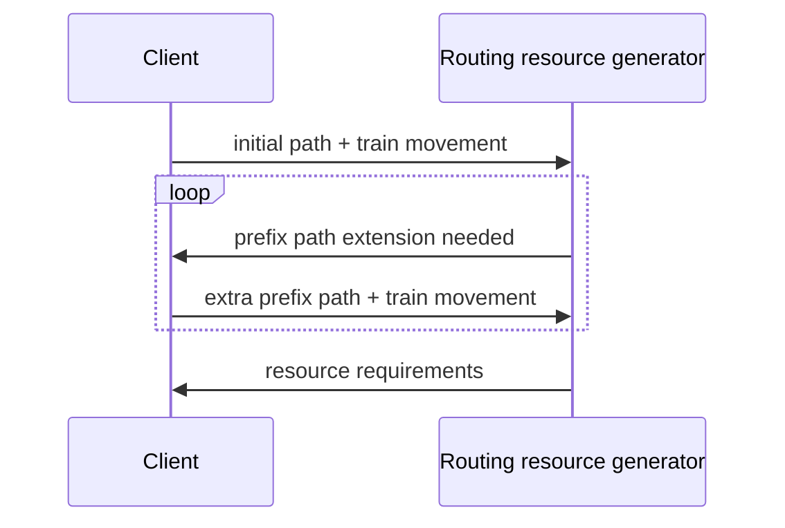
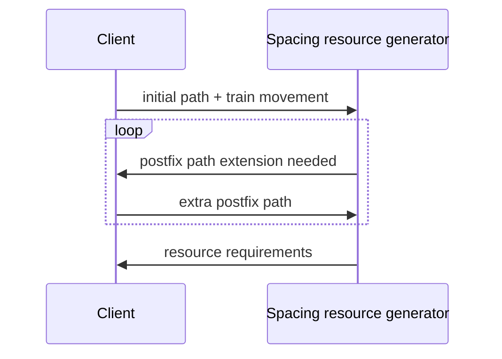

{}
This document is a work in progress
{}

Conflict detection is the process of looking for timetable conflicts.
A timetable conflict is any predictable condition which disrupts planned operations.
Planned operations can be disrupted if a train is slowed down, prevented from proceeding, or delayed.

One of the core features of OSRD is the ability to automatically detect some conflicts:

 - **spacing conflicts**: insufficient spacing between trains sharing the same path
 - **routing conflicts**: insufficient spacing between trains with intersecting paths

Some other kinds of conflicts may be detected _later on_:

 - **maintenance conflicts**: planned maintenance disrupts the path of a train
 - **power delivery conflicts**: combined power delivery requirements exceeds capacity


Conflict detection relies on interlocking and signaling modeling and simulation to:
1) figure out what each actor requires to perform its duty undisturbed
2) detect conflicting requirements


## Design constraints

The primary design goals are as follows:
 - enable threading new train paths into an existing timetable (see STDCM)
 - produce conflicts which can be linked back to a root cause
 - operate in way that can be visualized and interpreted
 - scale to real world timetables: millions of yearly trains, tens of thousands of daily trains

In addition to these goals, the following constraints apply:
 - it must be possible to thread new train paths into timetables with existing conflicts
 - it must not cause false-negatives: if no conflicts are detected, a multi-train simulation of the same timetable must not yield any slowdowns
 - it cannot rely on data we do not have
 - it has to enable later support of mobile block systems
 - it has to rely on existing signaling and interlocking simulation
 - it has to enable detecting conflicts regardless of the signaling system in use
 - it has to support transitions between signaling systems
 - it has to support conflicts between different signaling systems

## Conflict modeling

**Actors** are objects which cause resources to be used:
 - **train paths** (or someone / something on the behalf of the train)
 - **maintenance work**

Actors need **resources** to be available to proceed, such as:
 - **zones**, which have one state per way to traverse it
 - **switches**, which have one state per position
 - **station platforms**, which could be used to prevent two large trains from occupying both sides of a tiny platform

Actor emit **resource requirements**, which:
 - describe the need of an actor for a resource, for a given time span
 - describe what the resource is needed for
 - detail how the resource is used, such as switch position, zone entry and exit

Resource requirements can turn out to be either **satisfied**
or **conflicting** with other requirements, depending on compatibility rules.

**Compatibility rules differ by requirement purpose and resource type**. For example:
 - spacing requirements are exclusive: simultaneous requirements for the same resource are conflicting
 - zone and switch requirements are shareable: simultaneous requirements are satisfied if the resource configuration is identical

**For conflict detection to work, resource requirements have to be at least as extensive as what's required to guarantee that a train path will not be disturbed.**


## Routing conflicts

### Context

For trains to proceed safely along their planned path:

 - switches have to be moved in the appropriate position
 - level crossings have to activate
 - risks of collision with other trains have to be mitigated

In practice, the path of trains is partitioned into routes, which when set, ensure a train can safely follow the route.

Routes have the following lifestyle:

 - As a train approaches the start of one of its routes, it is **called** by an operator. If all resources required to safely use the route are available, switches and level crossings start to move. If a resources is not available, e.g. because another train has reserved a section of track, this process is delayed until all conditions are met.
 - Once all resources are configured and reserved, the route is **set** and ready to be followed. Before that point, the entry of the route was protected by signaling, which prevented the train from moving past the entry point.
 - As the train moves along the route, it is **destroyed**. When the tail of the trail releases key detectors along the route, resources before this detector are released, and can this be reserved by other routes.

For a train to proceed through a route unimpeded, the following things have to happen:

 - The route has to be set before the train arrives, and before it is slowed down by signaling.
 - The route has to be called, so that is it set in time.
 - All resources required for the route to start setting at call time have to be available.


### Generating requirements

```rust
struct RouteRequirement {
    route: RouteId,
    set_deadline: Time,
    zone_requirements: Vec<RouteZoneRequirement>,
}

struct RouteZoneRequirement {
    zone: ZoneId,
    entry_det: DirDetectorId,
    exit_det: DirDetectorId,
    release_time: Time,
    switches: Map<SwitchId, SwitchConfigId>,
}
```

Routing requirements are generated by the following algorithm:
- Compute the set deadline using signaling simulation. The set deadline is the point in time at which the train would be slowed down if the route were not set.
- For each zone in each route, simulate when it would be released, and thus not required anymore.

{}
Route overlaps are not yet supported.
{}

### Requirement compatibility rules

Requirement compatibility is evaluated for all `RouteZoneRequirement`s, grouped by zone. Requirements A and B, ordered such that `A.set_deadline <= B.set_deadline`, are compatible if and only if either:

 - their active time span does not overlap, such that `A.release_time <= (B.set_deadline - activation_time)`, where the activation time is the delay required to reconfigure from `A.switches` to `B.switches`.
 - `(A.entry_det, A.exit_det, A.switches) == (B.entry_det, B.exit_det, B.switches)`


## Spacing conflicts

### Context

Even if interlocking mitigates some of the risks associated with operating trains, a major one is left out: head to tail collisions, caused by insufficient spacing.

This responsibility is handled by signaling, which conveys both interlocking and spacing constraints.

Signaling helps trains slow down until the end of their movement authority, which is either:

 - behind the tail of the next train
 - at the end of the last route set for this train

**Spacing requirements are emitted for zones which if occupied, would cause a slowdown, and zones occupied by the train**


### Generating requirements

```rust
struct SpacingRequirement {
    zone: ZoneId,
    begin_time: Time,
    end_time: Time,
}
```

Every time the driver sees a signal, generate updated spacing requirements by calculating which zones, if occupied, would trigger a slowdown:

 - start by assuming the zone just after the head of the train is occupied
 - until the train is not slowed down, move the occupied section one zone further away from the train

### Requirement compatibility rules

Requirement compatibility is evaluated for all `SpacingRequirement`s, grouped by zone.

Requirements A and B are compatible if and only if their `[begin_time, end_time]` ranges do not overlap.


## Incremental requirement generation


### Routing requirements



After an initial path is given, the requirement generator can ask for more **prefix** path (before the start of the route). The client responds with:

 - the extra prefix path
 - the movement of the train over time on the given prefix path

If the initial path has multiple routes, the last route is the one resource requirements are emitted for.

### Spacing requirements



After an initial path is given, the requirement generator can ask for more **postfix** path (before the start of the route).

## Interactions with STDCM

STDCM needs to generate requirements on the fly:

- train simulation is done on the fly
- the train simulation lags behind path exploration
- STDCM needs to detect conflicts as soon as possible

The API is as follows:

- STDCM can extend the path, and add simulation results. Simulation results are queried using a callback API
- When the path is extended, or simulation results change, `processUpdate` has to be called
- From the standpoint of a requirement generation automaton, simulation results aren't revokable:
  if the callback API responds that the train arrives at a given location at some time, the answer shall not change.

The callback API from the requirement automaton to STDCM allows querying:

- when the train enters or leaves some path range
- the current simulation time
- the current simulation position
- whether the simulation is complete

`processUpdate` returns the list of requirements that changed since the last `processUpdate` call,
either due to a path extension or due to new simulation data. Please note that:

- Requirements are meant to be opaque data to STDCM, only to be processed by the conflict detection API
- If some requirements couldn't be generated due to missing path data, a flag indicating that more path is needed is set.
- When the end time of requirements is unknown due to the simulation not being complete, the simulation time is used as the end of requirement time.
- Requirements can be emitted multiple times for the same resource, until the simulation progresses until the point where the requirement is released

> When the path isn't long enough to emit all current requirements, does the API also return requirements in addition to the "not enough path" flag? If so, can these requirements be ignored?

It would be both easier to use and understand if the API returned either the flag, or requirements, but not both.

## Visualizing requirements

<script type="application/javascript" src="mkt.js"></script>
<object style="width: 100%" onload="mkt_hydrate(this.contentDocument.rootElement)" type="image/svg+xml" data="requirements-diagram.svg"></object>

[Full-page requirements diagram](./requirements-diagram.html)
