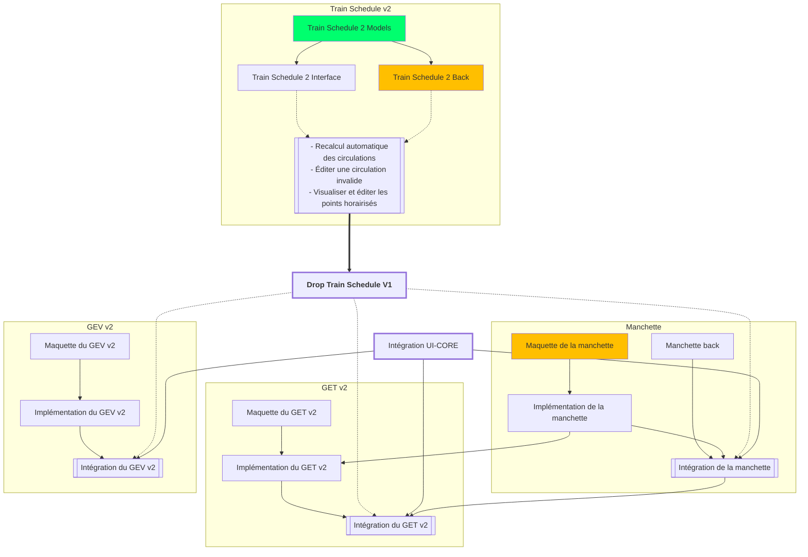
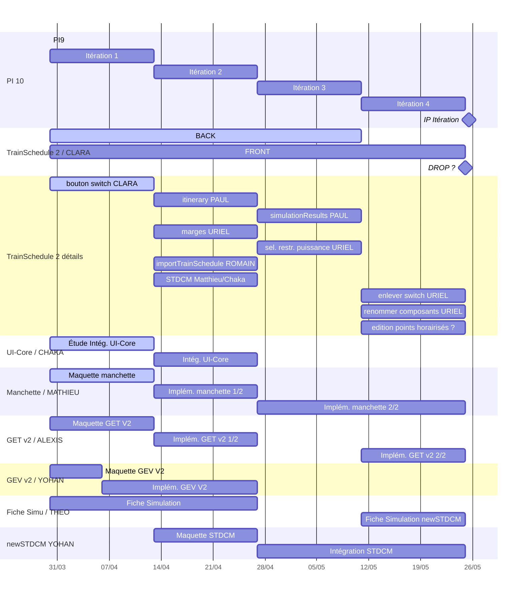

# Schéma de dépendances

```mermaid
  flowchart
    %% TS 2
    ts2_interface[Train Schedule 2 Models]
    style ts2_interface fill:#00ff6e
    ts2_back[Train Schedule 2 Back]
    style ts2_back fill:#ffbf00
    ts2_front[Train Schedule 2 Interface]
    features[[- Recalcul automatique\ndes circulations\n- Éditer une circulation invalide\n- Visualiser et éditer les points horairisés]]
  
    subgraph Train Schedule v2
      direction LR
        ts2_interface --> ts2_front
        ts2_interface --> ts2_back
        ts2_front -..-> features
        ts2_back -..-> features
    end
    
    uicore[Intégration UI-CORE]
    ts2_drop_v1["`**Drop Train Schedule V1**`"]
    style uicore stroke-width:3px
    style ts2_drop_v1 stroke-width:3px
    features ===> ts2_drop_v1

    %% Manchette
    back_manchette[Manchette back]
    maquette_manchette[Maquette de la manchette]
    style maquette_manchette fill:#ffbf00
    implem_manchette[Implémentation de la manchette]
    integration_manchette[[Intégration de la manchette]]

    %% GET
    maquette_GET2[Maquette du GET v2]
    implem_get[Implémentation du GET v2]
    integration_get[[Intégration du GET v2]]

    %% GEV
    maquette_GEV2[Maquette du GEV v2]
    implem_gev[Implémentation du GEV v2]
    integration_gev[[Intégration du GEV v2]]

    subgraph Manchette
        back_manchette ---> integration_manchette
        maquette_manchette --> implem_manchette --> integration_manchette
    end

    subgraph GET v2
        maquette_GET2 --> implem_get --> integration_get
    end

    subgraph GEV v2
        maquette_GEV2 --> implem_gev --> integration_gev
    end
 
    ts2_drop_v1 -...-> integration_get
    ts2_drop_v1 -...-> integration_gev
    ts2_drop_v1 -...-> integration_manchette

    uicore ---> integration_manchette
    uicore ---> integration_get
    uicore ---> integration_gev

    integration_manchette --> integration_get
    implem_manchette --> implem_get
```

# GANTT

## Par thématique

```mermaid
  gantt
    tickInterval 1week
    axisFormat %d/%m
    %% (`excludes` accepts specific dates in YYYY-MM-DD format, days of the week ("sunday") or "weekends", but not the word "weekdays".)

    section PI 10
    PI9                       :pi9, 2024-03-30, 2024-03-31
    Itération 1               :it1, after pi9, 14d
    Itération 2               :it2, after it1, 14d
    Itération 3               :it3, after it2, 14d
    Itération 4               :it4, after it3, 14d
    IP Itération              :milestone, it5, after it4, 1d

    section TrainSchedule 2 / CLARA
    BACK                      :active, ts2back, after pi9, until it4
    FRONT                     :ts2front, after pi9, until it5
    DROP ?                    :milestone, after ts2front


    section TrainSchedule 2 détails
    bouton switch CLARA       :active, bs2, after pi9, until it2
    itinerary PAUL            :iti, after bs2, 14d
    simulationResults PAUL    :simRes, after iti, 14d
    marges URIEL              :marges, after it1, 14d
    sel. restr. puissance URIEL :selPuis, after it2, 14d
    importTrainSchedule ROMAIN :importTS, after it1, 14d
    STDCM Matthieu/Chaka       :stdcm, after it1, 14d
    enlever switch URIEL       :enleverSwitch, after it3, 14d
    renommer composants URIEL  :renommage, after it3, 14d
    edition points horairisés ?:editPointH, after it3, 14d

    section UI-Core / CHAKA
    Étude Intég. UI-Core      :active, spikeUICore, after pi9, until it2
    Intég. UI-Core            :integrationUICore, after spikeUICore, 14d

    section Manchette / MATHIEU
    Maquette manchette        :active, maquetteManchette, after pi9, 14d
    Implém. manchette 1/2     :implemManchette12, after maquetteManchette, until it3
    Implém. manchette 2/2     :implemManchette22, after implemManchette12, until it5

    section GET v2 / ALEXIS
    Maquette GET V2           :maquetteGETV2, after pi9, 14d
    Implém. GET v2 1/2        :implemGETV2, after it1, 14d
    Implém. GET v2 2/2        :implemGETV2.2, after it3, 14d

    section GEV v2 / YOHAN
    Maquette GEV V2           :maquetteGEVV2, after pi9, 7d
    Implém. GEV V2            :implemGEVV2, after maquetteGEVV2, 21d

    section Fiche Simu / THEO
    Fiche Simulation          :ficheSimu, after pi9, 28d
    Fiche Simulation newSTDCM :ficheSimu, after it3, 14d

    section newSTDCM YOHAN
    Maquette STDCM            :maquetteSTDCM, after it1, 14d
    Intégration STDCM         :implemSTDCM, after maquetteSTDCM, 28d
```

## Par métier
