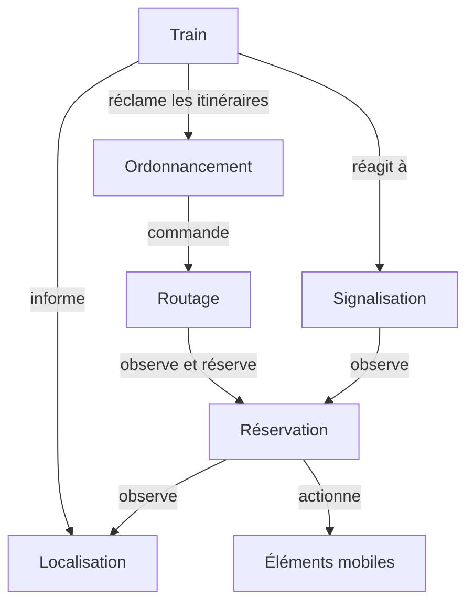

{}
Le modèle de poste d'aiguillage virtuel d'OSRD est pensé pour les besoins
spécifiques de la détection de conflit.

Certaines classes de fonctionnalités essentielles dans les postes
d'aiguillages réels, comme la tolérance aux pannes, ne sont pas utiles
à la détection de conflit, et donc omises du modèle.
{}

{}
Ce document est une description vivante du fonctionnement du poste d'aiguillage virtuel d'OSRD.
Il a pour objectif de renseigner développeurs et experts métiers sur le fonctionnement du simulateur.
Des changements y sont apportés au fil de l'évolution du projet.

Certaines fonctionnalités importantes sont manquantes:
 - enclanchements de convergence (France)
 - pédales (France)
 - overlaps (hors France)
{}

Le modèle de simulation définit le rôle et comportement des différents objets simulés au sein d'OSRD.

Cette modélisation est un compromis entre de multiples enjeux:
 - fidélité de la simulation
 - interprétabilité des résultats
 - adaptabilité du modèle à différentes technologies et usages, que cela soit en terme de signalisation, de poste d'aiguillage, ou d'usage des données

En particulier, certaines subtilités propres aux systèmes pratiques ont été sacrifiées sur l'autel de la compatibilité et de l'interprétabilité:
 - un signal doit forcément s'addresser à un train en particulier: les signaux n'ont pas d'aspect par défaut; ils n'existent que pour être vus
 - les itinéraires / routes sont formées à destination d'un train en particulier

## Architecture

{}
- Gestion des overlaps
{}

## Remerciements

Par ordre alphabétique:

- Christophe Mémin
- Djamal Bellebia
- Gilles Dessagne
- Nathanaël Dias
