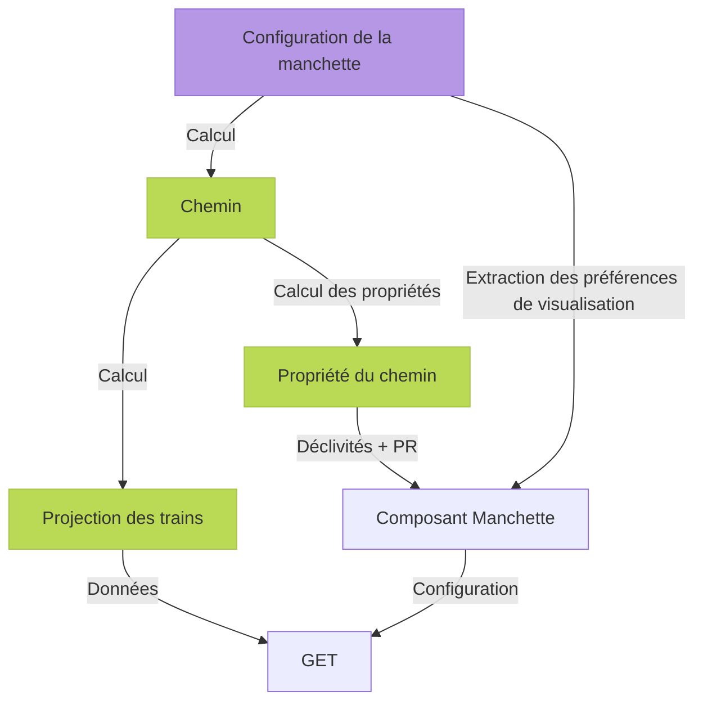

## Prérequis

- Pouvoir créer une manchette à partir d'une liste de PR
- Pouvoir créer une manchette à partir d'un train
- Pouvoir utiliser une manchette sur des infrastructures différentes
- Pouvoir configurer l'affichage de la manchette et que ce soit sauvegardé entre les utilisateurs

### Questions?

- Quelle manchette prendre au début ?
  - Proposition: Un train, cela implique d'avoir des manchettes éphémères.
- Une manchette créée via un train: Qui porte l'information du chemin ?
  - Proposition: on copie les informations du train pour créer l'objet.
- Overlap des stretching ?
  - On peut créer un overlapp (en modifiant l'infra par exemple)
  - Si un overlap à lieu comment c'est géré par le front ? (Il ignore ?, il supprime ?)


## Workflow



## Schéma

```yaml
name: Ma manchette
path:
  - { uic: 87210 } # Any operational point matching the given uic
  - { track: foo, offset: 10000 } # 10m on track foo
  - { trigram: ABC } # Any operational point matching the trigram ABC
  - { operational_point: 35f57ee0-4e67-4cf7-9946-0c6be757ef85 } # A specified operational point
operational_point_settings:
  35f57ee0-4e67-4cf7-9946-0c6be757ef85: # ID of an operational point
    bold: true
    hidden: false
zones:
  - start: 35f57ee0-4e67-4cf7-9946-0c6be757ef85
    end: 30e97a0a-ce2a-4727-8eba-038fba1a6671
stretching:
  - start: 35f57ee0-4e67-4cf7-9946-0c6be757ef85
    end: 30e97a0a-ce2a-4727-8eba-038fba1a6671
    factor: 1.5
```

## Endpoints

```
// TODO
```
