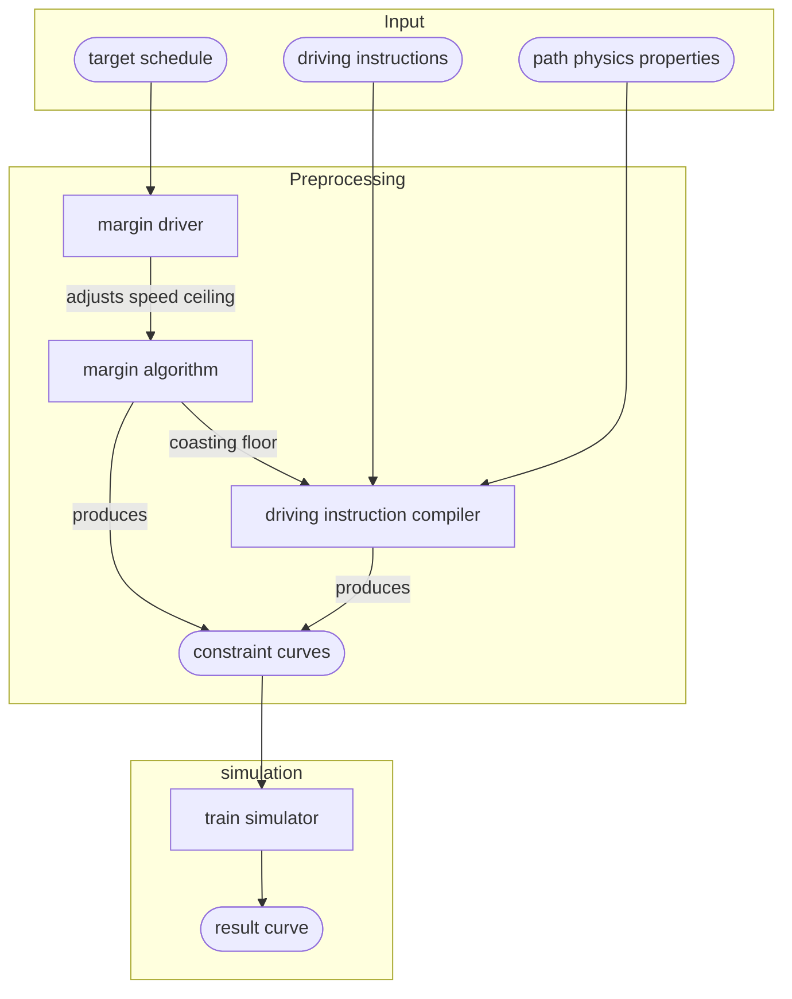

{}
This is a work in progress
{}

After two years of implementing features into a very simple model, it appeared that fundamental
changes are required to meet our needs. This document goes into:

- what are the system's current and projected requirements
- how train simulation is currently implemented
- the shortcomings of the current model
- the specification for the new design
- what was discussed during the design process, and the outcomes of individual discussions
- a discussion of the new design's limitations
- a list of questions designed to challenge design limits, answered by domain experts

# System requirements

The new system is expected to:

- be easy to integrate with [timetable v2](../timetable/)
- handle batch simulations of a full trip
- handle incremental simulations for STDCM
- follow a schedule during batch simulations
- handle rich train state vectors (pantograph, battery state)
- handle realistic reactions to signaling
- provide a low-level API, usable independantly
- integrate a pluggable margin algorithm API

In the long-term, this system is expected to:

- be used to drive multi-train simulations
- handling switching rolling stock at stops
- integrate driver behavior properties

# Previous implementation

The current implementation has a number of shortcomings make it pretty much impossible to evolve to
meet current system requirements. It also has a number of less severe flaws, such as the over-reliance
on floating point, especially for input and output.

The previous implementation cannot be changed to:

- react to signaling
- handle rich train state vectors
- be usable for both incremental simualtion and batch

These limitations are the primary reasons for this redesign.

## Margins

- are defined as post-processing filter passes on simulation results. This has a number of undesirable side effects:

  - the burden of producing correct results lays on margin algorithms, which makes the implementation brittle
  - because margins are applied after the simulation, the simulation can't adjust to impossible margin values
  - margin algorithms have no choice but to piece together results of different simulations:

    - this can only be done if the train state is entirely described by its location and speed,
      otherwise simulation results cannot be pieced together.
    - piecing together simulation results very hard to execute reliably, as there are many corner cases to be considered.
      the end result is quite brittle.

- engineering margins are defined such that their effect has to be entirely contained within their bounds.
  even though it's a desirable property, it means that simulations become a multi-pass affair, with no obvious
  way of keeping train behavior consistent accross passes and boundaries.
- how much time should be lost and where isn't defined in a way that makes scheduled points implementation easy
- when a transition between two margin values occurs, slow downs occur before value changes, and speed ups
  after value changes. This is nice in theory, because it makes the graphs look nicer. The downside is that it
  makes margin values interdependant at each slow-down, as how much speed needs to be lost affects the time lost
  in the section.

## Input modeling

With the previous implementation, the simulation takes sequence of constraint position and speed curves as an input
(continuous in position, can be discontinuous in speed), and produces a continuous curve.

The output is fine, but the input is troublesome:

- braking curves have to be part of constraint curves
- these constraint curves don't have a direct match with actual constraints, such as speed limits, stops, or reaction to signal
- constraints cannot evolve over time, and cannot be interpreted differently depending on when the train reached these constraints
- constraints cannot overlap. the input is pre-processed to filter out obscured constraints

# Design specification

