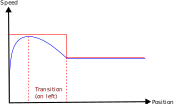
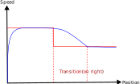

{}
Ceci est un travail en cours
{}

# Contexte

Les marges sont gérées par un composant orchestrant le calcul de marche.

## Quel est le problème de l'implémentation actuelle ?

C'est un renversement des responsabilités.
Cela complexifie grandement la gestion des marges et l’implémentation des marges MARECO.
Le composant de calcul de marche devrait être l'orchestrateur, et obtenir les informations de marge pour produire un résultat.

# Nouvel algorithme des marges

Un composant nommé "Stratégie de marge", prend en entrée les informations nécessaires à la production d'instructions de conduite.
Il est orchestré par le composant de "Calcul de Marche" à travers un coefficient permettant d'augmenter ou de réduire l'intensité des instructions de conduite.

Les entrées nécessaire à la construction de cette stratégie de marge sont :
* la courbe de marche de base
* les propriétés du chemin
* les propriétés du matériel roulant
* la vitesse du train en début de section (pour assurer la continuité de la courbe)
* optionnellement, une vitesse contrainte en fin de section

Ensuite, un coefficient de ralentissement permettra d'opérer cette stratégie de marge pour obtenir des instructions de conduite :
* des limites de vitesse (vitesse maximum)
* des contraintes de vitesse (pour les marches sur l'erre)

{}
Faut-il ajouter également les paramètres suivantes en sortie :
* des coefficients de freinage et d'accélération
{}

Avec le résultat renvoyé par la stratégie de marge, on peut relancer un calcul de marche sur la portion concernée.
En comparant le nouveau temps de parcours et le temps de parcours de la marche tendue, on peut ajuster le coefficient de ralentissement et relancer une exécution de la stratégie de marge.

Une fois que l'on a atteint un temps de parcours satisfaisant, on passe à la portion de chemin suivante.

{}
La transition de marge est donc entièrement prise en charge par le segment suivant (transition à droite).

Gérer les transitions de marges à gauche se répercuterait sur l'ensemble des portions du chemin (on ne pourra plus traiter les segments un par un, mais il faudra calculer les Margins Strategy pour tous les segments du chemin, lancer un CDM et comparer les nouveaux temps de parcours obtenu, puis ajuster tous les coefficients de ralentissement et recommencer).
La compléxité algorithmique sera beaucoup plus importante.
{}
