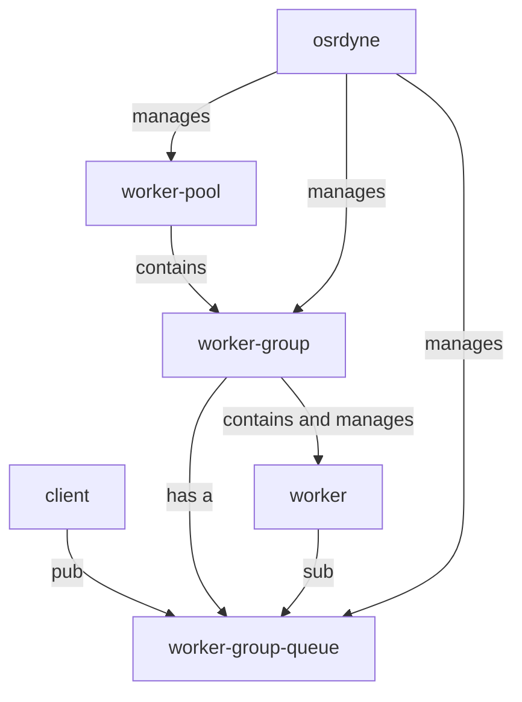
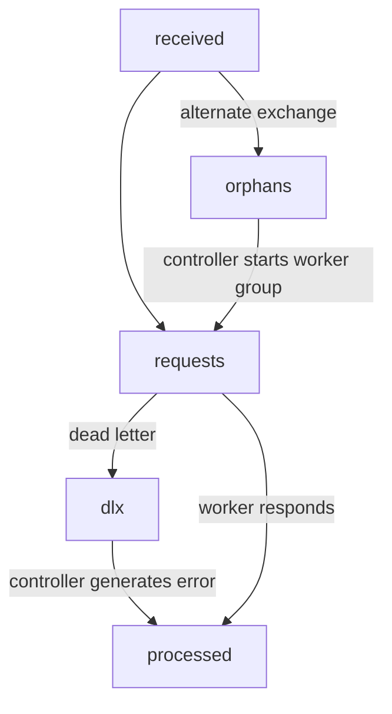
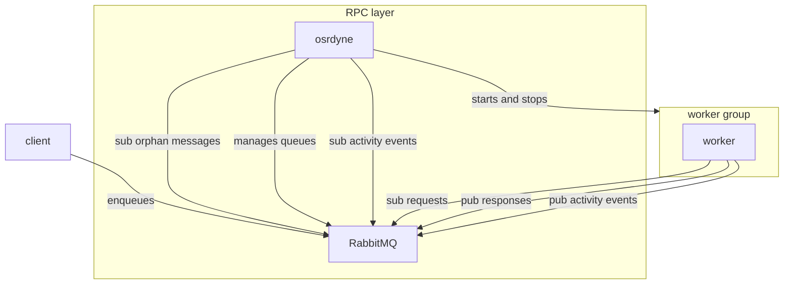
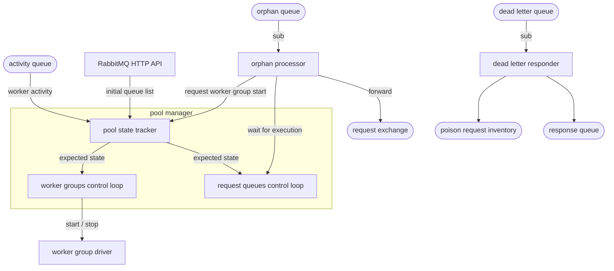
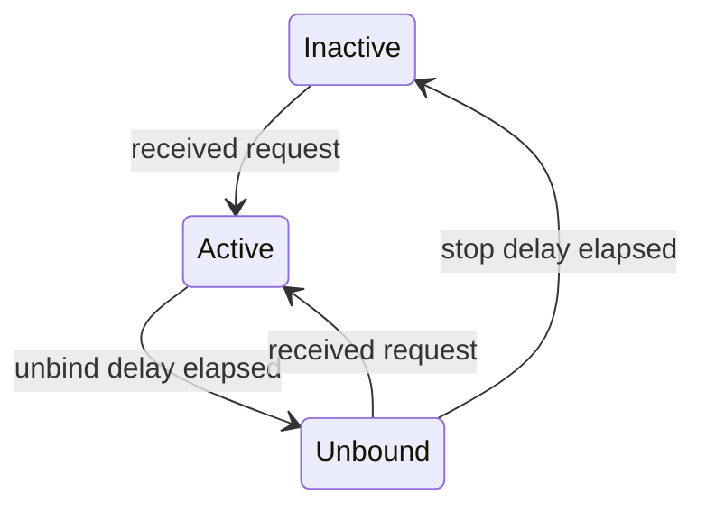

TODO: create another document describing RPC interactions between core and editoast

## Context and requirements

Without this proposal, editoast directly makes calls to core using http.
Using k8s, if multiple core workers are started, requests are randomly
distributed to core workers.

This architecture brings a number of issues:

- To respond to a request, the core worker need to hold the request's full infrastructure in memory.
  Workers do not have enough memory to hold all infrastructures in memory.
  Requests thus need to be routed to core workers specialized by infrastructure, which cannot be easily done using http.
- If too many requests are dispatched to a busy core worker, they will just time out.
- There is no easy way to scale up the number of workers to react to increased load.
- Because calls need to complete within the timeout of the client's http requests,
  the system falls appart when latency increases due to load.

This proposal intends to address these issues by introducing an RPC system which:

- manages [specialized](#worker-key) workers
- automatically scales specialized workers


### Goals

- `high priority` the RPC protocol between editoast and core should be the same for development and production setups
- `high priority` requests are dispatched to specialized workers
- `high priority` the RPC system should be stateless and failure-resilient
- `low priority` the complexity of the local development setup should not increase

### Non-goals

- `not a goal` streaming events to the front-end
- `not a goal` reliable response processing
- `not a goal` caching


## Concepts



### Client

Clients submit RPC [requests](#client-protocol) to the message queue. RPC requests are published using AMQP 0.9.1.

For example, `editoast` would be a client.

### Worker key

Every submitted request includes a requested `worker-key`, as the message's `routing-key`.

**The key is what identifies which worker group will process the request**.

Workers known their worker key at startup. All workers in a worker group have the same worker key.
It is an arbitrary utf-8 string set by the client, whose meaning is not defined by the RPC protocol:

- It could just be a way to have separate processing queues. In this case, workers may not care about what their  is.
- There could be an extra layer of protocol between client and worker about how the key is meant to be interpreted

Here are some **examples** of how such protocols may work:

- it could be the identifier of a resource to act upon: `42`
- it could be the identifiers of multiple resources: `infra=42,timetable=24`
- it could even be, even though that's probably **not a good idea**, random worker settings:
  `log_level=debug`


### Worker pools

Worker pools are collections of workers of the same type, which can be specialized by key.
osrdyne creates an exchange for each worker pool, where clients can submit requests.

For example, `core` would be a worker pool.


### Worker group

Worker groups are collections of workers of the same pool and key, processing messages from the same queue.
**Worker groups are responsible for scaling the number of workers depending on queue length and processing rate.**

Worker groups are managed by osrdyne. osrdyne should support multiple worker group drivers:

- a [keda](https://keda.sh) k8s driver
- a k8s autoscaler driver
- a docker driver
- a subprocess driver, where a single worker is started as a subprocess for each worker group
- a systemd template unit driver
- a noop driver, where workers have to be started manually

For example, each `core` worker group handles a given infrastructure.

### Worker

A worker is a server processing requests from its worker group queue. Worker have a key.
For example, `core` workers are keyed by infrastructure.

### osrdyne

- manages all exchanges, policies, queues and bindings
- starts and stops worker groups as needed
- generates error responses if the worker group fails to respond

Each osrdyne instance manages a worker pool. See the [dedicated section](#osrdyne-architecture).

## RPC protocol

### Client protocol

Requests are submitted using AMQP 0.9.1's `basic.publish`:

| AMQP field | semantics |
|------------|-----------|
| `exchange` | [worker pool](#worker-pools) identifier |
| `routing-key` | [requested key](#worker-key) |
| `correlation-id` | an optional request id. The response will copy this field. |
| `reply-to` property | optional response queue |
| `mandatory` | `true` to ensure an error is returned if the message cannot be routed |

The body of the request will be dispatched to a worker of the requested pool and key.
The request is guaranteed to be dispatched **at least once**

The response format is as follows:

| AMQP field | semantics |
|------------|-----------|
| `correlation-id` | the correlation ID from the request |
| `x-status` property | either `ok`, [or the reason for dead lettering](https://www.rabbitmq.com/docs/dlx#effects), taken from the request's `x-first-death-reason` |
| body | optional response data |


### Worker protocol

When starting workers, the worker group driver provides:

| Variable name | semantics |
|---------------|-----------|
| `WORKER_ID` | a unique identifier for this worker |
| `WORKER_KEY` | the [worker key](#worker-key) |
| `WORKER_POOL` | the name of the worker pool |
| `WORKER_REQUESTS_QUEUE` | the queue to consume work from |
| `WORKER_ACTIVITY_EXCHANGE` | the exchange to publish events to |

Workers then have to:
- publish a `started` [activity report message](#worker-activity-reports)
- subcribe to `WORKER_REQUESTS_QUEUE` using `basic.consume`
- for each request message:
  - publish a `request-received` [activity report message](#worker-activity-reports)
  - if the worker cannot process the request, it can request a requeue using `basic.reject` with `requeue=true`
  - build and publish a response to the [default exchange](https://www.rabbitmq.com/tutorials/amqp-concepts#exchange-default)
  - `basic.ack` the request


#### Worker response protocol

Responses are submitted using AMQP 0.9.1's `basic.publish`:

| AMQP field | semantics |
|------------|-----------|
| `exchange` | [worker pool](#worker-pools) identifier |
| `routing-key` | [requested key](#worker-key) |
| `reply-to` property | optional response queue |

#### Worker activity reports

Workers report the following activity events:

- `started`: the worker is about to start processing requests
- `request-received`: a request was received

| AMQP field | value |
|------------|-----------|
| `exchange` | `WORKER_ACTIVITY_EXCHANGE` |
| `routing-key` | `WORKER_KEY` |
| `x-event` property | the event type |


## Message passing architecture


For a full reference of all exchanges and queues, see the [exchanges and queues](#exchange-and-queues) section

## Message lifetime



## Service architecture



- `osrdyne` stops and starts worker groups following demand
- `worker` processes requests dequeued from rabbitmq


## Life of an RPC call

In this example:

- `editoast` is the client
- it makes a request to the `core` worker pool
- the `core` worker pool is keyed on infrastructures

### Fast path

- Editoast publishes a request message to `exchange=core` with `routing_key=42`. If the message expects a reply, `reply-to` is set.
- If the `core` exchange already has binding for worker group `42`, a worker picks up the request
- The worker processes the request, and uses the `reply-to` field to submit a response.
- The worker ACKs the request.

### Worker group startup

These steps only occur if the worker group / queue has not yet started:

- If there is no queue bound to routing key `42`, the message is routed to the `core-orphan-xchg` exchange.
  This exchange is a fanout exchange with a single queue, where `osrdyne` processes messages.
- `osrdyne` processes the message:
  - creates queue `core-req-42`, binds it to the `core` exchange on routing key `42`
  - forward the message to exchange `core`
  - ACK the original message once the original is forwarded
  - start worker group `core` key `42`
- the worker group starts up and processes the request

## osrdyne architecture



- the **pool manager** is the most complex component of osrdyne. It is in charge of creating,
  deleting request queues, and deciding which worker groups should be running at any given time. To make such decisions, it needs:
    - the ability to list existing queues at startup, which is done using the RabbitMQ HTTP API
    - worker activity events, to know which queues are active
    - queue creation commands from the orphan processor

  The pool manager runs two control loops:
  - the **worker groups control loop** starts and stops worker groups using the **worker group driver**
  - the **request queues control loop** creates and deletes request queues

- the **orphan processor** reacts to orphan messages by sending worker group start commands to the worker group manager
- the **dead letter responder**:
  - responds errors to dead lettered messages following the [worker protocol](#worker-protocol)
  - if a message is deemed to have caused repeated worker crashes, publish to the poison inventory

On worker pool startup:

- create and bind all [exchanges and queues](#exchanges-and-queues)
- configure the TTL, delivery timeout and delivery limit policies using the HTTP API
- start the **orphan processsor**, **dead letter responder** and **worker group manager**


### Exchanges and queues

osrdyne creates a number of exchanges and queues. Most of the setup is done
per worker pool, except for worker group request queues.

Worker pool exchanges:

- pool requests exchange `{pool}-req-xchg`, type `direct`:
  - alternate exchange is `{pool}-orphan-xchg`
  - dead letter exchange is `{pool}-dl-xchg`
  - worker group request queues are bound to this exchange
- orphan exchange `{pool}-orphan-xchg`, type `fanout`
- dead letter exchange `{pool}-dl-xchg`, type `fanout`
- activity queue `{pool}-activity-xchg`, type `fanout`

Worker pool queues:

- dead letter queue `{pool}-dl`, bound to `{pool}-dl-xchg` (**exclusive**)
- orphan queue `{pool}-orphan`, bound to `{pool}-orphan-xchg` (**exclusive**)
- worker activity queue `{pool}-activity`, bound to `{pool}-activity-xchg`
- poison queue `{pool}-poison`. Used to collect messages which could not be processed, supposedly due to worker crash

Worker group queues:

- request queue `{pool}-req-{key}`, bound by key to `{pool}-req-xchg`

### Worker group manager

The worker group manager has three internal components:

- the **pool state tracker** tracks the expected status of worker groups
- the **request queues control loop** applies changes to worker group request queues
- the **worker groups control loop** applies changes to worker groups

The state tracker assigns a 64 bit generation identifier to each expected state.
The two control loops report the last synchronized state.

When the orphan processor wants to start a worker group, it has to:

- tell the **state tracker**, which gives a generation identifier for the new expected state
- wait until the **request queue control loop** has caught up to this generation **and** has
  created the queue (which may be delayed due to networking issues)

#### Pool state tracker



Two time constants govern how the expected state of worker groups evolves:

- `UNBIND_DELAY` delay until the queue transitions from `Active` to `Unbound`
- `STOP_DELAY` delay until the worker group is stopped

The state tracker has the following API:

```rust
enum WGStatus {
    Active,
    Unbound,
}

struct Generation(u64);

struct PoolState {
    generation: Generation,
    wgs: im::OrdMap<String, WGStatus>,
}

trait PoolStateTracker {
    fn new(initial_worker_groups: Vec<String>) -> Self;

    /// Require some worker group to be active. The extra lifetime adds active duration compared to the configured spooldown schedule.
    /// This allows the worker activity processor to debounce activity events without lowering the active time of worker groups.
    /// Returns the state generation where this worker group starts being active.
    async fn require_worker_group(&self, key: &str, extra_lifetime: Duration) -> Generation;

    /// Subscribe to a stream of target pool state updates
    async fn subscribe(&self) -> tokio::sync::watch::Receiver<PoolState>;
}
```

### Request queues control loop

The request queue control loop takes care of creating, binding, unbinding and stopping request queues.
It subscribes to the pool state tracker, and reacts to state changes.

It exposes the following API, which is used by the orphan processor to wait for updates to propagate:

```rust
struct ReqQueueStatus {
    expected: Option<WGStatus>,
    actual: Option<WGStatus>,
}

struct ReqQueuesState {
    generation: Generation,
    queues: im::OrdMap<String, ReqQueueStatus>,
}

trait RequestQueueControlLoop {
    fn new(target: tokio::sync::watch::Receiver<PoolState>) -> Self;
    fn subscribe(&self) -> tokio::sync::watch::Receiver<ReqQueuesState>;
}
```

it runs the following control loop:

- fetch the set of `current`ly active request queues
- control loop:
  - for each queue in `expected` and not in `current`:
    - attempt to create the queue
    - if successful, update the current set
  - for each queue in `current` and not in `expected`:
    - attempt to remove the queue, if empty and unused
    - if successful, update the current set
  - for each waiting orphan processor, release if the condition is met

The control loop runs when `current` != `expected`, or when `expected` changes.

### Worker groups control loop

osrdyne is responsible for starting and stopping worker groups following demand.
**It it NOT responsible for scaling the number of workers per worker group**.

osrdyne runs the following control loop:

- receive the set of `expected` worker groups from the **pool state tracker**
- build the set of `running` worker groups: query running worker groups from the **worker group driver**. If this fails, log and continue to the next iteration of the control loop.
- make both sets converge:
  - for each worker group in `expected` and not in `running`:
    - use the docker / kubernetes API to start the worker group. This must be idempotent. **do not retry** [^control-loop-retry]
  - for each worker group in `running` and not in `expected`:
    - use the docker / kubernetes API to attemps to stop the worker group. This must be idempotent. **do not retry** [^control-loop-retry]

[^control-loop-retry]: The control loop is designed to make the state of all worker groups converge at once.
                       Retrying convergence for one worker group adds latency to convergence for all worker groups.

### Worker activity processor

As the number of worker activity events could be very high, we may not want to forward all of these to the pool state tracker:
if multiple messages are received within a short time span, only the first one is relevant. A separate actor can be used to receive
and dedup activity messages, and forward a low bandwidth summary to the pool state tracker.


## Failure mode analysis

### The worker fails to parse a message

This is an application layer error:
the worker must respond, and indicate that something went wrong

### The worker dies or stalls when processing a message

RabbitMQ will wait until the message TTL expires, and re-queues it.
A limit must be set on the number of times a message can be re-queued using a [`delivery-limit`](https://www.rabbitmq.com/docs/quorum-queues#poison-message-handling).
When this limit is reached, the poison message is sent to the dead letter exchange, and the client times out.

### osrdyne fails to start

- If exchanges are not setup, the client cannot publish messages
- If the appropriate work group is operational, the [fast path](#fast-path) can proceed
- Otherwise, requests pile up in the orphan queue, and the client ends up timing out

### Invalid worker key

Because the key is an arbitrary string set by the client, it has to be processed carefully:

- the format is defined as a convention between the client and workers. If the format isn't right,
  it is up to the worker to publish a response to the client.
- key validity conditions is also up to the worker: if the key is supposed to be some
  object ID, but the object does not exist, the worker needs to start up and respond

**Even if the key does not conform to the convention established between the client and the
worker, the worker needs to start and respond to all requests.**

### Workers fails to start

**A [per-queue message TTL](https://www.rabbitmq.com/blog/2014/01/23/preventing-unbounded-buffers-with-rabbitmq#per-queue-message-ttl)
should be set to avoid requests accumulating indefinitly.**

Workers failing to start will cause:

- messages to accumulate in the queue.
- when message TTL is reached, it will get transfered to the dead letter queue
- the client will time out awaiting a response


### Multiple ordyne daemons are started on the same pool

It shouldn't be an issue, as:

- all operations done on startup are idempotent
- before doing anything, the daemon has to start listening as an **exclusive consumer of the dead letter and orphan queues**

## Known limitations

### Latency, publisher confirms and reliability

Without publisher confirms, networker or broken failure can result in message loss.
However, publisher confirms add quite a bit of latency (about 200ms), as it ensures messages are persisted to disk if the queue is durable.

**We should use publisher confirms for responses and orphan transfers, and leave the decision of whether to do it for requests to the client.**

### At least once semantics

Most things in this protocol have at least once semantics if publisher confirms are used:

- `request delivery to workers`: if osrdyne is restarted while transfering an orphan to its destination, the orphan may be transfered twice
- `response delivery to clients`: if a worker takes slightly too long to ACK a message, but still responds, it may be requeued and re-processed, and thus responded to twice

## Design decisions

### Using RabbitMQ

To implement this solution, we rely on a combination of [features unique to RabbitMQ](https://www.rabbitmq.com/docs/extensions):

- each worker type needs a separate **exchange** and configuration
- when a message cannot be routed within a worker type's exchange, it is redirected to an **alternate exchange** managed by the worker manager
- **dead lettering** is leveraged to generate protocol errors
- the worker manager uses the **RabbitMQ HTTP API** to list queues

In addition to its attractive feature set, RabbitMQ has:

- various useful quality of life features, such as direct reply and per-message TTL
- long demonstrated its **reliability**
- multiple engineers on staff **experience**d with the tool


### Queues are created by osrdyne

At some point, we explored the possibility of RPC clients creating queues.
osrdyne would react to queue creation by starting workers. If the
queue were to be unused for a while, osrdyne would stop workers and
delete the queue.

This creates a race condition on queue deletion:

- osrdyne sees that the queue is empty
- the client ensures the queue is created
- osrdyne deletes the queue
- the client attempts to publish a message to the now deleted queue

We thus decided to move the responsibility of queue management to the
osrdyne, and implement a mechanism to ensure messages cannot be
dropped due to a missing queue.


### osrdyne republishes orphan messages

Initially, we though of a solution whereby osrdyne's orphan processor uses [dead lettering](https://www.rabbitmq.com/docs/dlx)
to send messages back to their original exchange. This is in fact a bad idea, as dead lettering [inhibits per message TTL](https://www.rabbitmq.com/docs/dlx#effects).

Instead, the orphan processor has to proxy messages back to their original exchange.
**This proxying process can cause requests to get delivered multiple times to the target queue**.


### osrdyne responds to dead lettered messages

If a message is dead lettered for some reason (expired TTL, delivery limit, max queue length),
we figured it would be best to give the client some idea that something went wrong.

The [worker protocol](#worker-protocol) thus has to allow the client to distinguish protocol errors from worker responses.


### Messages are only ACKed by workers once processed

If messages are ACKed on reception:
- processing time is not limited by message timeout (which is arguably not a feature)
- the broker does not attempt re-delivery if the worker were to stop and not respond for some reason

If messages are ACKed once processed:
- messages whose processing time exceeds TTL will be re-queued, even if the worker is still processing the message. **This can result in multiple responses being delivered**.
- if the worker crashes or is stopped, the message will be re-queued

We decided to rely on a [`delivery-limit` policy](https://www.rabbitmq.com/docs/quorum-queues#poison-message-handling) to handle poison messages, and ACK messages once processed.


### Report worker activity using AMQP

osrdyne needs to maintain queue usage statistics in order to know when worker groups can be stopped.
At first, we considered having workers use valkey to store the timestamp of the last processed message for the queue.
We decided against it as:

- it would mean the workers store a timestamp directly in database, read by a supervisor process. it's a pretty bad design
- it adds an additional database to the RPC architecture, for little to no benefit compared to just using rabbitmq
- if one of the workers has its clock drift by more than the worker group expiration time compared to osrdyne, the worker group will get stopped
- any worker can get the pool deleted by forcing the timestamp to an old value
- it adds a failure mode: if osrdyne / workers are unable to reach valkey, weird bugs may ensue

Instead, we decided to require worker to publish activity updates to a dedicated queue.
This queue can be watched by osrdyne, which can use these events to know when to stop a worker group.


### Make worker group lifetime decisions in a separate actor

The lifetime of worker groups is influenced by three types of asynchronous events:

- worker activity
- orphan requests
- worker group spooldown deadlines

When the orphan processor gets a request, it needs to create the worker group's request
queue before it can proceed to forward the message.

If queues were created and deleted asynchronously when these events are received, it would introduce a race condition:

- the orphan processor creates the queue
- the queue gets deleted because it expired at the same time
- the orphan processor forwards the message, which gets lost

We found multiple solutions for this issue:

- process all asynchronous events in a single actor. This was not deemed viable because worker activity processing is work intensive, and orphan request processing is latency sensitive.
- having a single actor create and delete queues (the [**request queues control loop**](#request-queues-control-loop)) and making the orphan processor wait until the control loop creates the queue


### Unbind the queue and wait before stopping workers

In a previous design, we tried to delete work queue in one go. It created a race condition issue on queue deletion,
caused by the fact ordyne does not get direct notifications of when messages are received on a work queue:

- we decide to stop the worker group
- work is received on the queue, but we aren't made aware as no worker is up
- we try to delete the queue, but cannot do so without loosing messages

We could think of two fixes for this issue:

- implement a two stage shutdown, where no work can get to the queue for a while before workers are stopped
- detect that the queue still has messages after workers have stopped, and start workers back up

We decided to implement two stage worker group shutdown:

- if no activity is register for `UNBIND_DELAY`, unbind the work queue
- wait for a while to see if any worker picks up work from the queue and notifies osrdyne, which would rebind the queue
- if no orphan nor worker activity is registered for `STOP_DELAY`, stop workers and delete the queue
