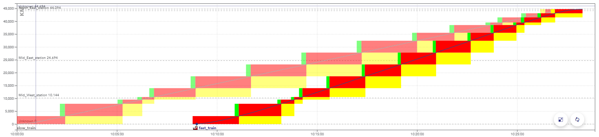

Some definitions:

### Capacity

**Capacity**, in this context, is the ability to
reserve infrastructure elements to allow the passage of a train.

Capacity is expressed in both space and time:
the reservation of an element can block a specific zone
that becomes inaccessible to other trains, and this reservation
lasts for a given time interval.

It can be displayed
on a chart, with the time on the horizontal axis
and the distance traveled on the vertical axis.

> Example of a space-time chart displaying the passage of a train.
>
> The colors here represent aspects of the signals, but
> display a consumption of the capacity as well:
> when these blocks overlap for two trains, they conflict.

There is a **conflict** between two trains when they reserve
the same object at the same time, in incompatible configurations.

> Example of a space-time graph with a conflict: the second train
> is faster than the first one, they are in conflict at the end
> of the path, when the rectangles overlap.
>
> When simulating this timetable, the second train would be
> slowed down by the yellow signals, caused by the
> presence of the first train.

### Train slots

A **train slot** corresponds to a capacity reservation
for the passage of a train. It is fixed in space and time:
the departure time and the path taken are known.
On the space-time charts in this page, a train slot corresponds
to the set of blocks displayed for a train.

> Note: in English-speaking countries, these are often simply called "train paths".
> But in this context, this name would be ambiguous with the
> physical path taken by the train.

The usual procedure is for the infrastructure manager
(e.g. SNCF Réseau) to offers train slots for sale to
railway companies (e.g. SNCF Voyageurs).

At a given date before the scheduled day of operation,
all the train paths are allocated. But **there may be
enough capacity to fit more trains**. Trains can fit between
scheduled slots,
when they are sufficiently far apart or have not found a buyer.

The remaining capacity after the allocation of train paths is called
**residual capacity**. This section explains how OSRD looks
for train slots in this residual capacity.