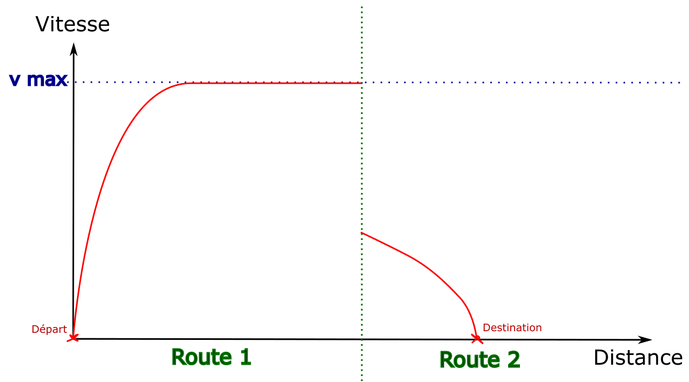

#### Le problème des discontinuités

Au moment d'explorer une arête du graphe, on effectue un calcul de
marche pour connaître l'évolution de sa vitesse.
Mais il n'est pas possible de voir plus loin que l'arête en question,
ce qui est gênant pour calculer les courbes de freinages qui peuvent
nécessiter de commencer à freiner plusieurs kilomètres avant l'arrivée.

> Cet exemple illustre le problème : par défaut
> la première arête est explorée en allant à la vitesse maximale.
> C'est seulement en explorant la seconde arête que la destination devient visible,
> sans que la distance restante soit suffisante pour s'arrêter.

#### La solution : revenir en arrière

Pour régler ce problème, lorsqu'une arête est générée avec une discontinuité
dans les courbes de vitesse, l'algorithme revient sur les arêtes précédentes
pour en créer des nouvelles qui incluent les décélérations.

Pour donner un exemple simplifié, sur un chemin de 4 routes
où le train peut accélérer ou décélérer de 10km/h par route :

Pour que le train s'arrête à la fin de la route 4, il doit être au plus à 10km/h
à la fin de la route 3. Une nouvelle arête est alors créée sur la route
3 qui finit à 10km/h. Une décélération est ensuite calculée à rebours de la fin de la route
vers le début, jusqu'à retrouver la courbe d'origine (ou le début
de l'arrête).

Dans cet exemple, la discontinuité a seulement été déplacée vers la
transition entre les routes 2 et 3. Le procédé est ensuite réitéré
sur la route 2, ce qui donne le résultat suivant :

Les anciennes arêtes sont toujours présentes dans le graphe, elles
peuvent mener à d'autres solutions.

