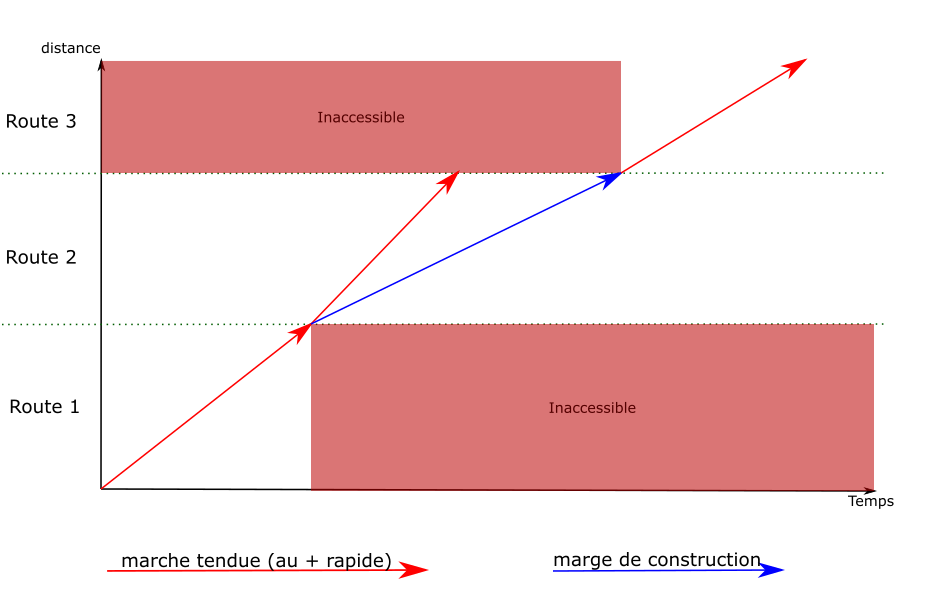

En explorant le graphe, il arrive souvent de tomber sur des situations
qui mèneraient à des conflits. Il faut être en mesure de rajouter du délai
pour les éviter.

#### Décalage du temps de départ

Dans les paramètres de l'algorithme, le temps de départ est donné
sous la forme d'une fenêtre : un temps de départ au plus tôt et au plus tard.
Tant que c'est possible, il est toujours préférable de décaler le temps
de départ pour éviter les conflits.

> Par exemple : un train doit partir entre 10:00 et 11:00. En partant
> à 10:00, cela provoque un conflit, le train doit entrer en gare
> d'arrivée 15 minutes plus tard. Il suffit de faire partir le train à
> 10:15 pour régler le problème.

Dans OSRD, cette fonctionnalité est gérée en gardant une trace,
à chaque arête, du décalage maximal du temps de départ qui pourra
être ajouté sur la suite du parcours. Tant que cette valeur est suffisante,
tous les conflits sont évités par ce moyen.

Le décalage du temps de départ est une valeur stockée sur chaque arête
et additionnée à la fin de la recherche de chemin.

> Par exemple :
> - un train doit partir entre 10:00 et 11:00. La recherche
> commence avec un délai maximal de 1:00.
> - Après quelques arêtes, une non-disponibilité est constatée
> 20 minutes après notre passage. La valeur passe donc à
> 20 minutes pour la suite du parcours.
> - Le temps de départ est ensuite décalé de 5 minutes pour contourner
> un conflit, modifiant le décalage maximal à 15 minutes.
> - Ce procédé continue jusqu'à arriver à la fin du trajet, ou
> jusqu'au point où il faut ajouter plus de délai.

#### Marges de construction

Quand la valeur de décalage maximal du temps de départ tombe à 0,
il faut rajouter du délai entre deux points du parcours du train.

Le principe est le même que pour régler les discontinuités de vitesse :
le graphe est parcouru en arrière pour créer de nouvelles arêtes.

La [marge de construction]( "marges")
est une fonctionnalité du calcul de marche
permettant d'ajouter un délai donné entre deux point du parcours.