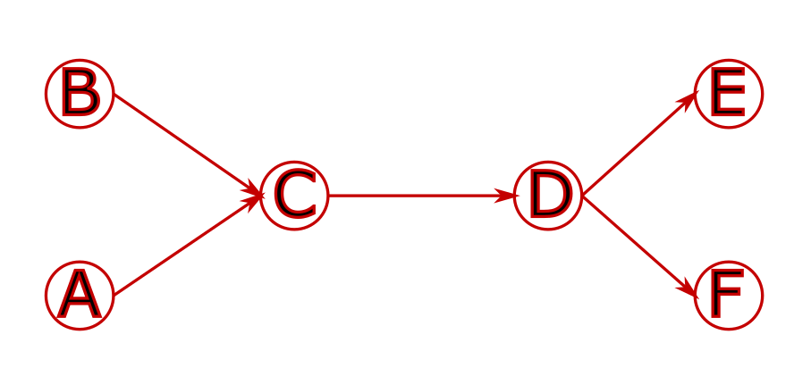
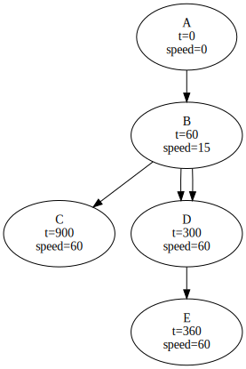

#### General principle

The problem is still a pathfinding problem in a given graph.
Once the problem is encoded as a graph search, it is possible to reuse
our existing tools for this purpose.

We consider the *product graph* of position, time, and speed.
This means that every graph element contains these 3 variables
(among other things)

Every graph edge is computed using
[running-time calculation]( "running-time calculation")
to get speed and positions as functions of time.

#### Graphical representation

Space is encoded with a graph that contains the physical infrastructure.

It is then "duplicated" at different times.

The nodes are then linked together in a way that reflects travel time.

#### Notes

- The graph is constructed on the fly as it is explored.
- It is *discretized* in time, to evaluate which nodes have already
been visited. We keep full accuracy of time values, but two nodes
at the same place and close times are considered identical.
- Every edge is computed with a running time computation.
- Speed isn't discretized or considered to check visited nodes,
it's only used to compute time.
- By default, the train always goes as fast as it can
(while still following standard allowances).
It only slows down when necessary.

#### Example

For example, with the following infrastructure, using the track graph:

Exploring the solution graph can give the following result:
