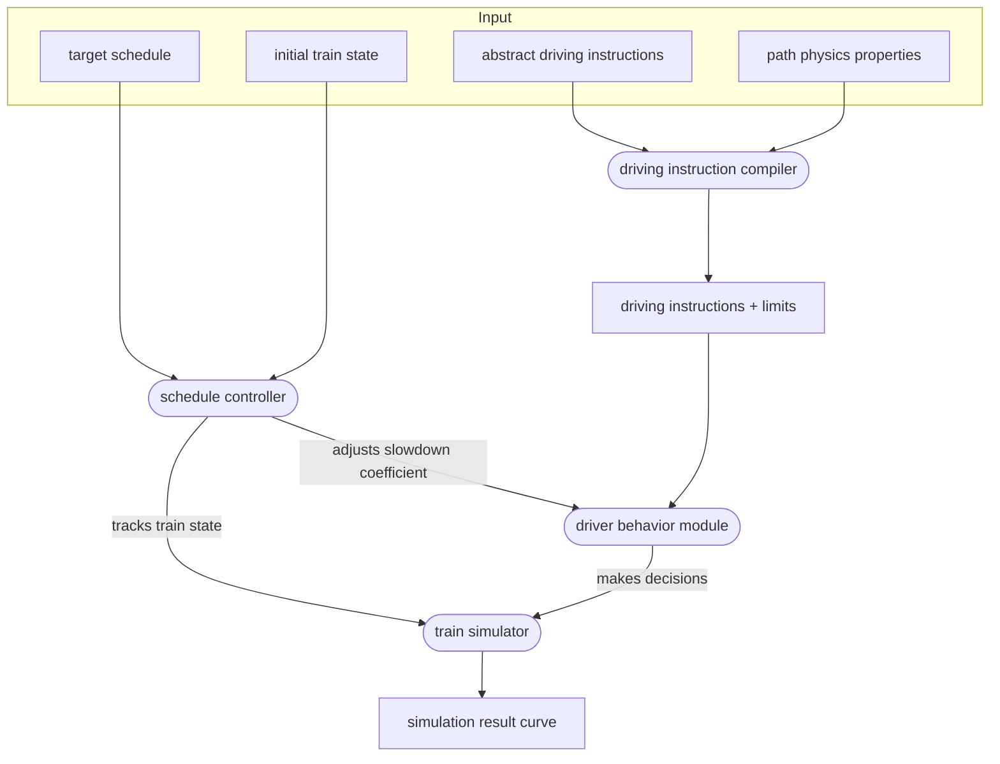

{}
This work is pending implementation, and has not yet been adjusted to
reflect potential required adjustments.
{}

After two years of extending a fairly simple simulation engine, it appeared that fundamental
changes are required to meet expectations.

TODO:
- add non goals
- better goals
- prioritize goals
- translate diagrams from the slideshow to english, add these here https://docs.google.com/presentation/d/1DWYU3K9as4w3O-XBFdCLxrB9miYzUEh1m_Baqqs8Tp4/edit#slide=id.g2c31b302dee_0_1
- explain how driver behavior modules work exactly
- give examples of driving instruction sequences for each kind of constraint
- describe what APIs driver behavior modules need to simulate samples
- give high level APIs for driver behavior modules and driving instructions
- describe how driver behavior modules would use the slowdown coefficient to monotonically generate decisions
- give examples of corner cases for driver behavior modules
- describe the exact external FFI api, and its differences from the rust library API
- add a short description of concepts, actors and who does what

## System requirements

The new system is expected to:

- be easy to integrate with [timetable v2](../timetable/)
- handle simulations of a full trip, with a complete known path, possibly following a schedule
- handle simulations where the path is discovered incrementaly
- handle rich train state (pantograph position, battery state)
- handle reactions to signaling
- provide a low-level API, usable independently
- integrate a pluggable margin algorithm API

In the long-term, this system is expected to:

- be used to drive multi-train simulations
- handling switching rolling stock at stops
- integrate driver behavior properties

## Design specification

## Design limits

- trains do not anticipate margin transitions: only the next target arrival time matters for finding the slowdown factor
