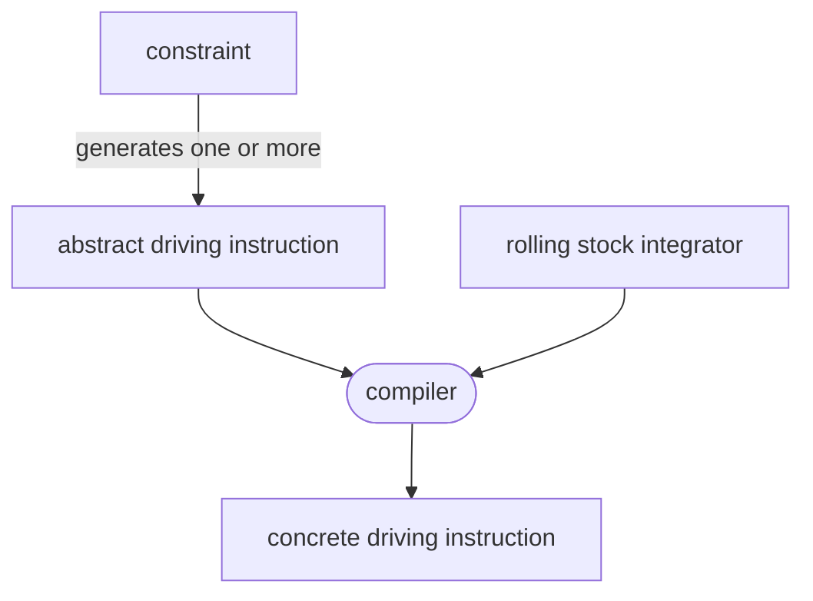
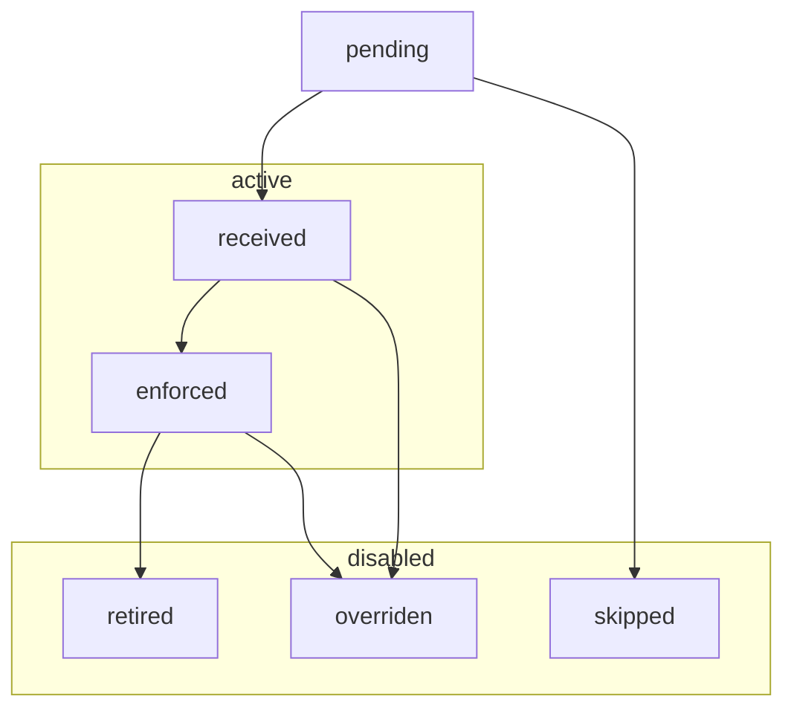
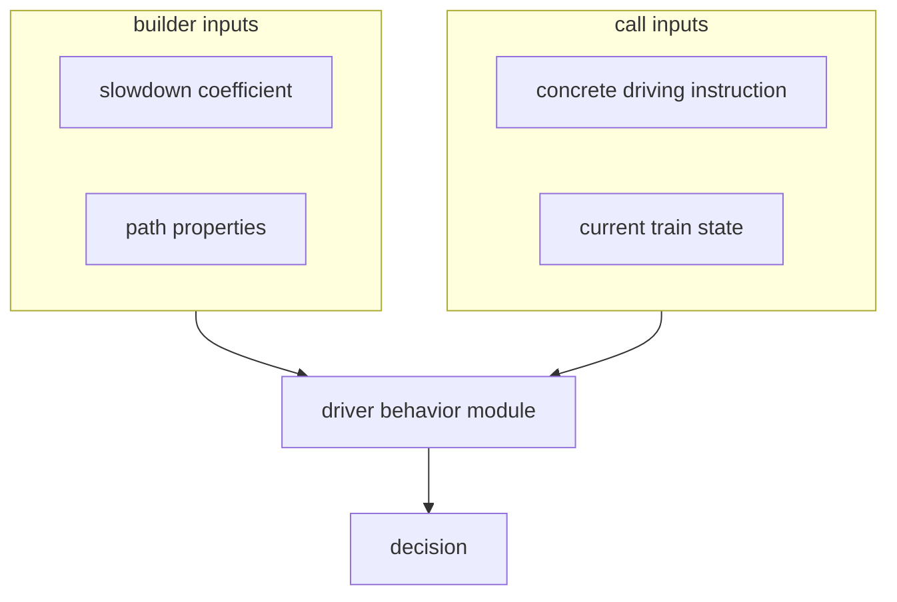

{}
This work is pending implementation, and has not yet been adjusted to
reflect potential required adjustments.
{}

After two years of implementing features into a very simple model, it appeared that fundamental
changes are required to meet our needs. This document goes into:

- what are the system's current and projected requirements
- how train simulation is currently implemented
- the shortcomings of the current model
- the specification for the new design
- what was discussed during the design process, and the outcomes of individual discussions
- a discussion of the new design's limitations
- a list of questions designed to challenge design limits, answered by domain experts


## System requirements

The new system is expected to:

- be easy to integrate with [timetable v2](../timetable/)
- handle simulations of a full trip, with a complete known path, following a schedule
- handle simulations where the path is discovered incrementaly
- handle rich train state (pantograph position, battery state)
- handle reactions to signaling
- provide a low-level API, usable independently
- integrate a pluggable margin algorithm API

In the long-term, this system is expected to:

- be used to drive multi-train simulations
- handling switching rolling stock at stops
- integrate driver behavior properties


## Previous implementation

The current implementation has a number of shortcomings making it pretty much impossible to evolve to
meet current system requirements. It also has a number of less severe flaws, such as the over-reliance
on floating point, especially for input and output.

The previous implementation cannot be changed to:

- react to signaling, as constraints stay the same as the simulation evolves
- handle rich train state vectors, due to the way margins are implemented
- be usable for both incremental simulation and batch

These limitations are the primary reasons for this redesign.

### Margins

- are defined as post-processing filter passes on simulation results. This has a number of undesirable side effects:

  - margin algorithms produce the final simulation results. They may produce bogus (physically unrealistic) simulations results
  - because margins are applied after the simulation, the simulation can't adjust to impossible margin values
  - margin algorithms have no choice but to piece together results of different simulations:

    - engineering margins are defined such that their effect has to be entirely contained within their bounds.
      even though it's a desirable property, it means that simulations become a multi-pass affair, with no obvious
      way of keeping train behavior consistent accross passes and boundaries.
    - this can only be done if the train state is entirely described by its location and speed,
      otherwise simulation results cannot be pieced together.
    - piecing together simulation results is very hard to execute reliably, as there are many corner cases to be considered.
      the end result is quite brittle.

- how much time should be lost and where isn't defined in a way that makes scheduled points implementation easy
- when a transition between two margin values occurs, slow downs occur before value changes, and speed ups
  after value changes. This is nice in theory, because it makes the graphs look nicer. The downside is that it
  makes margin values interdependent at each slow-down, as how much speed needs to be lost affects the time lost
  in the section.


### Input modeling

With the previous implementation, the simulation takes sequence of constraint position and speed curves as an input
(continuous in position, can be discontinuous in speed), and produces a continuous curve.

The output is fine, but the input is troublesome:

- braking curves have to be part of constraint curves
- these constraint curves don't have a direct match with actual constraints, such as speed limits, stops, or reaction to signal
- constraints cannot evolve over time, and cannot be interpreted differently depending on when the train reached these constraints
- constraints cannot overlap. the input is pre-processed to filter out obscured constraints

## Design specification


### Driving instructions

Driving instructions model what the train has to do, and under what conditions.
Driving instructions are generated using domain constraints such as:

- unsignaled line speed limits
- permanent signaled speed limits
- temporary speed limits
- dynamic signaling:
  - block / moving block
  - dynamically signaled speed restrictions
- neutral zones
- stops
- margins


There are two types of driving instructions:

- **Abstract driving instructions** model the high-level, rolling stock independent
range of acceptable behavior: reach 30km/h at this location
- **Concrete driving instructions** model the specific range of acceptable behavior
for a specific rolling stock, using limit curves: don't go faster than this curve




#### Interpreting driving instructions

During the simulation, driving instructions are partitionned into 4 sets:

- `PENDING` instructions may apply at some point in the future
- `RECEIVED` instructions aren't enforced yet, but will be unless overridden
- `ENFORCED` instructions influence train behavior
- `DISABLED` instructions don't ever have to be considered anymore. There are multiple ways instructions can be disabled:
  - `SKIPPED` instructions were not received
  - `RETIRED` instructions expired by themselves
  - `OVERRIDEN` instructions were removed by another instruction



These sets evolve as follows:

- when an integration steps overlaps a `PENDING` instruction's received condition, it is `RECEIVED` and becomes a candidate to execution
  - existing instructions may be `OVERRIDEN` due to an `override_on_received` operation
- if an instruction cannot ever be received at any future simulation state, it transitions to the `SKIPPED` state
- when simulation state exceeds an instruction's enforcement position, it becomes `ENFORCED`. Only enforced instructions influence train behavior.
  - existing instructions may be `OVERRIDEN` due to an `override_on_enforced` operation
- when simulation state exceeds an instruction's retirement position, it becomes `RETIRED`


#### Overrides

When an instruction transitions to the `RECEIVED` or `ENFORCED` state, it can disable active instructions
which match some metadata predicate. There are two metadata attributes which can be relied on for overrides:

- the `kind` allows overriding previous instructions for a given domain, such as spacing or block signaled speed limits
- the `rank` can be used as a "freshness" or "priority" field. If two instructions overriding each other are received
  (such as when a train sees two signals), the rank allows deciding which instruction should be prioritized.

This is required to implement a number of signaling features, as well as stops, where the stop instruction is overriden
by the restart instruction.


#### Data model


```rust
struct ReceivedCond {
    position_in: Option<PosRange>,
    time_in: Option<TimeRange>,
}

struct InstructionMetadata {
    // state transitions
    received_when: ReceivedCond,
    enforced_at: Position,
    retired_at: Option<Position>,

    // instruction metadata, used by override filters. if an instruction
    // has no metadata nor retiring condition, it cannot be overriden.
    kind: Option<InstructionKindId>,  // could be SPACING, SPEED_LIMIT
    rank: Option<usize>,

    // when the instruction transitions to a given state,
    // instructions matching any filter are overriden
    override_on_received: Vec<OverrideFilter>,
    override_on_enforced: Vec<OverrideFilter>,
}

enum AbstractInstruction {
    NeutralZone,
    SpeedTarget {
        at: Position,
        speed: Speed,
    }
}

enum ConcreteInstruction {
    NeutralZone,
    SpeedTarget {
        braking_curve: SpeedPosCurve,
    },
}

struct OverrideFilter {
    kind: InstructionKindId,
    rank: Option<(RankRelation, usize)>,
}

enum RankRelation {
    LT, LE, EQ, GE, GT
}
```

### Driver behavior modules



Driver behavior modules are responsible for making driving decisions. It's main responsibility, given the state of the train,
is to provide a driving instruction (a braking or traction force). To perform this critical task, it needs access to additional context:

- the physical properties of the path, which are used to make coasting decisions
- driving instructions


## Design decisions

### Lowering constraints to an intermediate representation

Early on, we started making lists of what domain constraints can have an impact on train behavior.
Meanwhile, to simulate train behavior, we figured out that we need to know which constraints apply at any given time.

There's a fundamental tension between these two design constraints, which can be resolved in one of two ways:

- either treat each type of constraint as its own thing during the simulation
- abstract away constraints into a common representation, and then simulate that

####  Distinct constraint types

When we first started drafting architecture diagrams, the train simulation API directly took
a bunch of constraint types as an input. It brought up a number of issues:

- the high diversity of constraint types makes it almost impossible to describe all interactions between all constraint types
- the domain of some of these interactions is very complex (block signaling)
- when simulating, it does not seem to matter why a constraint is there, only what to do about it

We couldn't find clear benefits to dragging distinctions between constraint types deep into the implementation.

####  Internal constraint types abstraction

We then realized that abstracting over constraint types during simulation had immense benefits:

- it allows expressing requirements on what constraints need to be enforceable
- it greatly simplifies the process of validating constraint semantics: instead of having to validate interactions between
  every possible type of constraints, we only have to validate that the semantics of each constraint type can be transfered
  to the abstract constraint type

We decided to explore the possibility of keeping constraint types distinct in the external API, but lowering these constraints into an intermediary representation internally. We found a number of downsides:

- the public simulation API would still bear the complexity of dealing with many constraint types
- there would be a need to incrementally generate internal abstracted constraints to support the incremental API

####  External constraint types abstraction

We tried to improve over the previous proposal by moving the burden of converting many constraints into a common abstraction out of the simulation API.

Instead of having many constraint types as an input, the simulation API takes a collection of a single abstract constraint type. The task of converting
domain constraints to abstract driving instructions is left to the API user.

We found that doing so:

- reduces the API surface of the train simulation module
- decouples behavior from constraint types: if a new constraint type needs to be added, the simulation
  API only needs expansion if the expected behavior expected for this constraint isn't part of the API.


### Interpreting driving instructions

As the train progresses through the simulation, it reacts according to driving instructions
which depend on more than the bare train physics state (position, time, and speed):

- the behavior of a train on each block depends on the state of the last passed block signal
- if a train encounters a yellow light, then a red light, stops before the red light, and the
  red light turns green, the train may have to keep applying the driving instruction from the
  yellow signal until the green light is passed

Thus, given:

- set of all possible driving instructions (alongside applicability metadata)
- the result of previous integration steps (which may be extended to hold metadata)

There is a need to know what driving instructions are applicable to the current integration step.

Overrides are a way of modeling instructions which disable previous ones. Here are some examples:

- if a driver watches a signal change state, its new aspect's instruction might take precedence over the previous one
- as block signaling slows a train down, new signals can override instructions from previous signals, as they encode information that is more up to date

We identified multiple filtering needs:

- overrides happen as a given kind of restriction is updated: SPACING instructions might override other SPACING instructions, but wish to leave other speed restrictions unaffected
- as multiple block signals can be visible at once, there's a need to avoid overriding instructions of downstream signals with updates to upstream signals

We quickly settled on adding a kind field, but had a lengthy discussion over how to discriminate upstream and downstream signals. We explored the following options:

-  adding `source` metadata, which was rejected as it does not address the issue of upstream / downstream
-  adding identifiers to instructions, and overriding specific instructions, which was rejected as it makes instruction generation and processing more complex
-  adding some kind of priority / rank field, which was adopted

### Unifying driver behavior and margin distribution algorithms

When this design project started, driver behavior was left completely undefined.
We assumed that a set of driving instructions can be unambiguously interpreted given a starting point.
This assumption was then decided to be relied on to search which margin speed ceiling yields expected
arrival times.

We also knew this assumption to be false: there are many ways instructions can be interpreted.
Worse yet, different use cases for OSRD have different needs:

- some users might want to reproduce existing timetables, which exhibit naive driver behavior:
  aggressive accelerations, aggressive breaking behavior.
- some users want to evaluate the feasability of timetables, and thus want somewhat realistic driver
  behavior, with less aggressive acceleration and cautious breaking behavior.

To resolve this tension, we thought of adding support for pluggable driver behavior.
Doing so, however, would create two ways a timetable can be loosened (loose time):

- lowering the margin speed ceiling
- making driver behavior less aggressive

Let's say we want to loosen the timetable by 1 minute on a given section. It could be achieved by:

- lowering the speed ceiling using margins while keeping aggressive driver behavior
- making driving behavior very conservative, but using no margins at all
- lowering the speed ceiling a little, and making driving behavior a little more conservative
- any other combination of the two factors

This is an issue, as it might make simulation results unstable: because there possible are many ways
to achieve the requested schedule, it would be very challenging to reliably choose a solution which
matches expectations.

-  We considered ignoring the issue, as driver behavior was initially out of the scope
  of this design project. We decided not to, as we expected the cost of making later changes to integrate
  driver behavior to be significant.
-  We decided to avoid this shortcoming by making margin distribution part of driver behavior.
  Driver behavior modules are controlled by a slowdown coefficient between 0 (loose as much time as shall
  be achieved) and 1 (loose no time).


### Interfacing driver behavior, driving instructions, and numerical integration

Driver behavior can be formally modeled as a local decision function `f`, which takes the state of the
train as an input, including position and speed, and returns an acceleration.

To best integrate this acceleration over the given time step, it is best not to use only the acceleration at (t). Since it may vary a lot along [t, t+dt]. To approximate the acceleration within this interval, we would need a better estimator, using a numerical method such as
[RK4](https://en.wikipedia.org/wiki/Runge%E2%80%93Kutta_methods). Such estimator then needs to call `f` multiple times.

A number of questions came up:
- should numerical integration within the driver behavior module, or outside
- are driver behavior modules queried about their reaction to a specific instruction, or in general
- does the driver behavior module return decisions, or parameters used to make decisions (such as curves)
- if decisions are returned, is it a force, an acceleration, or a new state
- if a new state is returned, how to deal with heterogenous time steps
- do we check decisions for correctness? that is, if a decision causes the train to overshoot a limit curve,
  do we do anything?


#### Do we have a single DBM for all driving instructions, or one per driving instruction?

We identified that this API choice shouldn't constrain the implementation. We decided to go the conservative route and have *one DBM per driving instructions* as it reduces the API surface and relieves DBM from the responsibility of finding the most restrictive instruction.

#### How do we prevent overshooting?

We identified that DBMs need the ability to follow internal target curves (distinct from limit curves).

To do so we could either:
1. Have a way to short-circuit our integration scheme, to snap to target curves without overshooting.
2. Accept oscillations around target curves (and thus overshooting).
3. Setup a feedback loop mechanism to avoid overshooting.

We decided that only the first option was desirable.

The design choices then are:

#####  Make the DBM as close as possible to a decision function

Then the DBM would not be aware of the time step it is called with, and would return an acceleration. Then the module should expose two methods:

* One for taking decisions, akin to `f`.  
Called several times depending on the integration method.

* One for correcting an integration step (i.e. a time step and a new state), if it happened to overshoot its internal goal curves (for example MARECO which sets it's own speed limits).  
Called on the integration step results from this DBM, and the other DBMs integration step results.

#####  The DBM returns a new state

The module would then expose two methods:
* One for taking decisions, which, given a train state and a desired/maximum time step, returns a new state (which does not overshoot) and a new current time.

* One for correcting an integration step (i.e. a time step and a new state), if it happened to overshoot its internal goal curves (for example MARECO which sets it's own speed limits).  
Called only on other DBMs integration step results.

#### How do we combine the decisions from all DBMs?

1. For each state property, find the most constraining value and `dt`.
2. Find the smallest `dt` amongst constraining properties. Interpolate remaining properties to this `dt`, to build a provisional state.
2. Submit this provisional state for truncation to all DBMs and take the truncation with the smallest `dt`.

To understand how this algorithm is designed, we need to consider two example cases:
- For step 1 and 2: if a neutral zone and a breaking instruction overlap, both are most constraining to different state properties: the neutral zone affects pantograph state, and the breaking instruction affects speed. The final state has to be a combination of both.
- For step 3: We need to truncate integration steps to avoid overshoots, and thus avoid the neeed for feedback loops. Idealy, we want to truncate to the exact overshoot location. This overshoot location is not the same as the initial `dt` for the overshot constraint.


#### Conclusion

We decided to model driver behavior modules as follows:
- numerical integration is performed within driver behavior modules
- each driver behavior module reacts to a specific driving instruction
- each driver behavior module is created ahead of time with:
  - a slowdown coefficient
  - a specific driving instruction
  - path properties
  - a simulator object
- when queried:
  - they take the current train state
  - they return a new train state (including time, possibly smaller than `input_state.time + dt`)
- driver behavior modules are queried for each driving instruction, and the decision with the lowest
  acceleration is choosen
- this decision is submitted for truncation to all driver behavior modules. The final decision is the one
  with the smallest `dt`


## Design limits

- trains do not anticipate margin transitions: only the next target arrival time matters for finding the slowdown factor
