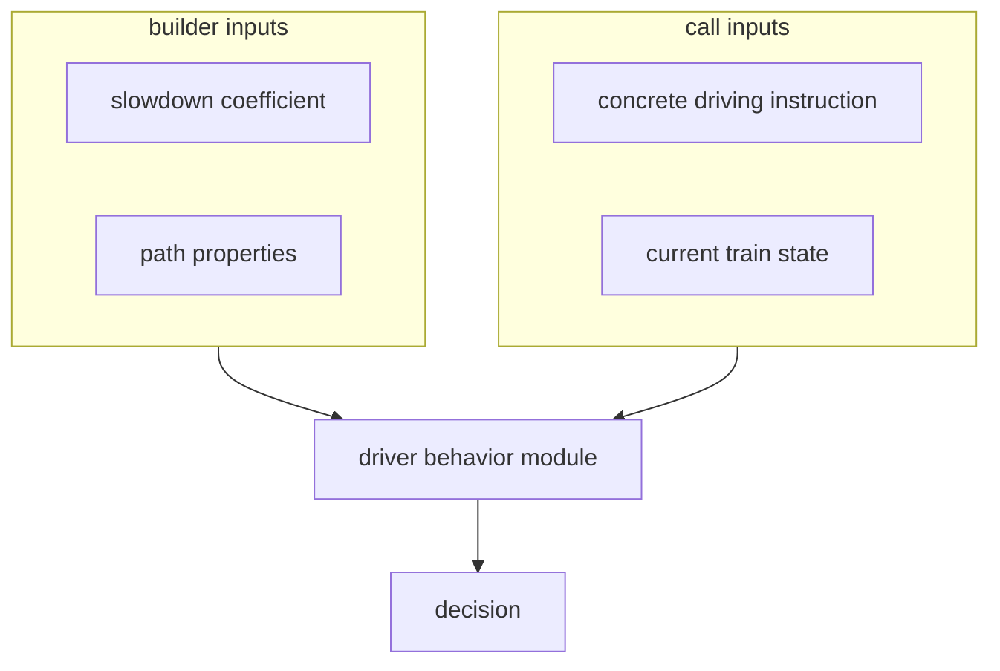

### Driver behavior modules

Driver behavior modules are responsible for making driving decisions. It's main responsibility, given the state of the train,
is to provide a driving instruction (a braking or traction force). To perform this critical task, it needs access to additional context:

- the physical properties of the path, which are used to make coasting decisions
- driving instructions

## Design decisions

### Unifying driver behavior and margin distribution algorithms

When this design project started, driver behavior was left completely undefined.
We assumed that a set of driving instructions can be unambiguously interpreted given a starting point.
This assumption was then decided to be relied on to search which margin speed ceiling yields expected
arrival times.

We also knew this assumption to be false: there are many ways instructions can be interpreted.
Worse yet, different use cases for OSRD have different needs:

- some users might want to reproduce existing timetables, which exhibit naive driver behavior:
  aggressive accelerations, aggressive breaking behavior.
- some users want to evaluate the feasability of timetables, and thus want somewhat realistic driver
  behavior, with less aggressive acceleration and cautious breaking behavior.

To resolve this tension, we thought of adding support for pluggable driver behavior.
Doing so, however, would create two ways a timetable can be loosened (loose time):

- lowering the margin speed ceiling
- making driver behavior less aggressive

Let's say we want to loosen the timetable by 1 minute on a given section. It could be achieved by:

- lowering the speed ceiling using margins while keeping aggressive driver behavior
- making driving behavior very conservative, but using no margins at all
- lowering the speed ceiling a little, and making driving behavior a little more conservative
- any other combination of the two factors

This is an issue, as it might make simulation results unstable: because there possible are many ways
to achieve the requested schedule, it would be very challenging to reliably choose a solution which
matches expectations.

-  We considered ignoring the issue, as driver behavior was initially out of the scope
  of this design project. We decided not to, as we expected the cost of making later changes to integrate
  driver behavior to be significant.
-  We decided to avoid this shortcoming by making margin distribution part of driver behavior.
  Driver behavior modules are controlled by a slowdown coefficient between 0 (loose as much time as shall
  be achieved) and 1 (loose no time).

### Interfacing driver behavior, driving instructions, and numerical integration

Driver behavior can be formally modeled as a local decision function `f`, which takes the state of the
train as an input, including position and speed, and returns an acceleration.

To best integrate this acceleration over the given time step, it is best not to use only the acceleration at (t). Since it may vary a lot along [t, t+dt]. To approximate the acceleration within this interval, we would need a better estimator, using a numerical method such as
[RK4](https://en.wikipedia.org/wiki/Runge%E2%80%93Kutta_methods). Such estimator then needs to call `f` multiple times.

A number of questions came up:
- should numerical integration within the driver behavior module, or outside
- are driver behavior modules queried about their reaction to a specific instruction, or in general
- does the driver behavior module return decisions, or parameters used to make decisions (such as curves)
- if decisions are returned, is it a force, an acceleration, or a new state
- if a new state is returned, how to deal with heterogenous time steps
- do we check decisions for correctness? that is, if a decision causes the train to overshoot a limit curve,
  do we do anything?

#### Do we have a single DBM for all driving instructions, or one per driving instruction?

We identified that this API choice shouldn't constrain the implementation. We decided to go the conservative route and have *one DBM per driving instructions* as it reduces the API surface and relieves DBM from the responsibility of finding the most restrictive instruction.

#### How do we prevent overshooting?

We identified that DBMs need the ability to follow internal target curves (distinct from limit curves).

To do so we could either:
1. Have a way to short-circuit our integration scheme, to snap to target curves without overshooting.
2. Accept oscillations around target curves (and thus overshooting).
3. Setup a feedback loop mechanism to avoid overshooting.

We decided that only the first option was desirable.

The design choices then are:

#####  Make the DBM as close as possible to a decision function

Then the DBM would not be aware of the time step it is called with, and would return an acceleration. Then the module should expose two methods:

* One for taking decisions, akin to `f`.  
Called several times depending on the integration method.

* One for correcting an integration step (i.e. a time step and a new state), if it happened to overshoot its internal goal curves (for example MARECO which sets it's own speed limits).  
Called on the integration step results from this DBM, and the other DBMs integration step results.

#####  The DBM returns a new state

The module would then expose two methods:
* One for taking decisions, which, given a train state and a desired/maximum time step, returns a new state (which does not overshoot) and a new current time.

* One for correcting an integration step (i.e. a time step and a new state), if it happened to overshoot its internal goal curves (for example MARECO which sets it's own speed limits).  
Called only on other DBMs integration step results.

#### How do we combine the decisions from all DBMs?

1. For each state property, find the most constraining value and `dt`.
2. Find the smallest `dt` amongst constraining properties. Interpolate remaining properties to this `dt`, to build a provisional state.
2. Submit this provisional state for truncation to all DBMs and take the truncation with the smallest `dt`.

To understand how this algorithm is designed, we need to consider two example cases:
- For step 1 and 2: if a neutral zone and a breaking instruction overlap, both are most constraining to different state properties: the neutral zone affects pantograph state, and the breaking instruction affects speed. The final state has to be a combination of both.
- For step 3: We need to truncate integration steps to avoid overshoots, and thus avoid the neeed for feedback loops. Idealy, we want to truncate to the exact overshoot location. This overshoot location is not the same as the initial `dt` for the overshot constraint.

#### Why do we need to reconcile candidates?

Here is an example of a numerical integration with two driving instructions (in red) resulting in two candidate curves (in solid black). The first driving instruction represents a braking curve, the second one is a speed limit.

The lower curve is more constraining than the upper one, however it has a greater Δt and overshoots one of the driving instructions. Another choice would be to pick the smallest Δt of all driving instructions, however we risk entering an infinite loop: the same situation is repeated on all following numerical integration steps.

As a result, we need to put a bit more effort into the Δt choice by computing the intersection between the more constraining candidate curve and the driving instructions.

TODO: is this something we really care about in practice? If not, we should probably turn that into an assert.

#### Conclusion

We decided to model driver behavior modules as follows:
- numerical integration is performed within driver behavior modules
- each driver behavior module reacts to a specific driving instruction
- each driver behavior module is created ahead of time with:
  - a slowdown coefficient
  - a specific driving instruction
  - path properties
  - a simulator object
- when queried:
  - they take the current train state
  - they return a new train state (including time, possibly smaller than `input_state.time + dt`)
- driver behavior modules are queried for each driving instruction, and the decision with the lowest
  acceleration is choosen
- this decision is submitted for truncation to all driver behavior modules. The final decision is the one
  with the smallest `dt`
