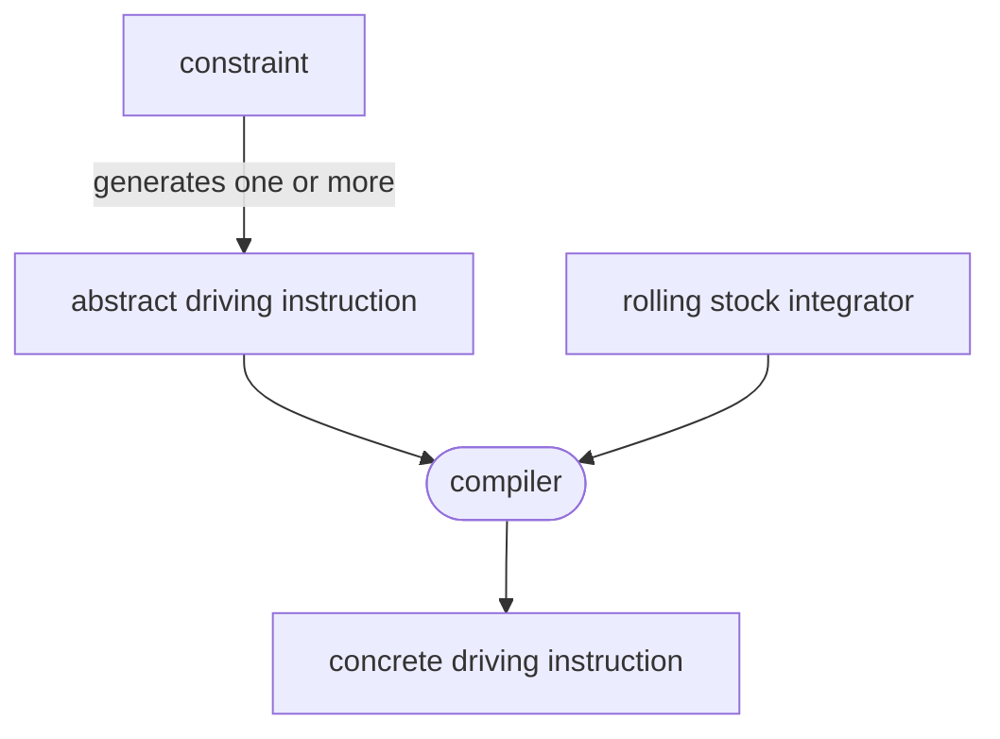
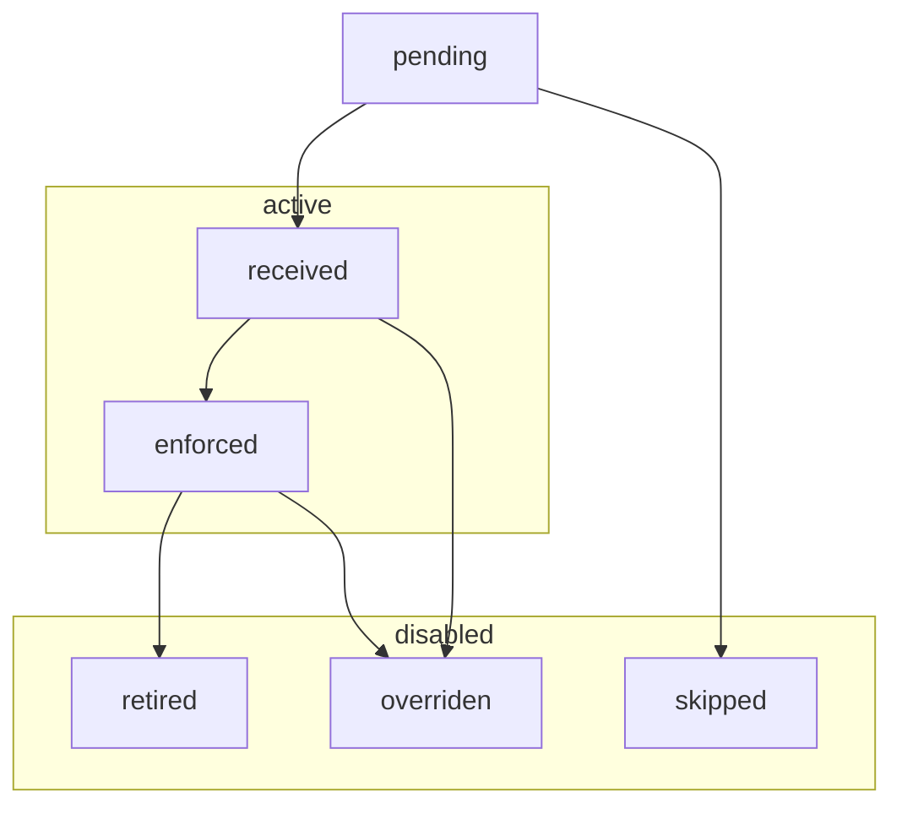

Driving instructions model what the train has to do, and under what conditions.
Driving instructions are generated using domain constraints such as:

- unsignaled line speed limits
- permanent signaled speed limits
- temporary speed limits
- dynamic signaling:
  - block / moving block
  - dynamically signaled speed restrictions
- neutral zones
- stops
- margins


There are two types of driving instructions:

- **Abstract driving instructions** model the high-level, rolling stock independent
range of acceptable behavior: reach 30km/h at this location
- **Concrete driving instructions** model the specific range of acceptable behavior
for a specific rolling stock, using limit curves: don't go faster than this curve




## Interpreting driving instructions

During the simulation, driving instructions are partitionned into 4 sets:

- `PENDING` instructions may apply at some point in the future
- `RECEIVED` instructions aren't enforced yet, but will be unless overridden
- `ENFORCED` instructions influence train behavior
- `DISABLED` instructions don't ever have to be considered anymore. There are multiple ways instructions can be disabled:
  - `SKIPPED` instructions were not received
  - `RETIRED` instructions expired by themselves
  - `OVERRIDEN` instructions were removed by another instruction



These sets evolve as follows:

- when an integration steps overlaps a `PENDING` instruction's received condition, it is `RECEIVED` and becomes a candidate to execution
  - existing instructions may be `OVERRIDEN` due to an `override_on_received` operation
- if an instruction cannot ever be received at any future simulation state, it transitions to the `SKIPPED` state
- when simulation state exceeds an instruction's enforcement position, it becomes `ENFORCED`. Only enforced instructions influence train behavior.
  - existing instructions may be `OVERRIDEN` due to an `override_on_enforced` operation
- when simulation state exceeds an instruction's retirement position, it becomes `RETIRED`


#### Overrides

When an instruction transitions to the `RECEIVED` or `ENFORCED` state, it can disable active instructions
which match some metadata predicate. There are two metadata attributes which can be relied on for overrides:

- the `kind` allows overriding previous instructions for a given domain, such as spacing or block signaled speed limits
- the `rank` can be used as a "freshness" or "priority" field. If two instructions overriding each other are received
  (such as when a train sees two signals), the rank allows deciding which instruction should be prioritized.

This is required to implement a number of signaling features, as well as stops, where the stop instruction is overriden
by the restart instruction.


#### Data model


```rust
struct ReceivedCond {
    position_in: Option<PosRange>,
    time_in: Option<TimeRange>,
}

struct InstructionMetadata {
    // state transitions
    received_when: ReceivedCond,
    enforced_at: Position,
    retired_at: Option<Position>,

    // instruction metadata, used by override filters. if an instruction
    // has no metadata nor retiring condition, it cannot be overriden.
    kind: Option<InstructionKindId>,  // could be SPACING, SPEED_LIMIT
    rank: Option<usize>,

    // when the instruction transitions to a given state,
    // instructions matching any filter are overriden
    override_on_received: Vec<OverrideFilter>,
    override_on_enforced: Vec<OverrideFilter>,
}

enum AbstractInstruction {
    NeutralZone,
    SpeedTarget {
        at: Position,
        speed: Speed,
    }
}

enum ConcreteInstruction {
    NeutralZone,
    SpeedTarget {
        braking_curve: SpeedPosCurve,
    },
}

struct OverrideFilter {
    kind: InstructionKindId,
    rank: Option<(RankRelation, usize)>,
}

enum RankRelation {
    LT, LE, EQ, GE, GT
}
```

## Design decisions

### Lowering constraints to an intermediate representation

Early on, we started making lists of what domain constraints can have an impact on train behavior.
Meanwhile, to simulate train behavior, we figured out that we need to know which constraints apply at any given time.

There's a fundamental tension between these two design constraints, which can be resolved in one of two ways:

- either treat each type of constraint as its own thing during the simulation
- abstract away constraints into a common representation, and then simulate that

####  Distinct constraint types

When we first started drafting architecture diagrams, the train simulation API directly took
a bunch of constraint types as an input. It brought up a number of issues:

- the high diversity of constraint types makes it almost impossible to describe all interactions between all constraint types
- the domain of some of these interactions is very complex (block signaling)
- when simulating, it does not seem to matter why a constraint is there, only what to do about it

We couldn't find clear benefits to dragging distinctions between constraint types deep into the implementation.

####  Internal constraint types abstraction

We then realized that abstracting over constraint types during simulation had immense benefits:

- it allows expressing requirements on what constraints need to be enforceable
- it greatly simplifies the process of validating constraint semantics: instead of having to validate interactions between
  every possible type of constraints, we only have to validate that the semantics of each constraint type can be transfered
  to the abstract constraint type

We decided to explore the possibility of keeping constraint types distinct in the external API, but lowering these constraints into an intermediary representation internally. We found a number of downsides:

- the public simulation API would still bear the complexity of dealing with many constraint types
- there would be a need to incrementally generate internal abstracted constraints to support the incremental API

####  External constraint types abstraction

We tried to improve over the previous proposal by moving the burden of converting many constraints into a common abstraction out of the simulation API.

Instead of having many constraint types as an input, the simulation API takes a collection of a single abstract constraint type. The task of converting
domain constraints to abstract driving instructions is left to the API user.

We found that doing so:

- reduces the API surface of the train simulation module
- decouples behavior from constraint types: if a new constraint type needs to be added, the simulation
  API only needs expansion if the expected behavior expected for this constraint isn't part of the API.
