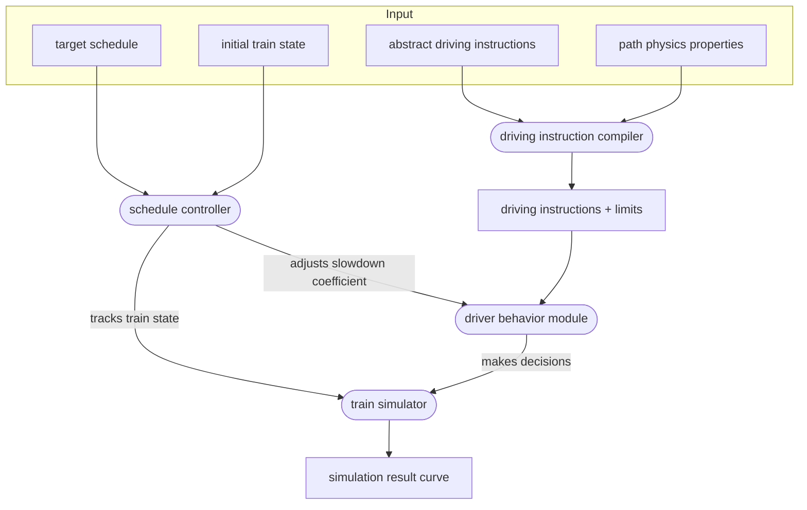

{}
This work is pending implementation, and has not yet been adjusted to
reflect potential required adjustments.
{}

After two years of extending a fairly simple simulation engine, it appeared that fundamental
changes are required to meet expectations.

## System requirements

The new system is expected to:

- be easy to integrate with [timetable v2](../timetable/)
- handle simulations of a full trip, with a complete known path, possibly following a schedule
- handle simulations where the path is discovered incrementally
- handle rich train state (pantograph position, battery state)
- handle reactions to signaling
- provide a low-level API, usable independently
- integrate a pluggable margin algorithm API

In the long-term, this system is expected to:

- be used to drive multi-train simulations
- handling switching rolling stock at stops
- integrate driver behavior properties

## Concepts

### Target schedule
The target schedule is a list of target arrival times at points specified along the path.
To respect the schedule, the train may have to not use its maximum traction.

### Train state
The train state is a vector of properties describing the train at a given point in time.
- position
- speed
- position of pantographs 
- driver reaction times ?
- battery state ?
- time elapsed since the last update

### Driving instructions

Driving instructions model what the train has to do along its path.
They are linked to conditions on their application, and can interact with each other.
They are generated using domain constraints such as speed limits or stops. 

See [the dedicated page]() for more details.

### Path properties

Path properties are the physical properties of the path, namely elevation, curves and electrification.

### Driver behavior module

The driver behavior modules update the train state based on:
- the current train state
- the path properties
- the driving instructions
- a slowdown coefficient (1 = no slowdown, 0 = full stop)

The train state changes should be physically realistic. 

See [the dedicated page]() for more details.

### Schedule controller

The schedule controller manages the slowdown coefficient given to the driver behavior module in order 
to respect the target schedule.

It adjusts the slowdown coefficient iteratively, using a dichotomous search, re-simulating the train behavior 
between two time-targeted points.

### Simulation results

The output of the simulation is the list of train states at each time step.

## Design overview

The main idea of the new train simulator is to have a simulation which is computed step by step and not post-processed.
This would ensure the physical consistency of the simulation.

The challenge is then to add ways to lose some time, in order to respect the target schedule.  
This is done by iterating over the sections between two scheduled points, while adjusting a slowdown factor.
This slowdown factor would be used to control how the driver behavior module would lose time while still being
physically realistic.  
See [the driver behavior module dedicated page]() for more details.

In order to accommodate an infrastructure which could change with time (like signals), we introduce driving instructions.
These instructions are generated from the path properties and the target schedule, and are used to update the train state.
Instructions can be conditional, and can interact with each other.  
The algorithm is described in detail in the [dedicated page]().

## Design limits

- trains do not anticipate margin transitions: only the next target arrival time matters for finding the slowdown factor
