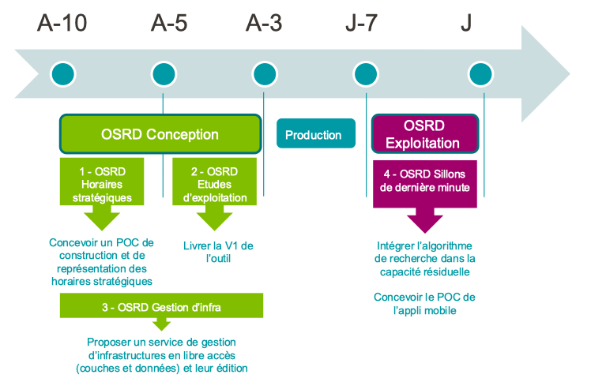

Le processus de planification de la circulation d’un train demande **10 ans d’anticipation** et implique la collaboration de différents services et acteurs pour transformer les besoins de mobilité des clients : **autorités organisatrices (AO)** et **entreprises ferroviaires (EF)** en **service annuel (SA)**. 

Le projet OSRD à l’ambition de répondre aux besoins de simulations qui couvrent la totalité du processus, de la conception du plan de transport jusqu’à sa mise en exploitation.

Notre mission est de fournir un outil de simulation qui peut être utilisé dans **toutes les étapes de la phase de conception** (planification des horaires et études d’exploitation), sur une **échelle géographique nationale** (comprenant tout le réseau français) et avec une **granulométrie des détails variable**. De plus, dans la phase opérationnelle, le projet OSRD propose un service pour tracer des **sillons de dernières minutes** (une tranche d’espace-temps durant laquelle l’infrastructure est affectée à la circulation d’un train spécifique) dans la capacité résiduelle théorique ou réelle du réseau ferroviaire, une fois que les autres circulations ont été déjà planifiées.

### Le projet OSRD

#### Les différents produits OSRD

#### Nos ambitions pour 2022

